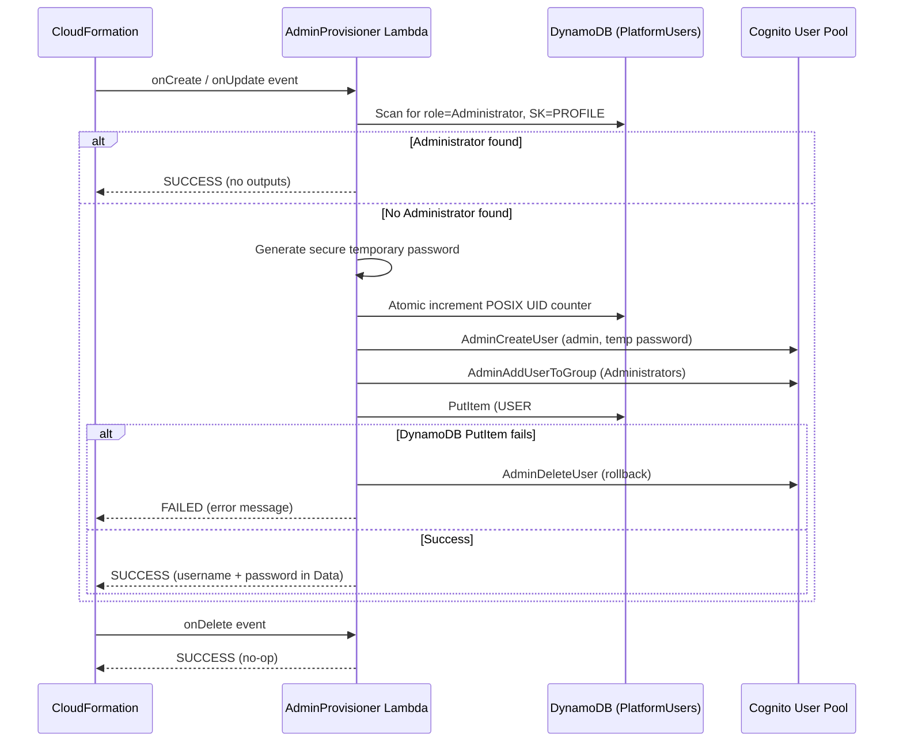
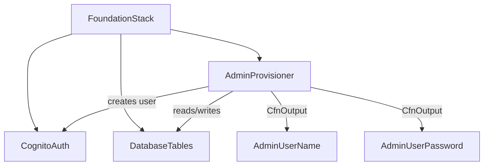

# Design Document: Admin User Provisioning

## Overview

The Admin User Provisioning feature ensures that every fresh deployment of the HPC Foundation stack results in a usable platform by guaranteeing at least one Administrator user exists. It runs as a Lambda-backed CloudFormation custom resource during stack create/update, scanning DynamoDB for any existing Administrator, and conditionally creating a default `admin` user in both Cognito and DynamoDB when none is found.

**Why a Lambda-backed custom resource instead of AwsCustomResource?**
The provisioning logic requires conditional branching (scan → decide → create or skip), multi-service orchestration (DynamoDB + Cognito), runtime password generation, and rollback handling. `AwsCustomResource` only supports single SDK calls per lifecycle event and cannot express this logic.

**Key design decisions:**
1. **Separate Lambda function** — The provisioner Lambda (`lambda/admin_provisioner/`) is independent from the existing `user_management` Lambda. This follows the project's construct-per-concern pattern and avoids coupling deployment-time logic with runtime API logic.
2. **Scan-based detection** — The provisioner scans for `role=Administrator` across all users, not just `userId=admin`. This correctly handles cases where an admin was created with a different userId through the API.
3. **Runtime password generation** — The temporary password is generated inside the Lambda using Python's `secrets` module, never appearing in CDK synth output or CloudFormation template parameters.
4. **No-op on delete** — Stack deletion does not remove the admin user, preventing accidental loss of the only administrator account.
5. **Update-safe by design** — Create and Update events share the same code path. The provisioner's sole decision criterion is the DynamoDB scan result, not resource property values. Changing `adminEmail` on a stack update cannot create a second admin or reset existing credentials.

## Architecture



### Integration with Foundation Stack

The `AdminProvisioner` construct is instantiated in `FoundationStack` after `CognitoAuth` and `DatabaseTables`, since it depends on both. It is wired similarly to other custom resources in the stack:



## Components and Interfaces

### 1. CDK Construct: `AdminProvisioner` (`lib/constructs/admin-provisioner.ts`)

A new CDK construct that creates the Lambda-backed custom resource.

```typescript
export interface AdminProvisionerProps {
  platformUsersTable: dynamodb.Table;
  userPool: cognito.UserPool;
  adminEmail: string; // Configurable admin email
}

export class AdminProvisioner extends Construct {
  constructor(scope: Construct, id: string, props: AdminProvisionerProps) {
    // 1. Create Lambda function from lambda/admin_provisioner/
    // 2. Grant DynamoDB read/write on PlatformUsers table
    // 3. Grant Cognito admin actions on User Pool
    // 4. Create CfnCustomResource pointing to Lambda
    // 5. Create CfnOutputs for AdminUserName and AdminUserPassword
    //    conditioned on custom resource response data
  }
}
```

**Props:**
- `platformUsersTable` — The PlatformUsers DynamoDB table reference.
- `userPool` — The Cognito User Pool reference.
- `adminEmail` — The email address for the default admin user. Sourced from CDK context (`this.node.tryGetContext('adminEmail')`). This is a **mandatory** parameter — the CDK construct will throw an error during synthesis if it is not provided.

**IAM permissions (least-privilege):**
- DynamoDB: `dynamodb:Scan`, `dynamodb:PutItem`, `dynamodb:UpdateItem` on the PlatformUsers table ARN.
- Cognito: `cognito-idp:AdminCreateUser`, `cognito-idp:AdminAddUserToGroup`, `cognito-idp:AdminGetUser`, `cognito-idp:AdminDeleteUser` on the User Pool ARN.

**CfnOutputs:**
- `AdminUserName` — Value from custom resource `Data.AdminUserName`. Uses `CfnCondition` or defaults to empty string when no user was created.
- `AdminUserPassword` — Value from custom resource `Data.AdminUserPassword`. Same conditional logic.

### 2. Lambda Function: `admin_provisioner` (`lambda/admin_provisioner/handler.py`)

A single-file Python Lambda that handles CloudFormation custom resource lifecycle events.

**Interface — CloudFormation Custom Resource Protocol:**

```python
def handler(event: dict, context: Any) -> dict:
    """
    CloudFormation custom resource handler.

    Event contains:
      - RequestType: "Create" | "Update" | "Delete"
      - ResourceProperties:
          - TableName: str
          - UserPoolId: str
          - AdminEmail: str

    Returns cfnresponse-compatible dict with:
      - Status: "SUCCESS" | "FAILED"
      - Data:
          - AdminUserName: str (only when user created)
          - AdminUserPassword: str (only when user created)
    """
```

**Internal functions:**

| Function | Responsibility |
|----------|---------------|
| `handler(event, context)` | Routes Create/Update/Delete, sends cfnresponse |
| `_scan_for_admin(table_name)` | Scans PlatformUsers for any `role=Administrator`, `SK=PROFILE` record |
| `_generate_password(length=16)` | Generates cryptographically secure password meeting Cognito policy |
| `_allocate_posix_uid(table_name)` | Atomic increment of POSIX UID counter (same pattern as `users.py`) |
| `_create_admin_user(table_name, user_pool_id, email, password)` | Orchestrates Cognito + DynamoDB creation with rollback |
| `_send_response(event, context, status, data)` | Sends response back to CloudFormation via pre-signed URL |

**cfnresponse handling:**
The Lambda uses `urllib.request` to send the response to the CloudFormation pre-signed S3 URL (standard custom resource pattern). This avoids adding the `cfnresponse` module as a dependency.

### 3. Foundation Stack Integration

In `lib/foundation-stack.ts`, the `AdminProvisioner` construct is added after `CognitoAuth` and `DatabaseTables`:

```typescript
// After construct #2 (DatabaseTables) and before UserManagement
const adminProvisioner = new AdminProvisioner(this, 'AdminProvisioner', {
  platformUsersTable: databaseTables.platformUsersTable,
  userPool: cognitoAuth.userPool,
  adminEmail: this.node.tryGetContext('adminEmail'), // mandatory — synth fails if missing
});
```

The admin email is passed via CDK context: `cdk deploy -c adminEmail=ops@company.com`. Synthesis will fail with a clear error if `adminEmail` is not provided.

## Data Models

### Custom Resource Event (Input)

```json
{
  "RequestType": "Create",
  "ResourceProperties": {
    "TableName": "PlatformUsers",
    "UserPoolId": "us-east-1_xxxxxxx",
    "AdminEmail": "admin@example.com"
  },
  "ResponseURL": "https://cloudformation-custom-resource-response-...",
  "StackId": "arn:aws:cloudformation:...",
  "RequestId": "unique-id",
  "LogicalResourceId": "AdminProvisionerResource",
  "PhysicalResourceId": "AdminProvisioner-<timestamp>"
}
```

### Custom Resource Response (Output)

**When admin user is created:**
```json
{
  "Status": "SUCCESS",
  "PhysicalResourceId": "AdminProvisioner-<timestamp>",
  "Data": {
    "AdminUserName": "admin",
    "AdminUserPassword": "<generated-16-char-password>"
  }
}
```

**When admin already exists:**
```json
{
  "Status": "SUCCESS",
  "PhysicalResourceId": "AdminProvisioner-existing",
  "Data": {}
}
```

**When creation fails:**
```json
{
  "Status": "FAILED",
  "Reason": "Failed to create Cognito user: <error details>",
  "PhysicalResourceId": "AdminProvisioner-failed"
}
```

### DynamoDB Record (Admin User)

Uses the same schema as all platform users in the PlatformUsers table:

| Attribute | Value |
|-----------|-------|
| PK | `USER#admin` |
| SK | `PROFILE` |
| userId | `admin` |
| displayName | `Admin` |
| email | `<configured email>` |
| role | `Administrator` |
| posixUid | `<next from counter>` |
| posixGid | `<same as posixUid>` |
| status | `ACTIVE` |
| cognitoSub | `<from Cognito response>` |
| createdAt | `<ISO 8601 UTC>` |
| updatedAt | `<ISO 8601 UTC>` |


## Correctness Properties

*A property is a characteristic or behavior that should hold true across all valid executions of a system — essentially, a formal statement about what the system should do. Properties serve as the bridge between human-readable specifications and machine-verifiable correctness guarantees.*

### Property 1: Admin detection scans by role, not userId

*For any* set of user records in the PlatformUsers table with varying `userId`, `role`, and `SK` values, `_scan_for_admin` SHALL return `True` if and only if at least one record has `role=Administrator` AND `SK=PROFILE`, regardless of the `userId` value.

**Validates: Requirements 1.1, 1.3**

### Property 2: Existing admin prevents all write operations

*For any* PlatformUsers table state that contains at least one record with `role=Administrator` and `SK=PROFILE`, the provisioner handler SHALL make zero DynamoDB write calls and zero Cognito mutating calls, and SHALL return a SUCCESS response with empty Data.

**Validates: Requirements 1.2, 6.1**

### Property 3: Created DynamoDB record contains all required attributes with correct values

*For any* valid admin email string, POSIX UID counter value, and Cognito sub string, the DynamoDB PutItem call SHALL produce a record containing: `PK=USER#admin`, `SK=PROFILE`, `userId=admin`, `displayName=Admin`, `email=<input email>`, `role=Administrator`, `posixUid=<counter value>`, `posixGid=<counter value>`, `status=ACTIVE`, `cognitoSub=<input sub>`, and valid ISO 8601 `createdAt` and `updatedAt` timestamps.

**Validates: Requirements 2.2, 3.2**

### Property 4: Generated password meets Cognito policy

*For any* invocation of `_generate_password`, the returned string SHALL be at least 16 characters long and contain at least one uppercase letter, one lowercase letter, one digit, and one symbol character.

**Validates: Requirements 4.2**

### Property 5: Creation failure leaves no partial state

*For any* failure during the admin creation sequence — whether at the Cognito creation step or the DynamoDB write step — the system SHALL NOT leave orphaned resources. Specifically: if Cognito user creation fails, no DynamoDB PutItem SHALL be attempted; if DynamoDB PutItem fails after Cognito user creation, the Cognito user SHALL be deleted.

**Validates: Requirements 6.3, 6.4**

### Property 6: Service errors propagate to CloudFormation response

*For any* service error (DynamoDB scan failure, Cognito creation error, POSIX UID allocation failure), the provisioner SHALL return a FAILED cfnresponse with a Reason string that contains the original error message.

**Validates: Requirements 7.1, 7.2, 7.3**

### Property 7: Update events with changed properties cannot bypass admin detection

*For any* Update event where the `AdminEmail` resource property differs from the original Create event, if an Administrator user already exists in the PlatformUsers table, the provisioner SHALL make zero DynamoDB write calls, zero Cognito mutating calls, and SHALL return a SUCCESS response with empty Data — identical behaviour to an Update with unchanged properties.

**Validates: Requirements 8.1, 8.2, 8.3, 8.4, 8.5**

## Error Handling

### Error Categories and Responses

| Error Source | Scenario | Handler Behaviour |
|-------------|----------|-------------------|
| DynamoDB Scan | Table not found, permissions error, throttling | Return FAILED cfnresponse with error details. Stack deployment fails. |
| DynamoDB UpdateItem (counter) | Counter item missing, permissions error | Return FAILED cfnresponse. No Cognito user created (counter runs first in the sequence). |
| Cognito AdminCreateUser | Service error, rate limiting | Return FAILED cfnresponse with Cognito error. No DynamoDB record written. |
| Cognito AdminAddUserToGroup | Group not found, service error | Return FAILED cfnresponse. Cognito user is rolled back (deleted). |
| DynamoDB PutItem | ConditionalCheckFailed (user exists), permissions error | Roll back Cognito user (AdminDeleteUser). Return FAILED cfnresponse. |
| DynamoDB PutItem | ConditionalCheckFailed specifically | This means `USER#admin` already exists but without Administrator role. Roll back Cognito user. Return FAILED with descriptive message. |
| Cognito AdminDeleteUser (rollback) | Fails during cleanup | Log warning. Still return FAILED for the original error. Best-effort cleanup. |
| cfnresponse send | Network error sending response to CloudFormation | CloudFormation will time out (default 1 hour) and roll back the stack. Lambda logs the error. |

### Operation Ordering for Atomicity

The creation sequence is ordered to minimise partial-state risk:

1. **Scan** — Read-only, safe to fail at any point.
2. **Allocate POSIX UID** — Counter increment is not rolled back on failure (acceptable: UIDs are cheap and gaps don't matter).
3. **Create Cognito user** — If this fails, no DynamoDB record exists. Clean exit.
4. **Add to Administrators group** — If this fails, Cognito user is deleted (rollback).
5. **Write DynamoDB record** — If this fails, Cognito user is deleted (rollback).

### Stack Update Abuse Prevention

The provisioner is designed to be safe against stack update manipulation:

| Attack Vector | Mitigation |
|--------------|------------|
| Change `AdminEmail` to create a second admin | Scan-based detection finds existing admin regardless of email; creation is skipped. |
| Force re-creation by modifying resource properties | Create and Update share the same `_provision_admin` code path; the scan always runs first. |
| Reset existing admin credentials | The provisioner never modifies existing Cognito users or DynamoDB records. |
| Extract new credentials from stack outputs | When admin exists, response Data is empty; CfnOutputs resolve to empty strings. |
| Overwrite `USER#admin` DynamoDB record | `attribute_not_exists(PK)` condition on PutItem prevents overwrites. |

### CloudFormation Timeout

The Lambda timeout should be set to 60 seconds (well under CloudFormation's custom resource timeout). If the Lambda times out, CloudFormation receives no response and eventually rolls back the stack after its own timeout period.

## Testing Strategy

### Property-Based Tests (Hypothesis — Python)

The project already uses Hypothesis (`.hypothesis/` directory exists). Property-based tests validate universal correctness properties across randomised inputs.

**Configuration:** Minimum 100 iterations per property test via `@settings(max_examples=100)`.

**Test file:** `test/lambda/test_admin_provisioner_properties.py`

| Property | Test Description | Generator Strategy |
|----------|-----------------|-------------------|
| Property 1: Admin detection | Generate random lists of user records with varying roles/SKs. Verify scan logic. | `st.lists(st.fixed_dictionaries({...}))` with role ∈ {User, Administrator} and SK ∈ {PROFILE, other} |
| Property 2: Skip on existing admin | Generate table states with ≥1 admin. Verify no writes. | Same as P1, filtered to include at least one admin |
| Property 3: Record completeness | Generate random emails, UIDs, and subs. Verify PutItem attributes. | `st.emails()`, `st.integers(min_value=10001)`, `st.uuids()` |
| Property 4: Password policy | Call `_generate_password()` repeatedly. Verify each output. | No input generator needed — the function itself is stochastic |
| Property 5: Creation atomicity | Generate random error injection points. Verify no partial state. | `st.sampled_from(["cognito_create", "cognito_group", "dynamodb_put"])` |
| Property 6: Error propagation | Generate random error messages and injection points. Verify cfnresponse. | `st.text(min_size=1, max_size=200)` for error messages |
| Property 7: Update abuse prevention | Generate Update events with varying AdminEmail values, with existing admin in table. Verify no writes. | `st.emails()` for AdminEmail, table pre-seeded with admin |

### Example-Based Unit Tests (pytest)

**Test file:** `test/lambda/test_admin_provisioner.py`

| Test | Validates |
|------|-----------|
| `test_create_event_no_existing_admin` | Happy path: scan returns empty, user created in Cognito + DynamoDB, response includes credentials (Req 2.1, 2.3, 2.4, 2.5, 3.1, 3.3, 5.1, 5.2) |
| `test_create_event_existing_admin_skips` | Scan returns admin, no writes, empty Data (Req 1.2, 5.3) |
| `test_update_event_existing_admin_skips` | Update lifecycle, admin exists, no writes (Req 6.2, 8.1) |
| `test_delete_event_noop` | Delete lifecycle returns SUCCESS with no side effects |
| `test_update_event_changed_email_does_not_create_second_admin` | Update with different AdminEmail, admin exists, no writes, empty Data (Req 8.2, 8.5) |
| `test_update_event_no_credential_modification` | Update event never modifies existing Cognito user or DynamoDB record (Req 8.3) |
| `test_cognito_user_force_change_password` | Verify AdminCreateUser uses TemporaryPassword param (Req 2.4) |
| `test_condition_expression_on_putitem` | Verify `attribute_not_exists(PK)` in PutItem (Req 3.3) |
| `test_posix_uid_atomic_increment` | Verify UpdateItem with ADD on counter (Req 3.1) |

### CDK Construct Tests (Jest)

**Test file:** `test/admin-provisioner.test.ts`

| Test | Validates |
|------|-----------|
| `test_lambda_created_with_correct_runtime` | Lambda uses Python 3.13 runtime |
| `test_lambda_has_required_env_vars` | TABLE_NAME, USER_POOL_ID, ADMIN_EMAIL in environment |
| `test_iam_policy_least_privilege` | Only required DynamoDB and Cognito actions granted |
| `test_cfn_outputs_created` | AdminUserName and AdminUserPassword outputs exist |
| `test_custom_resource_references_lambda` | CfnCustomResource ServiceToken points to Lambda ARN |

### Test Execution

- **Python tests:** `.venv/bin/pytest test/lambda/test_admin_provisioner.py test/lambda/test_admin_provisioner_properties.py -v`
- **CDK tests:** `npm test` (runs Jest)
- **All tests:** `make test`
