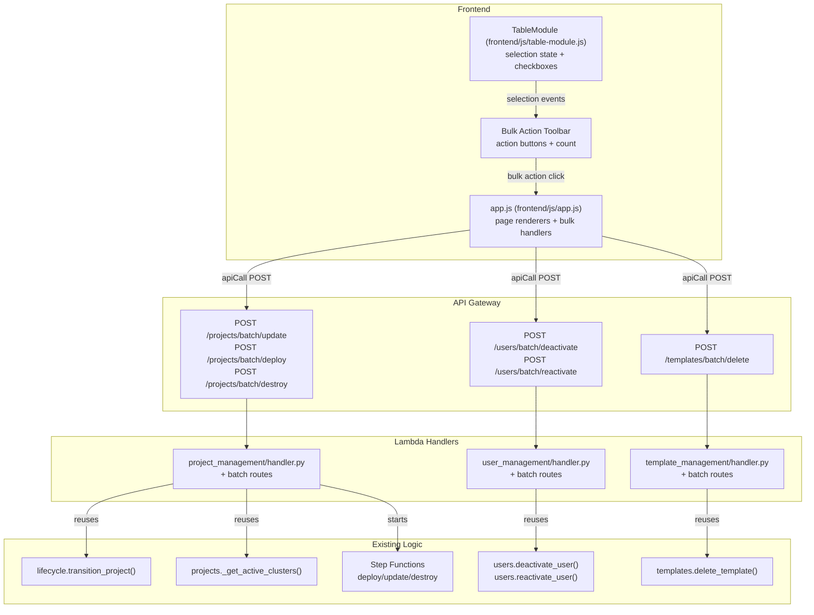

# Design Document: Bulk Actions UI

## Overview

This feature adds multi-select capability to the reusable `TableModule` (`frontend/js/table-module.js`) and exposes bulk action operations across the Projects, Users, and Templates list views in the portal (`frontend/js/app.js`). Administrators can select multiple items via checkboxes and trigger batch operations (update, deploy, destroy, deactivate, reactivate, delete) in a single action. The backend is extended with batch endpoints that accept arrays of identifiers, execute the corresponding single-item operations **sequentially**, and return per-item success/failure results in a consistent format. A staleness detection mechanism is added so that projects already up to date with the `FoundationStack` (`lib/foundation-stack.ts`) are excluded from unnecessary updates.

The design prioritises reuse of existing single-item logic (e.g., `lifecycle.transition_project()` in `lambda/project_management/lifecycle.py`, `deactivate_user()` / `reactivate_user()` in `lambda/user_management/users.py`, `delete_template()` in `lambda/template_management/templates.py`), error isolation (one failing item does not block others), and accessibility compliance for all new UI controls.

## Architecture



### Key Architectural Decisions

1. **Batch endpoints reuse single-item logic**: Each batch handler iterates over the input IDs and calls the existing single-item functions. Specifically:
   - **Project update/deploy/destroy**: reuses `lifecycle.transition_project()` from `lambda/project_management/lifecycle.py` to perform atomic status transitions, and `_get_active_clusters()` from `lambda/project_management/projects.py` for the destroy pre-check (verifies no ACTIVE or CREATING clusters exist).
   - **User deactivate/reactivate**: reuses `deactivate_user()` and `reactivate_user()` from `lambda/user_management/users.py`, which handle DynamoDB status updates and Cognito user enable/disable.
   - **Template delete**: reuses `delete_template()` from `lambda/template_management/templates.py`, which verifies existence via `get_template()` before deleting.
   This avoids duplicating validation and business logic.

2. **Sequential processing**: Items are processed one at a time within each batch request to avoid overwhelming DynamoDB, Cognito, and Step Functions. This is acceptable because the max batch size is 25.

3. **Error isolation via try/catch per item**: Each item operation is wrapped in its own try/except block. Failures are recorded in the result array and processing continues.

4. **Selection state lives in TableModule**: The selection state (set of selected row IDs) is managed inside the TableModule IIFE alongside existing sort/filter state, keeping the module self-contained.

5. **Foundation stack timestamp via DynamoDB metadata record**: A CDK custom resource in the `FoundationStack` class (`lib/foundation-stack.ts`) writes a timestamp to the Projects DynamoDB table (PK=`PLATFORM`, SK=`FOUNDATION_TIMESTAMP`) on every deploy. The `list_projects()` function in `lambda/project_management/projects.py` reads this record and includes `foundationStackTimestamp` in the `GET /projects` response. This avoids adding SSM dependencies and keeps all data in DynamoDB.

6. **Staleness is computed client-side**: The portal (`frontend/js/app.js`) compares each project's `statusChangedAt` (set by `lifecycle.transition_project()` on each status transition) against the `foundationStackTimestamp` returned by the API. This keeps the backend stateless with respect to staleness and allows the UI to update immediately when new data arrives via the existing polling mechanism (using `projectPollIntervalMs` from `frontend/js/config.js` and `projectStatusCache` in `state` for transition detection).

## Components and Interfaces

### 1. TableModule Selection Extension (`frontend/js/table-module.js`)

The existing `TableModule` IIFE (which currently exposes `render(tableId, config, data, container)`, `clearState(tableId)`, and `clearAllState()`) is extended with selection capabilities:

**New internal state** (per table, alongside existing `sortColumn`, `sortDirection`, `filterText` in the `tableStates` map):
- `selectedIds`: `Set<string>` — currently selected row identifiers

**New config properties**:
- `selectable: boolean` — enables checkbox column
- `rowId: string` — property name used as the unique row identifier (e.g., `'projectId'`)
- `onSelectionChange: function(selectedIds: string[])` — callback invoked when selection changes

**New public methods**:
- `getSelectedIds(tableId) → string[]` — returns array of currently selected IDs
- `clearSelection(tableId)` — deselects all rows, unchecks all checkboxes

**Rendering changes**:
- When `selectable: true`, a checkbox column is prepended to the header (select-all) and each body row
- Each row checkbox gets `aria-label="Select {entityType} {rowIdValue}"`
- The select-all checkbox gets `aria-label="Select all rows"`
- Select-all checks/unchecks based on whether all *visible* (post-filter) rows are selected
- Filtering preserves selections of rows that become hidden

**Event handling**:
- Individual checkbox toggle → add/remove from `selectedIds`, call `onSelectionChange`
- Select-all toggle → add/remove all visible row IDs, call `onSelectionChange`
- Filter change → re-render checkboxes to reflect selection state of newly visible rows; do not modify `selectedIds`

### 2. Bulk Action Toolbar (rendered by `frontend/js/app.js`)

Each page renderer (`renderProjectsPage`, `renderUsersPage`, `renderTemplatesPage` in `app.js`) creates a toolbar container above the table. The toolbar is shown/hidden based on selection count via the `onSelectionChange` callback.

**HTML structure**:
```html
<div class="bulk-action-toolbar" role="toolbar" aria-label="Bulk actions" aria-live="polite" style="display:none">
  <span class="bulk-selection-count">3 selected</span>
  <!-- Page-specific buttons -->
  <button class="btn btn-primary btn-sm">Update All</button>
  <button class="btn btn-primary btn-sm">Deploy All</button>
  <button class="btn btn-danger btn-sm">Destroy All</button>
  <button class="btn btn-sm">Clear Selection</button>
</div>
```

**Per-page buttons**:
- Projects: "Deploy All" (for CREATED), "Update All" (for stale ACTIVE), "Destroy All" (for ACTIVE)
- Users: "Deactivate All", "Reactivate All"
- Templates: "Delete All"

All buttons are always rendered; the handlers filter by eligibility before sending the request.

### 3. Batch API Endpoints

Six new routes, all requiring Administrator authorization via `is_administrator(event)` (consistent with existing single-item endpoints in each handler):

| Route | Method | Handler | Body |
|-------|--------|---------|------|
| `/projects/batch/update` | POST | `_handle_batch_update` | `{"projectIds": [...]}` |
| `/projects/batch/deploy` | POST | `_handle_batch_deploy` | `{"projectIds": [...]}` |
| `/projects/batch/destroy` | POST | `_handle_batch_destroy` | `{"projectIds": [...]}` |
| `/users/batch/deactivate` | POST | `_handle_batch_deactivate` | `{"userIds": [...]}` |
| `/users/batch/reactivate` | POST | `_handle_batch_reactivate` | `{"userIds": [...]}` |
| `/templates/batch/delete` | POST | `_handle_batch_delete` | `{"templateIds": [...]}` |

**Batch handler → existing function mapping**:

- `_handle_batch_update` (in `lambda/project_management/handler.py`): For each project ID, calls `get_project()` to verify ACTIVE status, then `lifecycle.transition_project(table_name, project_id, "UPDATING")` and starts the update Step Functions execution via `PROJECT_UPDATE_STATE_MACHINE_ARN` — mirroring the existing `_handle_update_project()`.
- `_handle_batch_deploy` (in `lambda/project_management/handler.py`): For each project ID, calls `get_project()` to verify CREATED status, then `lifecycle.transition_project(table_name, project_id, "DEPLOYING")` and starts the deploy Step Functions execution via `PROJECT_DEPLOY_STATE_MACHINE_ARN` — mirroring the existing `_handle_deploy_project()`.
- `_handle_batch_destroy` (in `lambda/project_management/handler.py`): For each project ID, calls `get_project()` to verify ACTIVE status, then `_get_active_clusters(CLUSTERS_TABLE_NAME, project_id)` to check for both ACTIVE and CREATING clusters, then `lifecycle.transition_project(table_name, project_id, "DESTROYING")` and starts the destroy Step Functions execution via `PROJECT_DESTROY_STATE_MACHINE_ARN` — mirroring the existing `_handle_destroy_project_infra()`.
- `_handle_batch_deactivate` (in `lambda/user_management/handler.py`): For each user ID, calls `deactivate_user(table_name, user_pool_id, user_id)` from `lambda/user_management/users.py`, which verifies the user exists, sets DynamoDB status to INACTIVE, and disables the Cognito user.
- `_handle_batch_reactivate` (in `lambda/user_management/handler.py`): For each user ID, calls `reactivate_user(table_name, user_pool_id, user_id)` from `lambda/user_management/users.py`, which verifies the user exists and is INACTIVE, sets DynamoDB status to ACTIVE, and re-enables the Cognito user.
- `_handle_batch_delete` (in `lambda/template_management/handler.py`): For each template ID, calls `delete_template(table_name, template_id)` from `lambda/template_management/templates.py`, which verifies existence via `get_template()` before deleting.

Each batch handler follows the same pattern:
1. Validate authorization via `is_administrator(event)` (admin only)
2. Parse and validate request body (non-empty array, max 25 items); on failure return HTTP 400 with `{"error": {"code": "VALIDATION_ERROR", "message": "...", "details": {}}}` matching the existing error response format from `build_error_response()` in each handler's `errors.py`
3. Iterate over IDs sequentially
4. For each ID: try the single-item operation, record success or catch error (`NotFoundError`, `ConflictError`, `ValidationError`, `AuthorisationError`) and record failure
5. Return `BatchResult` with HTTP 200

### 4. Foundation Stack Timestamp (`lib/foundation-stack.ts`)

A new CDK custom resource is added to the `FoundationStack` class (`lib/foundation-stack.ts`) that writes a timestamp to the Projects DynamoDB table (`this.projectsTable`) on every deployment:

```typescript
new cr.AwsCustomResource(this, 'FoundationStackTimestamp', {
  onUpdate: {  // runs on every deploy/update
    service: 'DynamoDB',
    action: 'putItem',
    parameters: {
      TableName: this.projectsTable.tableName,
      Item: {
        PK: { S: 'PLATFORM' },
        SK: { S: 'FOUNDATION_TIMESTAMP' },
        timestamp: { S: new Date().toISOString() },
      },
    },
    physicalResourceId: cr.PhysicalResourceId.of('FoundationStackTimestamp-' + Date.now()),
  },
  policy: cr.AwsCustomResourcePolicy.fromSdkCalls({
    resources: [this.projectsTable.tableArn],
  }),
});
```

The `list_projects()` function in `lambda/project_management/projects.py` is updated to also read this record and include `foundationStackTimestamp` in the response alongside the `projects` array.

### 5. Staleness Detection (client-side in `frontend/js/app.js`)

The `projectsTableConfig` actions column renderer in `app.js` is updated:
- For ACTIVE projects: compare `row.statusChangedAt` (set by `lifecycle.transition_project()` when the project last transitioned to ACTIVE) against the `foundationStackTimestamp` from the API response
- If `statusChangedAt >= foundationStackTimestamp` → Update button is disabled with tooltip "Project is up to date"
- If `statusChangedAt < foundationStackTimestamp` → Update button is enabled (project is stale)

The "Update All" bulk action filters the selected IDs to only include stale projects before sending the request. If no stale projects remain after filtering, the button is disabled.

### 6. Progress Bars for Batch Operations (client-side in `frontend/js/app.js`)

After a bulk operation transitions projects to a transitional status (DEPLOYING, UPDATING, DESTROYING), each project's actions column renders an independent progress bar using the same `progress-container compact` markup pattern already used for individual project progress rendering in the existing `projectsTableConfig` actions column renderer:

```html
<div class="progress-container compact">
  <div class="progress-label">{stepDescription} ({currentStep}/{totalSteps})</div>
  <div class="progress-bar-track"><div class="progress-bar-fill" style="width:{pct}%">{pct}%</div></div>
</div>
```

Each progress bar reflects that project's own `currentStep`, `totalSteps`, and `stepDescription` from the backend. The existing project list polling mechanism (using `projectPollIntervalMs` from `frontend/js/config.js` and `projectStatusCache` in `state` for transition detection) updates all in-progress project progress bars independently, so that each project's progress advances at its own pace.

## Data Models

### BatchResult Response Format

All batch endpoints return this consistent format:

```json
{
  "results": [
    {
      "id": "project-alpha",
      "status": "success",
      "message": "Update started"
    },
    {
      "id": "project-beta",
      "status": "error",
      "message": "Project status is CREATED, expected ACTIVE"
    }
  ],
  "summary": {
    "total": 2,
    "succeeded": 1,
    "failed": 1
  }
}
```

### Batch Request Body Format

**Projects** (update, deploy, destroy):
```json
{ "projectIds": ["project-alpha", "project-beta"] }
```

**Users** (deactivate, reactivate):
```json
{ "userIds": ["alice", "bob"] }
```

**Templates** (delete):
```json
{ "templateIds": ["cpu-general", "gpu-basic"] }
```

### Batch Validation Error Format

When the request body is missing, contains an empty array, or exceeds 25 identifiers, the batch endpoint returns HTTP 400 using the same error response format as existing endpoints (produced by `build_error_response()` in each handler's `errors.py`):

```json
{
  "error": {
    "code": "VALIDATION_ERROR",
    "message": "Batch request must contain between 1 and 25 identifiers.",
    "details": {}
  }
}
```

### Foundation Stack Timestamp Record (DynamoDB)

Stored in the Projects table:
```json
{
  "PK": "PLATFORM",
  "SK": "FOUNDATION_TIMESTAMP",
  "timestamp": "2025-01-15T10:30:00.000Z"
}
```

### TableModule Selection State (internal)

Added to the per-table state object in the `tableStates` map (alongside existing `sortColumn`, `sortDirection`, `filterText`):
```javascript
{
  sortColumn: null,
  sortDirection: 'asc',
  filterText: '',
  selectedIds: new Set()  // new
}
```

## Correctness Properties

*A property is a characteristic or behavior that should hold true across all valid executions of a system — essentially, a formal statement about what the system should do. Properties serve as the bridge between human-readable specifications and machine-verifiable correctness guarantees.*

### Property 1: Selection rendering matches data rows

*For any* array of row data objects and a table config with `selectable: true` and a `rowId` property, rendering the table SHALL produce exactly one checkbox per data row, and each checkbox's associated identifier SHALL equal the value of the `rowId` property for that row.

**Validates: Requirements 1.1, 1.11**

### Property 2: Select-all selects exactly the visible rows

*For any* dataset and filter text, when the "select all" checkbox is checked, `getSelectedIds` SHALL return exactly the set of row identifiers that are visible after filtering (i.e., the union of previously selected hidden rows and all currently visible rows).

**Validates: Requirements 1.3**

### Property 3: Individual toggle updates selection state

*For any* dataset and any row within it, toggling that row's checkbox SHALL add the row's identifier to `getSelectedIds` if it was not present, or remove it if it was present.

**Validates: Requirements 1.5**

### Property 4: Filter preserves selection of hidden rows

*For any* dataset with some rows selected, changing the filter text to hide some selected rows SHALL NOT remove those rows from `getSelectedIds`. The set of selected IDs before filtering SHALL be a subset of the set of selected IDs after filtering (no IDs are lost).

**Validates: Requirements 1.8**

### Property 5: Toolbar displays correct selection count

*For any* non-empty selection of rows, the Bulk Action Toolbar SHALL display a count equal to the length of `getSelectedIds`.

**Validates: Requirements 2.2**

### Property 6: Batch response format consistency

*For any* valid batch request containing N identifiers (1 ≤ N ≤ 25), the batch endpoint SHALL return HTTP 200 with a `results` array of exactly N entries, each containing an `id` field matching one of the input identifiers, a `status` field that is either `"success"` or `"error"`, and an optional `message` field. The `summary.total` SHALL equal N, and `summary.succeeded + summary.failed` SHALL equal N.

**Validates: Requirements 3.5, 4.5, 5.6, 6.4, 6.9, 7.5, 9.1, 9.2, 9.3**

### Property 7: Batch project eligibility — only projects in the required status succeed

*For any* batch of project identifiers where each project has a random status from the lifecycle state machine (`lifecycle.py` VALID_TRANSITIONS), the batch update endpoint SHALL return `"success"` only for projects with status `ACTIVE`, the batch deploy endpoint SHALL return `"success"` only for projects with status `CREATED`, and the batch destroy endpoint SHALL return `"success"` only for projects with status `ACTIVE` and no active or creating clusters (as determined by `_get_active_clusters()` which checks for both ACTIVE and CREATING statuses). All other projects SHALL receive `"error"` entries.

**Validates: Requirements 3.3, 3.6, 4.3, 4.6, 5.4, 5.7**

### Property 8: Batch user eligibility — only users in the required status succeed

*For any* batch of user identifiers where each user has a random status (ACTIVE or INACTIVE), the batch deactivate endpoint SHALL return `"success"` only for users with status `ACTIVE`, and the batch reactivate endpoint SHALL return `"success"` only for users with status `INACTIVE`. All other users SHALL receive `"error"` entries.

**Validates: Requirements 6.3, 6.5, 6.8, 6.10**

### Property 9: Batch template eligibility — only existing templates succeed

*For any* batch of template identifiers containing a mix of existing and non-existing template IDs, the batch delete endpoint SHALL return `"success"` only for templates that exist in the database. Non-existing templates SHALL receive `"error"` entries.

**Validates: Requirements 7.4, 7.6**

### Property 10: Batch error isolation — failures do not block remaining items

*For any* batch of N identifiers where some items will fail (due to wrong status, non-existence, or other errors), the batch endpoint SHALL still process all N items and return exactly N result entries. The number of `"success"` entries SHALL equal the number of eligible items, regardless of how many items failed.

**Validates: Requirements 10.1**

### Property 11: Staleness classification is correct

*For any* ACTIVE project with a `statusChangedAt` timestamp (set by `lifecycle.transition_project()` when the project last transitioned to ACTIVE) and a `foundationStackTimestamp` (from the DynamoDB record PK=`PLATFORM`, SK=`FOUNDATION_TIMESTAMP`), the project SHALL be classified as "up to date" if and only if `statusChangedAt >= foundationStackTimestamp`, and "stale" otherwise. The Update button's disabled state SHALL match the "up to date" classification.

**Validates: Requirements 8.3, 8.4, 8.5**

### Property 12: Update All filters to stale projects only

*For any* selection of ACTIVE project identifiers with mixed staleness, the "Update All" action SHALL include only the stale project identifiers in the batch request. The set of IDs sent to the API SHALL be a subset of the selected IDs, containing exactly those projects whose `statusChangedAt < foundationStackTimestamp`.

**Validates: Requirements 8.6**

### Property 13: Accessibility labels on row checkboxes

*For any* dataset rendered with `selectable: true`, each row checkbox SHALL have an `aria-label` attribute containing the row's identifier value.

**Validates: Requirements 11.1**

## Error Handling

### Frontend Error Handling

- **Batch result processing**: After receiving a `BatchResult`, the portal displays a summary toast: `"X of Y succeeded, Z failed"`. If any items failed, the toast uses the `'error'` type.
- **Network errors**: If the batch API call itself fails (network error, 500, etc.), a single error toast is shown and the selection is preserved so the user can retry.
- **Confirmation dialogs**: Destroy All and Delete All require explicit confirmation before proceeding. The confirmation dialog lists the affected item IDs.
- **Empty selection after filtering**: If the "Update All" action filters out all selected projects (all are up to date), a toast informs the user: "All selected projects are already up to date."

### Backend Error Handling

- **Pre-processing errors** (auth failure via `is_administrator(event)`, malformed body, empty array, >25 items): Return standard HTTP error (400/403) using the existing error response format `{"error": {"code": "VALIDATION_ERROR", "message": "...", "details": {}}}` via `build_error_response()`. These are caught by the existing exception handlers in each Lambda handler.
- **Per-item errors**: Each item operation is wrapped in `try/except ApiError`. Known errors (`NotFoundError`, `ConflictError`, `ValidationError`, `AuthorisationError` — all defined in each handler's `errors.py`) are caught and recorded as `"error"` entries with the error message. Unknown exceptions are caught as `"error"` with a generic message and logged.
- **Partial failure**: The batch always returns HTTP 200 with the `BatchResult`, even if all items failed. The `summary` object makes it clear how many succeeded vs failed.

## Testing Strategy

### Property-Based Tests (Python — Hypothesis)

Property-based tests target the backend batch processing logic, which is pure enough to test with generated inputs. Each property test should use a small number of examples (e.g., `@settings(max_examples=20)`) to keep test runs fast.

**Library**: [Hypothesis](https://hypothesis.readthedocs.io/) (already in use — see `.hypothesis/` directory)

Tests to implement:
- **Property 6**: Batch response format consistency — generate random ID arrays (1–25 items), mock the single-item operations with random success/failure, verify response structure and summary counts.
- **Property 7**: Batch project eligibility — generate projects with random statuses, call batch update/deploy/destroy, verify only eligible projects succeed.
- **Property 8**: Batch user eligibility — generate users with random statuses, call batch deactivate/reactivate, verify only eligible users succeed.
- **Property 9**: Batch template eligibility — generate mix of existing/non-existing template IDs, call batch delete, verify results.
- **Property 10**: Error isolation — generate batches where some items raise exceptions, verify all items are processed.

Each test is tagged with: `Feature: bulk-actions-ui, Property {N}: {title}`

### Property-Based Tests (JavaScript — fast-check)

Frontend selection logic is testable with property-based tests:

**Library**: [fast-check](https://fast-check.dev/)

Tests to implement:
- **Property 1**: Selection rendering — generate random data arrays, verify checkbox count matches row count.
- **Property 2**: Select-all — generate random data and filter, verify getSelectedIds after select-all.
- **Property 3**: Individual toggle — generate random data, toggle random row, verify state change.
- **Property 4**: Filter preserves selection — generate data, select rows, change filter, verify no selections lost.
- **Property 11**: Staleness classification — generate random timestamps, verify correct classification.
- **Property 12**: Update All filtering — generate projects with random staleness, verify only stale IDs sent.

### Unit Tests (Example-Based)

**Frontend** (Jest):
- Toolbar visibility: shown when selection > 0, hidden when 0
- Toolbar buttons: correct buttons per page
- Select-all checkbox auto-check/uncheck behavior
- Confirmation dialogs for Destroy All and Delete All
- Toast messages after batch results
- Accessibility: aria-live on toolbar, aria-label on select-all checkbox
- Update button disabled state for up-to-date projects
- Update All button disabled when all selected projects are up to date
- Progress bars use existing `progress-container compact` markup pattern for each transitional project
- Polling via `projectPollIntervalMs` from `frontend/js/config.js` updates each project's progress bar independently

**Backend** (pytest):
- Batch validation: empty array → 400, >25 items → 400, missing body → 400 (all returning `{"error": {"code": "VALIDATION_ERROR", "message": "...", "details": {}}}`)
- Authorization: non-admin (via `is_administrator(event)`) → 403
- Foundation stack timestamp included in GET /projects response (read from PK=`PLATFORM`, SK=`FOUNDATION_TIMESTAMP`)
- Sequential processing order verification
- Destroy batch rejects projects with ACTIVE or CREATING clusters (via `_get_active_clusters()`)

### Integration Tests

- CDK snapshot test for `FoundationStack` (`lib/foundation-stack.ts`) covering new API Gateway routes and the `FoundationStackTimestamp` custom resource
- End-to-end batch operation with mocked DynamoDB and Step Functions
