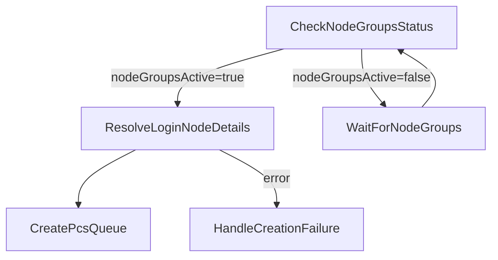
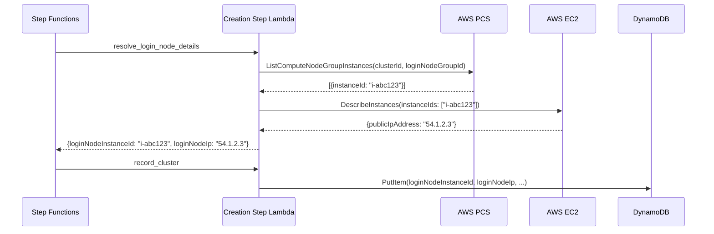
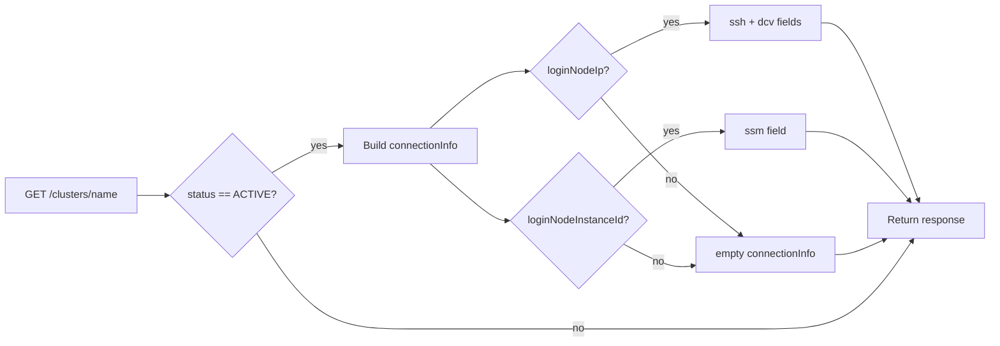

# Design Document: Cluster Connection UI

## Overview

This feature closes the gap between cluster creation and user connectivity. Today, the Step Functions creation workflow never extracts the login node's IP address or EC2 instance ID from PCS/EC2, so the DynamoDB record stores an empty `loginNodeIp` and no `loginNodeInstanceId`. The GET API computes `connectionInfo` from those empty fields, producing blank SSH and DCV strings. The frontend renders an empty "Connection Information" panel.

The fix spans four layers:

1. **Workflow** — Add a new step (`resolve_login_node_details`) that runs after node groups become ACTIVE. It calls PCS `ListComputeNodeGroupInstances` to get the login node's EC2 instance ID, then EC2 `DescribeInstances` to get its public IP. Both values flow into the state machine payload.
2. **DynamoDB record** — `record_cluster` stores `loginNodeInstanceId` alongside the existing `loginNodeIp`, `sshPort`, and `dcvPort`.
3. **API** — `_handle_get_cluster` builds `connectionInfo` with three fields: `ssh`, `dcv`, and the new `ssm` (an `aws ssm start-session` command).
4. **Frontend** — The cluster detail page renders all three connection methods with copy-to-clipboard buttons and a fallback message when connection details are unavailable.
5. **Notification** — The lifecycle email includes the SSM command alongside SSH and DCV.
6. **Documentation** — `docs/user/accessing-clusters.md` is updated with SSM instructions.

### Design Decisions

| Decision | Rationale |
|----------|-----------|
| New step rather than modifying `check_node_groups_status` | Separation of concerns — polling should not have side effects. The new step runs once after the poll loop exits. |
| PCS `ListComputeNodeGroupInstances` → EC2 `DescribeInstances` | PCS returns instance IDs but not public IPs. EC2 is the authoritative source for IP addresses. |
| Store `loginNodeInstanceId` in DynamoDB | The SSM command needs the instance ID, and re-querying PCS/EC2 on every GET would add latency and fragility. |
| `navigator.clipboard.writeText` with `select()` fallback | The Clipboard API is widely supported but requires secure context. The fallback handles edge cases. |
| No new Lambda function | The new step reuses the existing `hpc-cluster-creation-steps` Lambda via the step dispatcher pattern already in place. |

## Architecture

### State Machine Flow (Modified Section)

The change inserts a single step between the node-group-active check and the queue creation step:



### Data Flow



### API Response Flow



## Components and Interfaces

### 1. New Step Function: `resolve_login_node_details`

**File:** `lambda/cluster_operations/cluster_creation.py`

```python
def resolve_login_node_details(event: dict[str, Any]) -> dict[str, Any]:
    """Resolve the login node's EC2 instance ID and public IP.

    Called after node groups are ACTIVE. Queries PCS for the login
    node group instances, then EC2 for the public IP.

    Adds loginNodeInstanceId and loginNodeIp to the event.
    Raises InternalError if no instances found or EC2 call fails.
    """
```

**Input (from state machine payload):**
- `pcsClusterId` — PCS cluster identifier
- `loginNodeGroupId` — PCS login node group identifier
- `projectId`, `clusterName` — for progress tracking

**Output (merged into payload):**
- `loginNodeInstanceId` — e.g. `"i-0abc123def456"`
- `loginNodeIp` — e.g. `"54.123.45.67"`

**AWS API calls:**
1. `pcs_client.list_compute_node_group_instances(clusterIdentifier=..., computeNodeGroupIdentifier=...)` — returns list of `{instanceId}` objects
2. `ec2_client.describe_instances(InstanceIds=[instanceId])` — returns instance details including `PublicIpAddress`

**Error handling:**
- Empty instance list → `InternalError` (triggers rollback)
- EC2 API failure → `InternalError` (triggers rollback)
- No public IP on instance → `InternalError` (login nodes must be in public subnets)

### 2. Modified Step: `record_cluster`

**File:** `lambda/cluster_operations/cluster_creation.py`

Add `loginNodeInstanceId` to the DynamoDB record:

```python
cluster_record = {
    ...
    "loginNodeInstanceId": event.get("loginNodeInstanceId", ""),
    "loginNodeIp": event.get("loginNodeIp", ""),
    ...
}
```

Also update the notification message to include the SSM command when `loginNodeInstanceId` is present.

### 3. Modified API Handler: `_handle_get_cluster`

**File:** `lambda/cluster_operations/handler.py`

Extend the `connectionInfo` construction:

```python
if cluster.get("status") == "ACTIVE":
    login_ip = cluster.get("loginNodeIp", "")
    instance_id = cluster.get("loginNodeInstanceId", "")
    ssh_port = cluster.get("sshPort", 22)
    dcv_port = cluster.get("dcvPort", 8443)
    cluster["connectionInfo"] = {
        "ssh": f"ssh -p {ssh_port} <username>@{login_ip}" if login_ip else "",
        "dcv": f"https://{login_ip}:{dcv_port}" if login_ip else "",
        "ssm": f"aws ssm start-session --target {instance_id}" if instance_id else "",
    }
```

### 4. CDK State Machine Update

**File:** `lib/constructs/cluster-operations.ts`

- Add a new `LambdaInvoke` task `ResolveLoginNodeDetails` with step name `resolve_login_node_details`
- Insert it in the chain: `areNodeGroupsActive` → `ResolveLoginNodeDetails` → `createPcsQueue`
- Add catch handler routing to `failureChain`
- Add `pcs:ListComputeNodeGroupInstances` to the creation step Lambda's IAM policy (it already has `pcs:GetComputeNodeGroup` and related permissions)

### 5. Frontend: Connection Details Section

**File:** `frontend/js/app.js`

Replace the existing `connection-info` rendering block with a new implementation that:
- Renders three connection methods (SSH, DCV, SSM) with labels
- Adds copy-to-clipboard buttons for SSH and SSM commands
- Makes the DCV URL a clickable link
- Shows a fallback message when `connectionInfo` is empty or all fields are empty strings

**File:** `frontend/css/styles.css`

Add styles for:
- `.connection-method` — individual connection method row
- `.copy-btn` — copy-to-clipboard button
- `.copy-toast` — brief confirmation indicator

### 6. Documentation Update

**File:** `docs/user/accessing-clusters.md`

- Add "Connecting via SSM Session Manager" section with prerequisites and CLI command
- Update the example API response to include the `ssm` field
- Describe all three connection methods

## Data Models

### DynamoDB Cluster Record (Modified)

New field added to the existing cluster record:

| Field | Type | Description |
|-------|------|-------------|
| `loginNodeInstanceId` | String | EC2 instance ID of the login node (e.g. `"i-0abc123def456"`). Empty string if not yet resolved. |

Existing fields used (no schema change):

| Field | Type | Description |
|-------|------|-------------|
| `loginNodeIp` | String | Public IP of the login node. Already in schema but stored as empty string today. |
| `sshPort` | Number | SSH port (default 22). Already in schema. |
| `dcvPort` | Number | DCV port (default 8443). Already in schema. |

### API Response: `connectionInfo` Object (Modified)

```json
{
  "connectionInfo": {
    "ssh": "ssh -p 22 <username>@54.123.45.67",
    "dcv": "https://54.123.45.67:8443",
    "ssm": "aws ssm start-session --target i-0abc123def456"
  }
}
```

| Field | Type | Condition |
|-------|------|-----------|
| `ssh` | String | Non-empty when `loginNodeIp` is present |
| `dcv` | String | Non-empty when `loginNodeIp` is present |
| `ssm` | String | Non-empty when `loginNodeInstanceId` is present |

When all source fields are empty, `connectionInfo` is `{"ssh": "", "dcv": "", "ssm": ""}`.

### State Machine Payload (Modified)

New fields added after `resolve_login_node_details` step:

| Field | Type | Source |
|-------|------|--------|
| `loginNodeInstanceId` | String | PCS `ListComputeNodeGroupInstances` → first instance ID |
| `loginNodeIp` | String | EC2 `DescribeInstances` → `PublicIpAddress` |


## Correctness Properties

*A property is a characteristic or behavior that should hold true across all valid executions of a system — essentially, a formal statement about what the system should do. Properties serve as the bridge between human-readable specifications and machine-verifiable correctness guarantees.*

### Property 1: Connection info fields are correctly formatted for any valid inputs

*For any* valid combination of login node IP address (non-empty IPv4 string), EC2 instance ID (non-empty string matching `i-[a-f0-9]+`), SSH port (positive integer), and DCV port (positive integer), the constructed `connectionInfo` object SHALL satisfy all of:
- The `ssh` field equals `"ssh -p {sshPort} <username>@{loginNodeIp}"`
- The `dcv` field equals `"https://{loginNodeIp}:{dcvPort}"`
- The `ssm` field equals `"aws ssm start-session --target {loginNodeInstanceId}"`

And *for any* input where `loginNodeIp` is empty, the `ssh` and `dcv` fields SHALL be empty strings. *For any* input where `loginNodeInstanceId` is empty, the `ssm` field SHALL be an empty string.

**Validates: Requirements 3.1, 3.2, 3.3, 3.4**

### Property 2: Lifecycle notification contains all applicable connection strings

*For any* non-empty login node IP and non-empty instance ID, the cluster-ready notification message SHALL contain the SSH command (`ssh -p {sshPort} ... @{loginNodeIp}`), the DCV URL (`https://{loginNodeIp}:{dcvPort}`), and the SSM command (`aws ssm start-session --target {loginNodeInstanceId}`). When the IP is empty, the message SHALL NOT contain SSH or DCV connection strings. When the instance ID is empty, the message SHALL NOT contain the SSM command.

**Validates: Requirements 6.1, 6.2**

## Error Handling

### `resolve_login_node_details` Step

| Error Condition | Handling | Recovery |
|----------------|----------|----------|
| PCS `ListComputeNodeGroupInstances` returns empty list | Raise `InternalError` with descriptive message | State machine catch routes to `HandleCreationFailure` (rollback) |
| PCS `ListComputeNodeGroupInstances` API call fails (`ClientError`) | Raise `InternalError` wrapping the AWS error | Rollback via `HandleCreationFailure` |
| EC2 `DescribeInstances` API call fails (`ClientError`) | Raise `InternalError` wrapping the AWS error | Rollback via `HandleCreationFailure` |
| EC2 instance has no `PublicIpAddress` | Raise `InternalError` — login node must be in a public subnet | Rollback via `HandleCreationFailure` |

### API `connectionInfo` Construction

| Error Condition | Handling |
|----------------|----------|
| `loginNodeIp` is empty | `ssh` and `dcv` fields are empty strings |
| `loginNodeInstanceId` is empty | `ssm` field is empty string |
| Both fields empty | All three `connectionInfo` fields are empty strings |
| Cluster is not ACTIVE | `connectionInfo` is not included in response |

### Frontend Copy-to-Clipboard

| Error Condition | Handling |
|----------------|----------|
| `navigator.clipboard` unavailable (insecure context) | Fall back to selecting the text in the code element for manual Ctrl+C |
| `writeText()` promise rejects | Fall back to text selection |

## Testing Strategy

### Unit Tests (Example-Based)

**Backend — `resolve_login_node_details`:**
- Mock PCS `list_compute_node_group_instances` returning one instance → verify `loginNodeInstanceId` and `loginNodeIp` in output
- Mock PCS returning empty instance list → verify `InternalError` raised
- Mock EC2 `describe_instances` failure → verify `InternalError` raised
- Mock EC2 instance with no public IP → verify `InternalError` raised

**Backend — `record_cluster` (modified):**
- Verify `loginNodeInstanceId` is included in the DynamoDB `put_item` call
- Verify empty `loginNodeInstanceId` is stored as empty string
- Verify notification message includes SSM command when instance ID is present
- Verify notification message omits SSM when instance ID is empty

**Backend — `_handle_get_cluster` (modified):**
- ACTIVE cluster with IP and instance ID → verify all three `connectionInfo` fields populated
- ACTIVE cluster with empty IP and empty instance ID → verify all fields are empty strings
- Non-ACTIVE cluster → verify `connectionInfo` not in response

**Frontend:**
- Manual verification of connection details rendering for each method
- Manual verification of copy-to-clipboard behavior
- Manual verification of fallback message when connection info is empty

### Property-Based Tests

**Library:** [Hypothesis](https://hypothesis.readthedocs.io/) (Python, already in use in this project)

**Configuration:** Minimum 100 examples per property test.

**Property 1 test:** Generate random IPv4 addresses, instance IDs matching `i-[a-f0-9]{17}`, SSH ports (1-65535), and DCV ports (1-65535). Also generate cases where IP and/or instance ID are empty strings. Call the `connectionInfo` construction logic and verify the output matches the expected format.
- Tag: `Feature: cluster-connection-ui, Property 1: Connection info fields are correctly formatted for any valid inputs`

**Property 2 test:** Generate random connection details (IP, instance ID, ports) including empty-string cases. Call the notification message builder and verify the message contains (or omits) the expected connection strings.
- Tag: `Feature: cluster-connection-ui, Property 2: Lifecycle notification contains all applicable connection strings`

### Integration Tests

- Deploy the CDK stack and verify the state machine definition includes the `ResolveLoginNodeDetails` step
- End-to-end cluster creation verifying that `loginNodeInstanceId` and `loginNodeIp` are populated in the DynamoDB record
- GET API call on an ACTIVE cluster verifying all three `connectionInfo` fields are present
