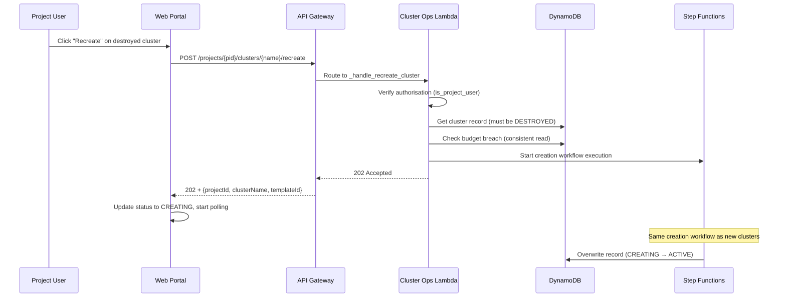
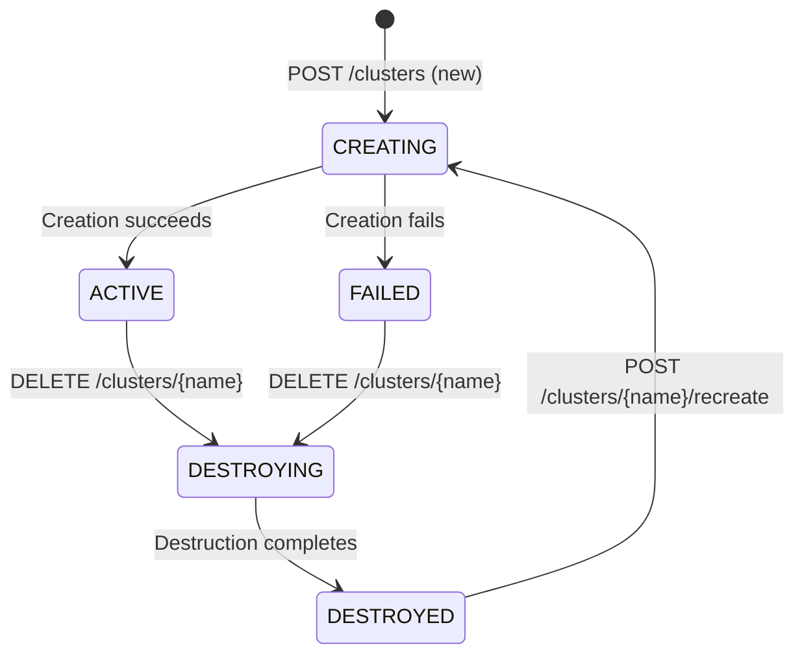

# Design Document: Cluster Recreation

## Overview

This design adds a dedicated "recreate" action for clusters in DESTROYED status. Currently, when a cluster is destroyed, its DynamoDB record transitions to DESTROYED and the underlying AWS resources (PCS cluster, FSx filesystem, node groups) are deleted. The cluster name remains registered in the ClusterNameRegistry for the same project, and persistent storage (EFS home directories, S3 bucket) is preserved. However, there is no way to re-create a destroyed cluster — users must create a brand-new cluster with a different name or manually reuse the name via the standard creation flow without any awareness of the previous cluster's configuration.

This feature introduces a `POST /projects/{projectId}/clusters/{clusterName}/recreate` endpoint that reuses the original cluster name and template configuration (with optional override), runs the same Step Functions creation workflow, and produces a fresh set of AWS resources. The destroyed cluster record is overwritten by the new CREATING record, making the process seamless for users who want to spin up the same environment again.

### Key Design Decisions

1. **Reuse the existing Creation_Workflow** — Recreation starts the same Step Functions state machine as new cluster creation. No new state machine is needed. The creation workflow already handles name registration (which is idempotent for same-project reuse), budget checks, FSx creation, PCS provisioning, and DynamoDB recording.
2. **Overwrite the DESTROYED record** — The creation workflow's `record_cluster` step uses `put_item`, which overwrites the existing DESTROYED record with a new CREATING/ACTIVE record. No special DynamoDB logic is needed.
3. **ClusterNameRegistry is already compatible** — The `register_cluster_name` function uses a conditional put that succeeds when the name is already registered to the same project (`attribute_not_exists(PK) OR projectId = :pid`). Recreation does not need to deregister the name first.
4. **Optional template override** — The recreate endpoint accepts an optional `templateId` in the request body. If omitted, it falls back to the `templateId` stored in the destroyed cluster record. This lets users upgrade to a different template without changing the cluster name.
5. **Same authorisation and budget enforcement** — Recreation uses the same `is_project_user` check and `check_budget_breach` call as cluster creation, keeping the security model consistent.

## Architecture

### Request Flow



### Cluster Status Lifecycle (Updated)



## Components and Interfaces

### 1. Cluster Operations Lambda — New Route

A new route is added to `lambda/cluster_operations/handler.py`:

#### POST /projects/{projectId}/clusters/{clusterName}/recreate (New)

Initiates recreation of a destroyed cluster.

```python
def _handle_recreate_cluster(
    event: dict[str, Any], project_id: str, cluster_name: str
) -> dict[str, Any]:
    """Handle POST /projects/{projectId}/clusters/{clusterName}/recreate.

    1. Verify caller is a project member (is_project_user)
    2. Retrieve the existing cluster record
    3. Verify cluster status is DESTROYED (else 409 Conflict)
    4. Resolve templateId: use request body override, or fall back to stored value
    5. Check project budget breach (else 403 Budget Exceeded)
    6. Start the creation Step Functions execution with the same payload
       format as new cluster creation
    7. Return 202 Accepted
    """
```

**Request body (optional):**
```json
{
  "templateId": "gpu-basic"
}
```

If `templateId` is omitted or empty, the endpoint uses the `templateId` from the destroyed cluster record.

**Response (202 Accepted):**
```json
{
  "message": "Cluster 'genomics-run-42' recreation started.",
  "projectId": "genomics-team",
  "clusterName": "genomics-run-42",
  "templateId": "cpu-general"
}
```

**Error cases:**

| Scenario | Error Code | HTTP Status |
|----------|-----------|-------------|
| Cluster does not exist | `NOT_FOUND` | 404 |
| Cluster not in DESTROYED status | `CONFLICT` | 409 |
| Project budget breached | `BUDGET_EXCEEDED` | 403 |
| Caller not a project member | `AUTHORISATION_ERROR` | 403 |

### 2. Handler Routing Update

The handler's routing block in `handler.py` gains a new resource match:

```python
elif (
    resource == "/projects/{projectId}/clusters/{clusterName}/recreate"
    and http_method == "POST"
):
    project_id = path_parameters.get("projectId", "")
    cluster_name = path_parameters.get("clusterName", "")
    response = _handle_recreate_cluster(event, project_id, cluster_name)
```

### 3. Creation Workflow Compatibility

The existing creation workflow (`cluster_creation.py`) requires no changes. The recreation endpoint passes the same payload shape:

```python
payload = {
    "projectId": project_id,
    "clusterName": cluster_name,
    "templateId": template_id,
    "createdBy": caller,
}
```

The workflow steps handle recreation naturally:
- **Step 1 (validate_and_register_name):** The `register_cluster_name` function succeeds because the name is already registered to the same project (conditional put: `attribute_not_exists(PK) OR projectId = :pid`).
- **Step 2 (check_budget_breach):** Same budget check as new creation.
- **Steps 3-9:** Create fresh AWS resources (FSx, PCS cluster, node groups, queue, tags).
- **Step 10 (record_cluster):** Uses `put_item` which overwrites the DESTROYED record with the new ACTIVE record.
- **Step 11 (handle_creation_failure):** Uses `put_item` which overwrites with FAILED status, same as new creation.

### 4. Web Portal Changes

#### 4.1 Cluster List — Recreate Button

The `loadClusters()` function in `frontend/js/app.js` is modified to show a "Recreate" button for DESTROYED clusters:

```javascript
// In the cluster row rendering:
if (c.status === 'DESTROYED') {
  actionsHtml = budgetBreached
    ? ''  // No button when budget is breached
    : `<button class="btn btn-primary btn-sm"
         onclick="recreateCluster('${esc(projectId)}','${esc(c.clusterName)}')">
         Recreate
       </button>`;
}
```

The budget breach status is checked by reading the project's `budgetBreached` flag from the project context or a lightweight project status check.

#### 4.2 Recreate Function

A new `recreateCluster()` function:

```javascript
async function recreateCluster(projectId, clusterName) {
  if (!confirm(`Recreate cluster '${clusterName}'? This will provision new resources using the original template.`)) return;
  try {
    await apiCall('POST',
      `/projects/${encodeURIComponent(projectId)}/clusters/${encodeURIComponent(clusterName)}/recreate`
    );
    showToast(`Cluster '${clusterName}' recreation started`);
    loadClusters(projectId);
  } catch (e) { showToast(e.message, 'error'); }
}
```

#### 4.3 Cluster Detail Page — Recreate Button

The `loadClusterDetail()` function is modified to show a "Recreate" button for DESTROYED clusters, alongside the existing info message:

```javascript
if (cluster.status === 'DESTROYED') {
  html += `<div style="margin-top:1rem">
    <button class="btn btn-primary" onclick="recreateCluster('${esc(projectId)}','${esc(clusterName)}')">
      Recreate Cluster
    </button>
  </div>`;
}
```

### 5. CDK Infrastructure Changes

#### 5.1 API Gateway Route

A new route is added to the API Gateway REST API in `lib/foundation-stack.ts`:

```typescript
// Under the existing {clusterName} resource:
const recreateResource = clusterNameResource.addResource('recreate');
recreateResource.addMethod('POST', clusterOpsIntegration, {
  authorizer: cognitoAuthorizer,
  authorizationType: apigateway.AuthorizationType.COGNITO,
});
```

No new Lambda functions or permissions are needed — the existing cluster operations Lambda already has all required permissions (DynamoDB read/write, Step Functions start execution).

### 6. Documentation Updates

#### 6.1 Cluster Management Docs (`docs/project-admin/cluster-management.md`)

Add a new "Recreating a Cluster" section covering:
- The recreate endpoint, request/response format, and error cases
- The optional template override
- The updated cluster status lifecycle diagram showing DESTROYED → CREATING

#### 6.2 API Reference (`docs/api/reference.md`)

Add the `POST /projects/{projectId}/clusters/{clusterName}/recreate` endpoint with full request/response schemas and error codes.

## Data Models

### No Schema Changes Required

The cluster recreation feature does not add any new fields to the DynamoDB schema. The existing Clusters table record structure supports recreation because:

1. **The creation workflow uses `put_item`** — This overwrites the entire record, replacing the DESTROYED record with a fresh CREATING record containing all the standard fields (clusterName, projectId, templateId, createdBy, createdAt, status, progress fields, resource IDs).

2. **The ClusterNameRegistry already supports same-project reuse** — The conditional put expression `attribute_not_exists(PK) OR projectId = :pid` allows re-registration within the same project.

### Cluster Record Lifecycle During Recreation

```
Before recreation:
{
  PK: "PROJECT#genomics-team",
  SK: "CLUSTER#genomics-run-42",
  clusterName: "genomics-run-42",
  projectId: "genomics-team",
  templateId: "cpu-general",
  status: "DESTROYED",
  destroyedAt: "2025-01-20T10:00:00Z",
  createdBy: "jsmith",
  createdAt: "2025-01-15T14:00:00Z",
  ...resource IDs from previous incarnation...
}

After recreation starts (Step 1 progress update):
{
  PK: "PROJECT#genomics-team",
  SK: "CLUSTER#genomics-run-42",
  clusterName: "genomics-run-42",
  projectId: "genomics-team",
  status: "CREATING",
  currentStep: 1,
  totalSteps: 10,
  stepDescription: "Registering cluster name",
  ...
}

After recreation completes (Step 10 record_cluster):
{
  PK: "PROJECT#genomics-team",
  SK: "CLUSTER#genomics-run-42",
  clusterName: "genomics-run-42",
  projectId: "genomics-team",
  templateId: "cpu-general",
  status: "ACTIVE",
  createdBy: "jsmith",          ← user who triggered recreation
  createdAt: "2025-01-21T09:00:00Z",  ← new timestamp
  pcsClusterId: "pcs-456",     ← new resource IDs
  fsxFilesystemId: "fs-789",
  loginNodeIp: "54.200.1.2",
  ...
}
```


## Correctness Properties

*A property is a characteristic or behavior that should hold true across all valid executions of a system — essentially, a formal statement about what the system should do. Properties serve as the bridge between human-readable specifications and machine-verifiable correctness guarantees.*

### Property 1: Template resolution uses override when provided, stored value otherwise

*For any* destroyed cluster record with a stored templateId, and any recreation request: if the request body contains a non-empty templateId, the response and Step Functions payload SHALL use the request body templateId; if the request body omits templateId or provides an empty value, the response and Step Functions payload SHALL use the templateId from the destroyed cluster record.

**Validates: Requirements 1.2, 1.3**

### Property 2: Non-DESTROYED cluster status rejects recreation

*For any* cluster record whose status is not DESTROYED (i.e. CREATING, ACTIVE, FAILED, or DESTROYING), a recreation request SHALL be rejected with HTTP 409 Conflict and error code CONFLICT.

**Validates: Requirements 2.3**

### Property 3: Budget breach blocks cluster recreation

*For any* project whose budget has been breached, a recreation request for a DESTROYED cluster in that project SHALL be rejected with HTTP 403 Forbidden and error code BUDGET_EXCEEDED.

**Validates: Requirements 3.2**

### Property 4: Unauthorised caller cannot recreate clusters

*For any* caller who is not a Project_User, Project_Administrator, or Administrator for the specified project, a recreation request SHALL be rejected with HTTP 403 Forbidden and error code AUTHORISATION_ERROR.

**Validates: Requirements 4.1, 4.2**

## Error Handling

### API-Level Errors

The recreate endpoint uses the same structured error response format as all other cluster operations endpoints, via `build_error_response()`:

| Error Condition | Error Class | HTTP Status | Error Code |
|----------------|-------------|-------------|------------|
| Caller not a project member | `AuthorisationError` | 403 | `AUTHORISATION_ERROR` |
| Cluster record not found | `NotFoundError` | 404 | `NOT_FOUND` |
| Cluster not in DESTROYED status | `ConflictError` | 409 | `CONFLICT` |
| Project budget breached | `BudgetExceededError` | 403 | `BUDGET_EXCEEDED` |
| Request body is invalid JSON | `ValidationError` | 400 | `VALIDATION_ERROR` |
| Step Functions start_execution fails | `InternalError` | 500 | `INTERNAL_ERROR` |

### Error Ordering

The handler checks conditions in this order, matching the existing cluster creation pattern:
1. **Authorisation** — reject unauthorised callers first
2. **Cluster existence** — retrieve the cluster record (404 if missing)
3. **Status validation** — verify DESTROYED status (409 if not)
4. **Budget check** — verify budget is not breached (403 if breached)
5. **Start workflow** — start Step Functions execution (500 on failure)

### Workflow-Level Errors

The creation workflow's existing error handling applies unchanged:
- If any step fails, the `handle_creation_failure` catch handler runs
- Partially created resources (FSx, PCS cluster, node groups, queue) are cleaned up in reverse order
- The cluster record is set to FAILED status with the error message
- The creating user receives an email notification about the failure

## Testing Strategy

### Property-Based Tests (Hypothesis)

Property-based tests validate the four correctness properties using the Hypothesis library, following the existing pattern in `test/lambda/test_property_*.py`. Each test:
- Uses `@mock_aws` to create isolated DynamoDB tables per example
- Generates random inputs via Hypothesis strategies
- Runs a minimum of 50 examples (matching existing test configuration)
- Tags the property it validates with a comment

**Library:** Hypothesis (already in use — see `test/lambda/test_property_cluster_names.py`)

| Property | Test File | Strategy |
|----------|-----------|----------|
| 1: Template resolution | `test_property_cluster_recreation.py` | Generate random stored templateId and optional override templateId; verify response uses the correct one |
| 2: Non-DESTROYED rejection | `test_property_cluster_recreation.py` | Generate random non-DESTROYED statuses; verify 409 |
| 3: Budget breach blocks | `test_property_cluster_recreation.py` | Generate random project/cluster with breached budget; verify 403 |
| 4: Unauthorised rejection | `test_property_cluster_recreation.py` | Generate random callers without project membership; verify 403 |

### Unit Tests

Unit tests cover specific examples, edge cases, and integration points:

| Test | Description |
|------|-------------|
| Successful recreation with stored template | Happy path: DESTROYED cluster, no budget breach, authorised user |
| Successful recreation with template override | Override templateId in request body |
| Recreation with empty request body | No body at all — should use stored templateId |
| Recreation with empty templateId in body | `{"templateId": ""}` — should fall back to stored |
| Non-existent cluster returns 404 | Cluster record does not exist |
| ACTIVE cluster returns 409 | Specific status example |
| CREATING cluster returns 409 | Specific status example |
| FAILED cluster returns 409 | Specific status example |
| Budget breached returns 403 | Specific budget breach example |
| Unauthorised user returns 403 | User not in project groups |
| Admin can recreate | Platform Administrator has access |
| Project Admin can recreate | Project Administrator has access |

### CDK Tests

Snapshot/assertion tests in `test/self-service-hpc.test.ts` verify:
- The new API Gateway route `POST /projects/{projectId}/clusters/{clusterName}/recreate` is synthesised
- The route uses the Cognito authoriser
- The route integrates with the existing cluster operations Lambda

### Manual/Integration Tests

- End-to-end recreation flow via the web portal
- Verify the "Recreate" button appears for DESTROYED clusters
- Verify the "Recreate" button is hidden when budget is breached
- Verify polling and status transitions work correctly after recreation
