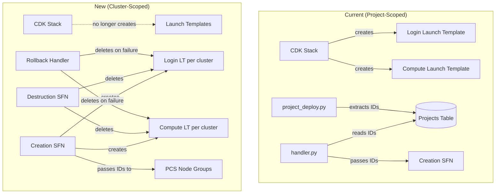
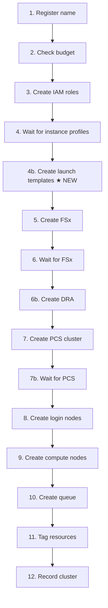
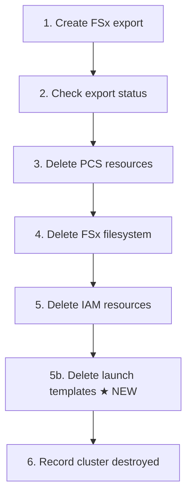

# Design Document: Cluster-Scoped Launch Templates

## Overview

This feature migrates EC2 launch templates from project-scoped resources (created statically in the CDK infrastructure stack) to cluster-scoped resources (created dynamically during cluster creation). Currently, two launch templates (login and compute) are defined in `ProjectInfrastructureStack`, extracted during project deployment, stored in the Projects DynamoDB table, and passed through the cluster handler to the creation workflow. After this change, launch templates will be created and destroyed alongside other per-cluster resources (IAM roles, PCS clusters, FSx filesystems), following the same pattern already established for instance profiles.

Each launch template currently contains only a security group reference. The security groups themselves remain in the CDK stack — only the launch template wrapper moves to runtime creation.

### Key Design Decisions

1. **Naming convention**: `hpc-{projectId}-{clusterName}-login` and `hpc-{projectId}-{clusterName}-compute` — deterministic names derived from project and cluster identifiers, matching the existing IAM role naming pattern (`AWSPCS-{projectId}-{clusterName}-login/compute`). This enables lookup-by-name for deletion without storing template IDs.

2. **Name-based deletion**: Launch templates are deleted by name (via `describe_launch_templates` + `delete_launch_template`) rather than by stored ID. This avoids needing to persist template IDs in DynamoDB and simplifies rollback cleanup where the template ID may not have been captured.

3. **Step ordering**: Launch template creation runs after IAM resource creation and instance profile propagation, but before PCS node group creation (which references the templates). Destruction runs after PCS resource deletion but before the DynamoDB record update.

## Architecture



### Cluster Creation Workflow (updated steps)



### Cluster Destruction Workflow (updated steps)



## Components and Interfaces

### 1. `lib/project-infrastructure-stack.ts` — Remove launch templates

**Changes:**
- Remove `loginLaunchTemplate` and `computeLaunchTemplate` L2 construct declarations
- Remove corresponding `CfnOutput` entries (`LoginLaunchTemplateId`, `ComputeLaunchTemplateId`)
- Remove public properties from the class

**No changes to:** VPC, security groups, EFS, S3, CloudWatch log group, or any other outputs.

### 2. `lambda/project_management/project_deploy.py` — Remove template extraction

**Changes in `extract_stack_outputs`:**
- Remove extraction of `LoginLaunchTemplateId` and `ComputeLaunchTemplateId` from `output_map`
- Remove those keys from the returned event dict

**Changes in `record_infrastructure`:**
- Remove `loginLaunchTemplateId` and `computeLaunchTemplateId` from the DynamoDB `UpdateExpression`

### 3. `lambda/cluster_operations/handler.py` — Remove template ID passthrough

**Changes in `_lookup_project_infrastructure`:**
- Remove `loginLaunchTemplateId` and `computeLaunchTemplateId` from the returned dict

**Changes in `_handle_create_cluster` and `_handle_recreate_cluster`:**
- Remove `loginLaunchTemplateId` and `computeLaunchTemplateId` from the SFN execution payload

### 4. `lambda/cluster_operations/cluster_creation.py` — Create launch templates

**New function: `create_launch_templates(event) -> event`**

Creates two EC2 launch templates using `ec2_client.create_launch_template()`:

| Parameter | Login Template | Compute Template |
|---|---|---|
| Name | `hpc-{projectId}-{clusterName}-login` | `hpc-{projectId}-{clusterName}-compute` |
| Security Group | `securityGroupIds["headNode"]` | `securityGroupIds["computeNode"]` |
| Tags | `build_resource_tags(projectId, clusterName)` | Same |

Returns the event with `loginLaunchTemplateId` and `computeLaunchTemplateId` added.

On `ClientError`, raises `InternalError` with a descriptive message.

**Changes to `handle_creation_failure`:**
- Add launch template cleanup (best-effort, by name) between IAM cleanup and PCS cleanup
- New helper `_cleanup_launch_template(template_name: str) -> str` — deletes by name, catches not-found errors

**New step in `_STEP_DISPATCH`:** `"create_launch_templates": create_launch_templates`

### 5. `lambda/cluster_operations/cluster_destruction.py` — Delete launch templates

**New function: `delete_launch_templates(event) -> event`**

Deletes both launch templates by name using `ec2_client.describe_launch_templates()` to resolve the name to an ID, then `ec2_client.delete_launch_template()`. If the template doesn't exist, logs a warning and continues.

**New step in `_STEP_DISPATCH`:** `"delete_launch_templates": delete_launch_templates`

Adds `launchTemplateCleanupResults` to the returned event.

### 6. EC2 Client Addition

Both `cluster_creation.py` and `cluster_destruction.py` need an `ec2_client = boto3.client("ec2")` added to their AWS clients section.

## Data Models

### Launch Template Naming Convention

```
hpc-{projectId}-{clusterName}-login
hpc-{projectId}-{clusterName}-compute
```

Deterministic — no need to store template IDs in DynamoDB. Templates can be looked up or deleted by name.

### Projects Table — Fields Removed

The following fields are removed from the Projects DynamoDB table records:
- `loginLaunchTemplateId` (string)
- `computeLaunchTemplateId` (string)

### Event Payload Changes

**Cluster creation SFN input** — fields removed:
- `loginLaunchTemplateId` (no longer passed from handler)
- `computeLaunchTemplateId` (no longer passed from handler)

These fields are now set dynamically by the `create_launch_templates` step within the workflow.

### CloudFormation Stack Outputs — Removed

- `LoginLaunchTemplateId`
- `ComputeLaunchTemplateId`

## Correctness Properties

*A property is a characteristic or behavior that should hold true across all valid executions of a system — essentially, a formal statement about what the system should do. Properties serve as the bridge between human-readable specifications and machine-verifiable correctness guarantees.*

### Property 1: Launch template creation produces correctly named and configured templates

*For any* valid projectId and clusterName, calling the launch template creation function SHALL produce two EC2 `create_launch_template` calls: one with name `hpc-{projectId}-{clusterName}-login` using the headNode security group, and one with name `hpc-{projectId}-{clusterName}-compute` using the computeNode security group, both tagged with the correct Project and ClusterName tags.

**Validates: Requirements 4.1, 4.2, 4.5**

### Property 2: Launch template destruction targets correctly named templates

*For any* valid projectId and clusterName, calling the launch template destruction function SHALL attempt to delete templates named `hpc-{projectId}-{clusterName}-login` and `hpc-{projectId}-{clusterName}-compute`.

**Validates: Requirements 5.1, 5.2**

### Property 3: Rollback cleanup targets correctly named launch templates

*For any* valid projectId and clusterName, the creation rollback handler SHALL attempt to delete templates named `hpc-{projectId}-{clusterName}-login` and `hpc-{projectId}-{clusterName}-compute`.

**Validates: Requirements 6.1**

## Error Handling

| Scenario | Behaviour |
|---|---|
| `create_launch_template` fails with `ClientError` | Raise `InternalError` with descriptive message; SFN triggers rollback |
| Template not found during destruction | Log warning, continue — best-effort cleanup |
| Template not found during rollback | Log warning, continue — best-effort cleanup |
| Template already exists (name collision) | `ClientError` with `InvalidLaunchTemplateName.AlreadyExistsException` — raise `InternalError`; indicates a previous failed cleanup |

## Testing Strategy

### Property-Based Tests (Hypothesis, min 100 examples)

Three property tests corresponding to the correctness properties above. Each generates random `projectId` and `clusterName` strings and verifies the EC2 API calls use the correct naming convention, security groups, and tags via mocked boto3 clients.

Library: **Hypothesis** (already used in the project — see `.hypothesis/` directory and existing `test_property_*.py` files)

Configuration: `@given(...)` with `@settings(max_examples=100)`

Tag format: `Feature: cluster-scoped-launch-templates, Property {N}: {title}`

### Unit Tests (pytest)

- CDK stack no longer contains launch template resources or outputs (CDK assertions)
- `extract_stack_outputs` no longer returns template IDs
- `record_infrastructure` no longer writes template IDs to DynamoDB
- `_lookup_project_infrastructure` no longer returns template IDs
- SFN payload no longer contains template IDs
- `create_launch_templates` raises `InternalError` on EC2 failure
- Destruction gracefully handles missing templates
- Rollback gracefully handles missing templates
- Step ordering: launch template creation before node groups, deletion after PCS resources
- Regression: all other creation/destruction behaviour unchanged
