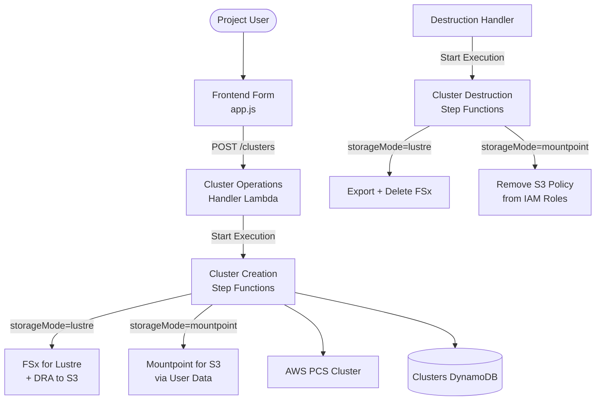
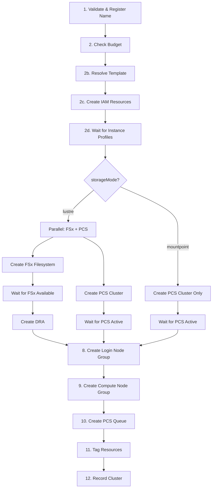
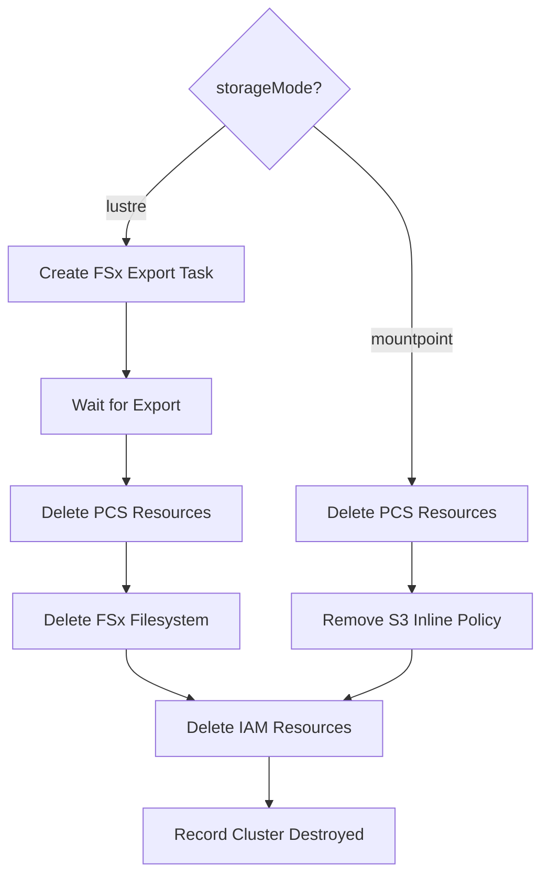

# Design Document: Cluster Storage Configuration

## Overview

This feature extends the cluster creation workflow to support configurable storage modes and compute node scaling overrides. Currently, every cluster unconditionally provisions an FSx for Lustre filesystem (1.2 TiB, SCRATCH_2, LZ4 compression) with a Data Repository Association (DRA) to the project S3 bucket, and compute scaling is fixed to template-defined values.

After this change, users can:
1. Choose between FSx for Lustre (`lustre`) or Mountpoint for Amazon S3 (`mountpoint`) as the project data access layer.
2. Specify FSx for Lustre storage capacity in 1200 GiB increments when using Lustre mode.
3. Override the template's default `minNodes` and `maxNodes` for the compute node group.

The design touches five layers: the frontend form, the API handler, the Step Functions workflow, the cluster destruction workflow, and the DynamoDB cluster record schema.

### Key Design Decisions

1. **Both API and UI default to `mountpoint`.** When `storageMode` is omitted from the API request or the UI form, the default is `mountpoint`. This is the lower-cost, faster-provisioning option that suits most users. Backward compatibility with existing API consumers is not a concern for this feature.

2. **Mountpoint for S3 is installed via user data script.** Rather than baking Mountpoint into a custom AMI, the user data script installs and mounts it at boot time. This keeps the AMI generic and avoids a hard dependency on AMI updates when Mountpoint versions change.

3. **Conditional branching in Step Functions.** The FSx creation, polling, and DRA steps are wrapped in a Choice state that checks `storageMode`. When `mountpoint` is selected, the workflow skips directly to PCS cluster creation, reducing provisioning time by ~5–10 minutes.

4. **Node scaling overrides are pass-through.** The handler validates and passes `minNodes`/`maxNodes` into the Step Functions payload. The `resolve_template` step merges template defaults only for fields not already present in the payload, preserving user overrides.

## Architecture

### System Context



### Modified Creation Workflow

The existing 12-step workflow is modified with conditional branching at the FSx steps:



### Modified Destruction Workflow



## Components and Interfaces

### 1. Frontend Form (`frontend/js/app.js`)

**Changes to `renderClustersPage`:**

The cluster creation form gains three new controls:

| Control | Type | Default | Visibility |
|---------|------|---------|------------|
| Storage Mode | Radio group (`mountpoint` / `lustre`) | `mountpoint` | Always visible |
| Lustre Capacity (GiB) | Number input (step=1200, min=1200) | 1200 | Only when `storageMode === 'lustre'` |
| Min Nodes | Number input (min=0) | Template default | Always visible (after template selection) |
| Max Nodes | Number input (min=1) | Template default | Always visible (after template selection) |

When the user selects a template, the `minNodes` and `maxNodes` fields are pre-populated from the template preview data. The user can then override these values.

The submit handler sends:
```javascript
{
  clusterName: "...",
  templateId: "...",
  storageMode: "mountpoint" | "lustre",
  lustreCapacityGiB: 1200,    // only when storageMode === "lustre"
  minNodes: 0,                 // optional override
  maxNodes: 10                 // optional override
}
```

### 2. Cluster Operations Handler (`lambda/cluster_operations/handler.py`)

**`_handle_create_cluster` modifications:**

New validation logic after existing `clusterName`/`templateId` validation:

```python
# Storage mode validation
storage_mode = body.get("storageMode", "mountpoint")  # API default
if storage_mode not in ("lustre", "mountpoint"):
    raise ValidationError(
        f"Invalid storageMode '{storage_mode}'. Must be 'lustre' or 'mountpoint'.",
        {"field": "storageMode"},
    )

# Lustre capacity validation (only when lustre mode)
lustre_capacity_gib = body.get("lustreCapacityGiB", 1200)
if storage_mode == "lustre":
    if not isinstance(lustre_capacity_gib, int) or lustre_capacity_gib < 1200:
        raise ValidationError(...)
    if lustre_capacity_gib % 1200 != 0:
        raise ValidationError(...)

# Node scaling overrides
min_nodes = body.get("minNodes")
max_nodes = body.get("maxNodes")
# Validate if provided (None means "use template default")
```

The Step Functions payload is extended with:
```python
payload = {
    ...existing fields...,
    "storageMode": storage_mode,
    "lustreCapacityGiB": lustre_capacity_gib if storage_mode == "lustre" else None,
    "minNodes": min_nodes,      # None if not provided
    "maxNodes": max_nodes,      # None if not provided
}
```

**`_handle_recreate_cluster` modifications:**

Accepts optional `storageMode`, `lustreCapacityGiB`, `minNodes`, `maxNodes` in the request body. Falls back to the destroyed cluster record's `storageMode` when omitted.

### 3. Cluster Creation Workflow (`lambda/cluster_operations/cluster_creation.py`)

**`resolve_template` modifications:**

The function must preserve user-provided overrides. Currently it unconditionally overwrites `minNodes`/`maxNodes` from the template. The fix:

```python
def resolve_template(event):
    ...
    # Only set from template if not already in the event (user override)
    result = {**event}
    if "minNodes" not in event or event["minNodes"] is None:
        result["minNodes"] = item.get("minNodes", 0)
    if "maxNodes" not in event or event["maxNodes"] is None:
        result["maxNodes"] = item.get("maxNodes", 10)
    # storageMode and lustreCapacityGiB pass through unchanged
    return result
```

**`create_fsx_filesystem` modifications:**

Uses `event["lustreCapacityGiB"]` instead of hardcoded `1200`:
```python
StorageCapacity=event.get("lustreCapacityGiB", 1200),
```

**New function: `configure_mountpoint_s3_iam`**

When `storageMode == "mountpoint"`, attaches an inline IAM policy to both login and compute roles granting S3 access to the project bucket:

```python
def configure_mountpoint_s3_iam(event):
    s3_bucket_name = event["s3BucketName"]
    policy_document = {
        "Version": "2012-10-17",
        "Statement": [{
            "Effect": "Allow",
            "Action": [
                "s3:GetObject", "s3:PutObject", "s3:DeleteObject",
                "s3:ListBucket", "s3:GetBucketLocation"
            ],
            "Resource": [
                f"arn:aws:s3:::{s3_bucket_name}",
                f"arn:aws:s3:::{s3_bucket_name}/*"
            ]
        }]
    }
    # Attach to both login and compute roles
    for role_name in [login_role_name, compute_role_name]:
        iam_client.put_role_policy(
            RoleName=role_name,
            PolicyName="MountpointS3Access",
            PolicyDocument=json.dumps(policy_document),
        )
```

**User data script modifications (`posix_provisioning.py`):**

A new function generates Mountpoint for S3 mount commands:

```python
def generate_mountpoint_s3_commands(s3_bucket_name: str, mount_path: str = "/data") -> list[str]:
    """Generate bash commands to install and mount S3 via Mountpoint."""
    return [
        "# --- Mount project S3 bucket via Mountpoint for Amazon S3 ---",
        "yum install -y mountpoint-s3 || apt-get install -y mountpoint-s3",
        f"mkdir -p {mount_path}",
        f"mount-s3 {s3_bucket_name} {mount_path} --allow-delete --allow-overwrite",
        f"echo 'mount-s3 {s3_bucket_name} {mount_path} --allow-delete --allow-overwrite' >> /etc/rc.local",
        "chmod +x /etc/rc.local",
    ]
```

A corresponding function generates FSx for Lustre mount commands:

```python
def generate_fsx_lustre_mount_commands(
    fsx_dns_name: str, fsx_mount_name: str, mount_path: str = "/data"
) -> list[str]:
    """Generate bash commands to mount FSx for Lustre."""
    return [
        "# --- Mount FSx for Lustre filesystem ---",
        "amazon-linux-extras install -y lustre || yum install -y lustre-client",
        f"mkdir -p {mount_path}",
        f"mount -t lustre {fsx_dns_name}@tcp:/{fsx_mount_name} {mount_path}",
        f"echo '{fsx_dns_name}@tcp:/{fsx_mount_name} {mount_path} lustre defaults,noatime,flock,_netdev 0 0' >> /etc/fstab",
    ]
```

### 4. Step Functions State Machine (`lib/constructs/cluster-operations.ts`)

The CDK construct is modified to add a Choice state after the instance profile wait loop:

```typescript
const storageChoice = new sfn.Choice(this, 'StorageModeChoice')
  .when(
    sfn.Condition.stringEquals('$.storageMode', 'mountpoint'),
    // Skip FSx, go directly to PCS-only branch
    createPcsClusterOnly
  )
  .otherwise(
    // Existing parallel FSx + PCS branch
    parallelFsxAndPcs
  );
```

The `resultSelector` on the parallel state is updated to conditionally include FSx fields. For the mountpoint path, FSx fields are set to empty strings.

### 5. Cluster Destruction Workflow (`lambda/cluster_operations/cluster_destruction.py`)

**`create_fsx_export_task` modifications:**

Already handles missing `fsxFilesystemId` gracefully (returns `exportSkipped: True`). For `mountpoint` clusters, `fsxFilesystemId` will be empty, so the existing skip logic works.

**New function: `remove_mountpoint_s3_policy`**

Before deleting IAM roles, removes the `MountpointS3Access` inline policy:

```python
def remove_mountpoint_s3_policy(event):
    """Remove the Mountpoint S3 inline policy from login and compute roles."""
    for role_suffix in ["login", "compute"]:
        role_name = f"AWSPCS-{event['projectId']}-{event['clusterName']}-{role_suffix}"
        try:
            iam_client.delete_role_policy(
                RoleName=role_name,
                PolicyName="MountpointS3Access",
            )
        except ClientError as exc:
            if exc.response["Error"]["Code"] != "NoSuchEntity":
                logger.warning("Failed to remove S3 policy from %s: %s", role_name, exc)
```

### 6. Cluster Record Schema (DynamoDB)

The Clusters table record gains new fields:

| Field | Type | Description |
|-------|------|-------------|
| `storageMode` | String | `"lustre"` or `"mountpoint"` |
| `lustreCapacityGiB` | Number | FSx capacity in GiB (only when `storageMode == "lustre"`) |
| `minNodes` | Number | Effective min compute nodes (template or override) |
| `maxNodes` | Number | Effective max compute nodes (template or override) |

The `record_cluster` step is updated to persist these fields. The `_handle_get_cluster` response includes them.

## Data Models

### Cluster Creation Request (Extended)

```json
{
  "clusterName": "genomics-run-42",
  "templateId": "cpu-general",
  "storageMode": "mountpoint",
  "lustreCapacityGiB": 2400,
  "minNodes": 2,
  "maxNodes": 20
}
```

| Field | Type | Required | Default | Validation |
|-------|------|----------|---------|------------|
| `clusterName` | string | Yes | — | Non-empty, alphanumeric/hyphens/underscores |
| `templateId` | string | Yes | — | Must exist in ClusterTemplates table |
| `storageMode` | string | No | `"mountpoint"` | Must be `"lustre"` or `"mountpoint"` |
| `lustreCapacityGiB` | integer | No | `1200` | ≥ 1200, multiple of 1200; ignored when `storageMode != "lustre"` |
| `minNodes` | integer | No | Template value | ≥ 0; must be ≤ `maxNodes` |
| `maxNodes` | integer | No | Template value | ≥ 1; must be ≥ `minNodes` |

### Step Functions Payload (Extended)

```json
{
  "projectId": "genomics-team",
  "clusterName": "genomics-run-42",
  "templateId": "cpu-general",
  "createdBy": "jsmith",
  "storageMode": "mountpoint",
  "lustreCapacityGiB": null,
  "minNodes": 2,
  "maxNodes": 20,
  "vpcId": "vpc-...",
  "efsFileSystemId": "fs-...",
  "s3BucketName": "hpc-genomics-team-storage-...",
  "publicSubnetIds": ["subnet-..."],
  "privateSubnetIds": ["subnet-..."],
  "securityGroupIds": { "headNode": "sg-...", "computeNode": "sg-...", "efs": "sg-...", "fsx": "sg-..." }
}
```

### Cluster DynamoDB Record (Extended)

```json
{
  "PK": "PROJECT#genomics-team",
  "SK": "CLUSTER#genomics-run-42",
  "clusterName": "genomics-run-42",
  "projectId": "genomics-team",
  "templateId": "cpu-general",
  "storageMode": "mountpoint",
  "minNodes": 2,
  "maxNodes": 20,
  "pcsClusterId": "pcs-...",
  "fsxFilesystemId": "",
  "status": "ACTIVE",
  "createdBy": "jsmith",
  "createdAt": "2025-01-15T14:00:00Z"
}
```

When `storageMode` is `"lustre"`, the record also includes `lustreCapacityGiB`.

### Cluster Recreation Request (Extended)

```json
{
  "templateId": "gpu-basic",
  "storageMode": "lustre",
  "lustreCapacityGiB": 2400,
  "minNodes": 1,
  "maxNodes": 8
}
```

All fields are optional. `storageMode` falls back to the destroyed cluster record's value. `minNodes`/`maxNodes` fall back to the resolved template values.

## Error Handling

### Validation Errors (HTTP 400)

| Condition | Error Code | Message |
|-----------|-----------|---------|
| `storageMode` not in `{lustre, mountpoint}` | `VALIDATION_ERROR` | Invalid storageMode '{value}'. Must be 'lustre' or 'mountpoint'. |
| `lustreCapacityGiB` < 1200 | `VALIDATION_ERROR` | Lustre capacity must be at least 1200 GiB. |
| `lustreCapacityGiB` not multiple of 1200 | `VALIDATION_ERROR` | Lustre capacity must be a multiple of 1200 GiB. |
| `minNodes` < 0 | `VALIDATION_ERROR` | minNodes must be a non-negative integer. |
| `maxNodes` < 1 | `VALIDATION_ERROR` | maxNodes must be a positive integer. |
| `minNodes` > `maxNodes` | `VALIDATION_ERROR` | minNodes cannot exceed maxNodes. |

### Workflow Error Handling

- **Mountpoint for S3 installation failure:** If the `mount-s3` command fails in user data, the node will still boot but without the `/data` mount. The user data script uses `set -euo pipefail`, so subsequent commands will not execute. The node will be accessible via SSH for debugging.
- **FSx creation failure:** Existing rollback handler already cleans up FSx resources. No changes needed.
- **IAM policy attachment failure:** The `configure_mountpoint_s3_iam` step raises `InternalError`, which triggers the existing rollback handler. The rollback handler's IAM cleanup already handles `delete_role_policy` with best-effort semantics.

### Destruction Error Handling

- **Mountpoint S3 policy removal failure:** The `remove_mountpoint_s3_policy` function uses best-effort semantics — `NoSuchEntity` errors are silently ignored (the policy may not exist if the cluster was created in lustre mode). Other errors are logged but do not block role deletion.
- **FSx export skip for mountpoint clusters:** The existing `create_fsx_export_task` already handles empty `fsxFilesystemId` by returning `exportSkipped: True`, so no additional error handling is needed.

## Testing Strategy

### Unit Tests (Python — pytest)

**Handler validation tests (`test/lambda/cluster_operations/test_handler.py`):**
- Valid `storageMode` values accepted (`lustre`, `mountpoint`)
- Invalid `storageMode` rejected with 400
- `storageMode` defaults to `mountpoint` when omitted
- Valid `lustreCapacityGiB` values accepted (1200, 2400, 3600)
- Invalid `lustreCapacityGiB` rejected (< 1200, not multiple of 1200)
- `lustreCapacityGiB` defaults to 1200 when omitted with lustre mode
- `lustreCapacityGiB` ignored when `storageMode` is `mountpoint`
- Valid `minNodes`/`maxNodes` overrides accepted
- Invalid `minNodes`/`maxNodes` rejected (negative, zero max, min > max)
- `minNodes`/`maxNodes` default to None when omitted (template fallback)
- Step Functions payload includes all new fields
- Recreation handler accepts and validates new fields
- Recreation handler falls back to destroyed cluster's `storageMode`

**Workflow step tests (`test/lambda/cluster_operations/test_cluster_creation.py`):**
- `resolve_template` preserves user-provided `minNodes`/`maxNodes`
- `resolve_template` falls back to template values when overrides are None
- `resolve_template` preserves `storageMode` and `lustreCapacityGiB`
- `create_fsx_filesystem` uses `lustreCapacityGiB` from event
- `record_cluster` persists `storageMode`, `lustreCapacityGiB`, `minNodes`, `maxNodes`

**Mountpoint/FSx mount command tests (`test/lambda/cluster_operations/test_posix_provisioning.py`):**
- `generate_mountpoint_s3_commands` produces correct mount-s3 command
- `generate_fsx_lustre_mount_commands` produces correct lustre mount command
- Both use `/data` as mount path

**IAM policy tests (`test/lambda/cluster_operations/test_cluster_creation.py`):**
- `configure_mountpoint_s3_iam` attaches policy with correct S3 actions
- Policy is scoped to specific bucket ARN (no wildcards)
- Policy is attached to both login and compute roles

**Destruction tests (`test/lambda/cluster_operations/test_cluster_destruction.py`):**
- `remove_mountpoint_s3_policy` removes policy from both roles
- `remove_mountpoint_s3_policy` handles `NoSuchEntity` gracefully
- FSx export is skipped when `fsxFilesystemId` is empty

### Property-Based Tests (Python — Hypothesis)

Property-based tests use the `hypothesis` library with `@settings(max_examples=100)`. Each test is tagged with a comment referencing the design property.

**Test file: `test/lambda/cluster_operations/test_storage_config_properties.py`**

| Property | Test Description | Generator Strategy |
|----------|-----------------|-------------------|
| Property 1 | Invalid storageMode rejected | `text()` filtered to exclude "lustre" and "mountpoint" |
| Property 2 | Invalid lustreCapacityGiB rejected | `integers()` filtered to < 1200 or not multiple of 1200 |
| Property 3 | Valid capacity flows to FSx | `integers(min_value=1, max_value=10).map(lambda x: x * 1200)` |
| Property 4 | Mountpoint S3 commands correct | `from_regex(r'[a-z0-9][a-z0-9.-]{1,61}[a-z0-9]')` for bucket names |
| Property 5 | FSx mount commands correct | `text(min_size=1)` for DNS name, `text(min_size=1, alphabet=string.ascii_lowercase)` for mount name |
| Property 6 | S3 IAM policy scoped correctly | `from_regex(r'[a-z0-9][a-z0-9.-]{1,61}[a-z0-9]')` for bucket names |
| Property 7 | Invalid node scaling rejected | `integers()` for minNodes/maxNodes with constraint min > max or out of range |
| Property 8 | resolve_template preserves overrides | `integers(min_value=0)` for minNodes, `integers(min_value=1)` for maxNodes, `sampled_from(["lustre","mountpoint"])` for storageMode |
| Property 9 | Cluster record round-trip | `sampled_from(["lustre","mountpoint"])` for storageMode, `integers(min_value=1, max_value=10).map(lambda x: x * 1200)` for capacity |

### CDK Snapshot Tests (TypeScript — Jest)

- Verify the Step Functions state machine definition includes the `StorageModeChoice` Choice state
- Verify the creation step Lambda environment variables are unchanged
- Verify IAM permissions include S3 actions needed for Mountpoint policy attachment

### Frontend Tests

- Verify storage mode radio group renders with correct default
- Verify lustre capacity field visibility toggles with storage mode
- Verify minNodes/maxNodes fields populate from template selection
- Verify submit payload includes new fields
