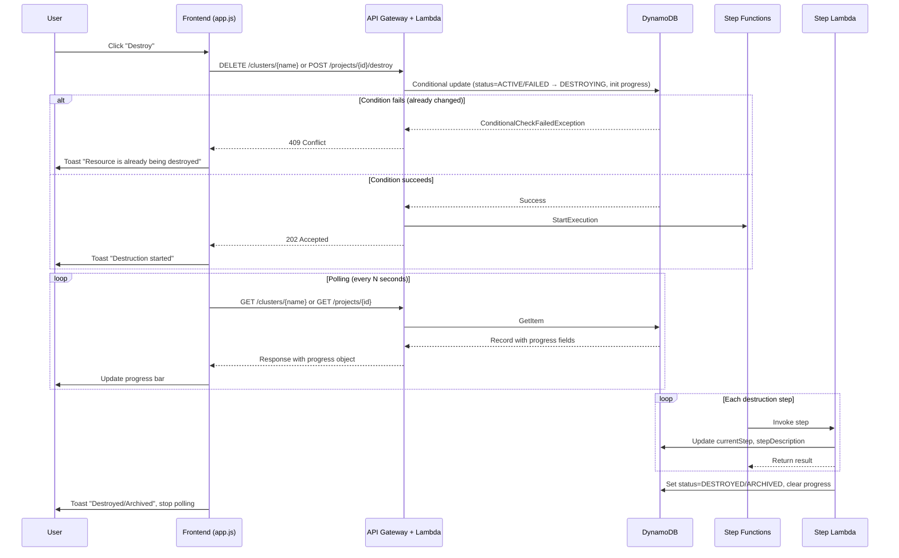

# Design Document: Deletion Progress Tracking

## Overview

This feature extends the existing progress tracking pattern (used by cluster creation, project deployment, and project update workflows) to the DESTROYING status for both clusters and projects. The system already tracks progress via `currentStep`, `totalSteps`, and `stepDescription` fields in DynamoDB, with the frontend rendering progress bars during transitional states. This design adds the same capability to destruction workflows, plus introduces concurrent deletion prevention via DynamoDB conditional updates.

The key design principle is **pattern consistency**: the destruction progress tracking mirrors the creation/deployment progress tracking exactly, reusing the same DynamoDB field schema, API response shape, and frontend rendering approach. A single shared `renderProgressBar()` function replaces all duplicated progress bar HTML across the frontend.

### Key Changes Summary

| Layer | Component | Change |
|-------|-----------|--------|
| Backend | `cluster_destruction.py` | Add `_update_step_progress()` calls at each step, add `STEP_LABELS` and `TOTAL_STEPS` |
| Backend | `cluster_operations/handler.py` | Atomic conditional update + progress init in `_handle_delete_cluster()`, include progress in GET for DESTROYING |
| Backend | `project_management/handler.py` | Atomic conditional update in `_handle_destroy_project_infra()` |
| Frontend | `app.js` | Extract shared `renderProgressBar()`, add DESTROYING handling to cluster list/detail, handle 409 |
| Docs | `docs/` | Document destruction progress and concurrency behaviour |

## Architecture

The architecture follows the existing pattern established by cluster creation and project deployment:



### Design Decisions

1. **Atomic conditional update for concurrency prevention**: Rather than a read-then-write pattern, the handler uses a single DynamoDB `update_item` with `ConditionExpression` to atomically check the current status and transition to DESTROYING. This eliminates the race window between checking status and starting the workflow.

2. **Shared `renderProgressBar()` function**: All five progress bar rendering locations (cluster creation in list, cluster creation in detail, project deploying, project updating, project destroying) and the new cluster destroying cases all call a single function. This eliminates the current code duplication and ensures visual consistency.

3. **Progress field clearing on completion**: The final step of each destruction workflow clears `currentStep`, `totalSteps`, and `stepDescription` from the DynamoDB record when setting the terminal status. This prevents stale progress data from appearing if the record is queried later.

4. **8 steps for cluster destruction**: The cluster destruction workflow has 8 logical steps matching the state machine definition: FSx export, check export, delete PCS resources, check PCS deletion, delete PCS cluster, delete FSx, cleanup IAM/launch templates, record destroyed.

## Components and Interfaces

### Backend Components

#### 1. Cluster Destruction Step Lambda (`cluster_destruction.py`)

**New additions:**
- `TOTAL_STEPS = 8` constant
- `STEP_LABELS` dict mapping step numbers 1–8 to human-readable descriptions
- `_update_step_progress(project_id, cluster_name, step_number)` function (mirrors `cluster_creation.py`)
- Each step handler calls `_update_step_progress()` at the beginning of execution
- `record_cluster_destroyed()` updated to clear progress fields

```python
TOTAL_STEPS = 8

STEP_LABELS: dict[int, str] = {
    1: "Exporting data to S3",
    2: "Checking export status",
    3: "Deleting compute resources",
    4: "Waiting for resource cleanup",
    5: "Deleting cluster",
    6: "Deleting filesystem",
    7: "Cleaning up IAM and templates",
    8: "Finalising destruction",
}
```

**Step-to-function mapping:**

| Step | Function | Description |
|------|----------|-------------|
| 1 | `create_fsx_export_task` | Export FSx data to S3 |
| 2 | `check_fsx_export_status` | Poll export task status |
| 3 | `delete_pcs_resources` | Initiate PCS sub-resource deletion |
| 4 | `check_pcs_deletion_status` | Poll PCS deletion status |
| 5 | `delete_pcs_cluster_step` | Delete the PCS cluster |
| 6 | `delete_fsx_filesystem` | Delete FSx filesystem |
| 7 | `delete_iam_resources` / `delete_launch_templates` / `remove_mountpoint_s3_policy` / `deregister_cluster_name` | Cleanup IAM, launch templates, S3 policy, name registry |
| 8 | `record_cluster_destroyed` | Set status DESTROYED, clear progress |

#### 2. Cluster Operations Handler (`cluster_operations/handler.py`)

**`_handle_delete_cluster()` changes:**
- Replace the current read-then-check pattern with a single atomic DynamoDB `update_item` using `ConditionExpression` to transition from ACTIVE or FAILED to DESTROYING
- Initialize progress fields (`currentStep: 0`, `totalSteps: 8`, `stepDescription: "Starting cluster destruction"`) in the same atomic update
- Catch `ConditionalCheckFailedException` and return 409 Conflict

**`_handle_get_cluster()` changes:**
- Extend the existing progress inclusion block to also cover DESTROYING status (currently only covers CREATING)

```python
# Current: if cluster.get("status") == "CREATING":
# New:     if cluster.get("status") in ("CREATING", "DESTROYING"):
```

#### 3. Project Management Handler (`project_management/handler.py`)

**`_handle_destroy_project_infra()` changes:**
- Replace the current `get_project()` + status check + `lifecycle.transition_project()` + separate `update_item` for progress with a single atomic `update_item` using `ConditionExpression` on `status = ACTIVE`
- The atomic update sets status to DESTROYING, initializes progress fields, and sets `statusChangedAt`/`updatedAt` in one operation
- Catch `ConditionalCheckFailedException` and return 409 Conflict
- Keep the active clusters check before the atomic update (this is a business rule, not a concurrency concern)

### Frontend Components

#### 4. Shared `renderProgressBar()` Function (`app.js`)

**New function:**

```javascript
/**
 * Render a progress bar with step info and percentage.
 * @param {number} currentStep - Current step number
 * @param {number} totalSteps - Total number of steps
 * @param {string} stepDescription - Human-readable step description
 * @param {string} defaultLabel - Fallback label if stepDescription is empty
 * @param {boolean} [compact=true] - Whether to use compact styling
 * @returns {string} HTML string for the progress bar
 */
function renderProgressBar(currentStep, totalSteps, stepDescription, defaultLabel, compact = true) {
  const cur = currentStep || 0;
  const total = totalSteps || 1;
  const pct = total > 0 ? Math.round((cur / total) * 100) : 0;
  const desc = stepDescription || defaultLabel;
  const compactClass = compact ? ' compact' : '';
  return `<div class="progress-container${compactClass}">
    <div class="progress-label">${esc(desc)} (${cur}/${total})</div>
    <div class="progress-bar-track"><div class="progress-bar-fill" style="width:${pct}%">${pct}%</div></div>
  </div>`;
}
```

**Replacement locations:**

1. **`projectsTableConfig` DEPLOYING case** → `renderProgressBar(row.currentStep, row.totalSteps, row.stepDescription, 'Deploying…')`
2. **`projectsTableConfig` UPDATING case** → `renderProgressBar(row.currentStep, row.totalSteps, row.stepDescription, 'Updating…')`
3. **`projectsTableConfig` DESTROYING case** → `renderProgressBar(row.currentStep, row.totalSteps, row.stepDescription, 'Destroying…')`
4. **`clustersTableConfig` CREATING case** → `renderProgressBar(row.currentStep, row.totalSteps, row.stepDescription, 'Initialising…')` (plus stale warning logic kept outside)
5. **`clustersTableConfig` DESTROYING case** (new) → `renderProgressBar(row.currentStep, row.totalSteps, row.stepDescription, 'Destroying…')`
6. **Cluster detail page CREATING case** → `renderProgressBar(...)` with `compact=false`
7. **Cluster detail page DESTROYING case** (new) → `renderProgressBar(...)` with `compact=false`

#### 5. Cluster List Table Config Changes

Add DESTROYING status handling to the `_progress` column render function:

```javascript
} else if (row.status === 'DESTROYING') {
  return renderProgressBar(row.currentStep, row.totalSteps, row.stepDescription, 'Destroying…');
}
```

The existing polling logic already includes DESTROYING in the transitional filter: `['CREATING', 'DESTROYING'].includes(c.status)`.

#### 6. Cluster Detail Page Changes

Add a DESTROYING progress section (mirroring the existing CREATING section):

```javascript
if (cluster.status === 'DESTROYING') {
  const progress = cluster.progress || {};
  html += `<div class="info-box">
    <h4>Destruction Progress</h4>
    ${renderProgressBar(progress.currentStep, progress.totalSteps, progress.stepDescription, 'Destroying…', false)}
    <p style="font-size:0.8rem;margin:0.5rem 0 0;color:var(--color-text-muted)">
      This page refreshes automatically. You can navigate away and return to check progress.
    </p>
  </div>`;
  startClusterDetailPolling(projectId, clusterName);
}
```

Add DESTROYING → DESTROYED transition detection:

```javascript
} else if (prev === 'DESTROYING' && cluster.status === 'DESTROYED') {
  showToast(`Cluster '${clusterName}' has been destroyed`, 'success');
}
```

#### 7. 409 Conflict Handling

Update `destroyCluster()` and `destroyProject()` (via `showDestroyConfirmation`) to catch 409 responses:

```javascript
} catch (e) {
  if (e.message && e.message.includes('409')) {
    showToast('This resource is already being destroyed', 'error');
  } else {
    showToast(e.message, 'error');
  }
}
```

Since the `apiCall()` function throws an Error with the message from the API response, and the 409 response includes a descriptive message, the existing error handling already shows the message. The enhancement is to provide a more user-friendly toast specifically for 409 conflicts.

### API Response Changes

#### Cluster GET Response (DESTROYING status)

```json
{
  "clusterName": "my-cluster",
  "projectId": "my-project",
  "status": "DESTROYING",
  "currentStep": 3,
  "totalSteps": 8,
  "stepDescription": "Deleting compute resources",
  "progress": {
    "currentStep": 3,
    "totalSteps": 8,
    "stepDescription": "Deleting compute resources"
  }
}
```

The `progress` object is added by the handler for convenience (same pattern as CREATING status). The raw `currentStep`/`totalSteps`/`stepDescription` fields remain on the record for the cluster list view (which reads from the list endpoint, not the detail endpoint).

#### 409 Conflict Response

```json
{
  "error": {
    "code": "CONFLICT",
    "message": "Cluster 'my-cluster' cannot be destroyed in its current state (status: DESTROYING).",
    "details": {
      "clusterName": "my-cluster",
      "status": "DESTROYING"
    }
  }
}
```

## Data Models

### DynamoDB Clusters Table — Progress Fields

No schema changes required. The existing fields are reused:

| Field | Type | Description |
|-------|------|-------------|
| `currentStep` | Number | Current step number (0 = not started, 1–N = in progress) |
| `totalSteps` | Number | Total number of steps in the workflow |
| `stepDescription` | String | Human-readable description of the current step |

These fields are set during both CREATING and DESTROYING workflows and cleared when the workflow completes (status transitions to ACTIVE or DESTROYED).

### DynamoDB Projects Table — Progress Fields

Same fields, already in use for DEPLOYING/UPDATING/DESTROYING workflows:

| Field | Type | Description |
|-------|------|-------------|
| `currentStep` | Number | Current step number |
| `totalSteps` | Number | Total steps (5 for all project workflows) |
| `stepDescription` | String | Human-readable step description |

### Cluster Destruction Step Labels

| Step | Label | State Machine Step |
|------|-------|--------------------|
| 1 | Exporting data to S3 | CreateFsxExportTask |
| 2 | Checking export status | CheckFsxExportStatus |
| 3 | Deleting compute resources | DeletePcsResources |
| 4 | Waiting for resource cleanup | CheckPcsDeletionStatus |
| 5 | Deleting cluster | DeletePcsCluster |
| 6 | Deleting filesystem | DeleteFsxFilesystem |
| 7 | Cleaning up IAM and templates | DeleteIamResources / DeleteLaunchTemplates / RemoveMountpointS3Policy / DeregisterClusterName |
| 8 | Finalising destruction | RecordClusterDestroyed |

### Atomic Conditional Update — Cluster Deletion

```python
clusters_table.update_item(
    Key={"PK": f"PROJECT#{project_id}", "SK": f"CLUSTER#{cluster_name}"},
    UpdateExpression=(
        "SET #st = :destroying, currentStep = :zero, totalSteps = :total, "
        "stepDescription = :desc, updatedAt = :now"
    ),
    ConditionExpression="#st IN (:active, :failed)",
    ExpressionAttributeNames={"#st": "status"},
    ExpressionAttributeValues={
        ":destroying": "DESTROYING",
        ":zero": 0,
        ":total": 8,
        ":desc": "Starting cluster destruction",
        ":active": "ACTIVE",
        ":failed": "FAILED",
        ":now": now,
    },
)
```

### Atomic Conditional Update — Project Destruction

```python
table.update_item(
    Key={"PK": f"PROJECT#{project_id}", "SK": "METADATA"},
    UpdateExpression=(
        "SET #st = :destroying, currentStep = :zero, totalSteps = :total, "
        "stepDescription = :desc, statusChangedAt = :now, updatedAt = :now, "
        "errorMessage = :empty"
    ),
    ConditionExpression="#st = :active",
    ExpressionAttributeNames={"#st": "status"},
    ExpressionAttributeValues={
        ":destroying": "DESTROYING",
        ":zero": 0,
        ":total": 5,
        ":desc": "Starting project destruction",
        ":active": "ACTIVE",
        ":now": now,
        ":empty": "",
    },
)
```

## Correctness Properties

*A property is a characteristic or behavior that should hold true across all valid executions of a system — essentially, a formal statement about what the system should do. Properties serve as the bridge between human-readable specifications and machine-verifiable correctness guarantees.*

### Property 1: Atomic cluster deletion initializes progress and transitions status

*For any* cluster record with status ACTIVE or FAILED, when a DELETE request is processed, the handler SHALL atomically set status to DESTROYING and initialize progress fields (currentStep=0, totalSteps=8, stepDescription="Starting cluster destruction") in a single DynamoDB conditional update. For any cluster with a status other than ACTIVE or FAILED, the handler SHALL raise a ConflictError.

**Validates: Requirements 1.1, 9.1, 9.2**

### Property 2: Cluster GET includes progress object for transitional statuses

*For any* cluster record with status CREATING or DESTROYING, the GET endpoint SHALL return a `progress` object containing `currentStep` (integer), `totalSteps` (integer), and `stepDescription` (string). For any cluster with a status other than CREATING or DESTROYING, the GET endpoint SHALL omit the `progress` object.

**Validates: Requirements 2.1, 2.2, 2.3**

### Property 3: Destruction step labels provide complete monotonic coverage

*For any* step number in the range [1, TOTAL_STEPS], the STEP_LABELS dictionary SHALL contain that key mapped to a non-empty string description. The dictionary SHALL have exactly TOTAL_STEPS entries with no gaps.

**Validates: Requirements 1.3**

### Property 4: Progress bar percentage calculation is correct

*For any* currentStep in [0, totalSteps] and totalSteps > 0, the `renderProgressBar` function SHALL produce HTML containing the percentage value `Math.round((currentStep / totalSteps) * 100)` and the step description text.

**Validates: Requirements 3.1, 3.2, 5.1, 5.2**

### Property 5: Atomic project destruction initializes progress and transitions status

*For any* project record with status ACTIVE, when a destroy request is processed, the handler SHALL atomically set status to DESTROYING and initialize progress fields (currentStep=0, totalSteps=5, stepDescription="Starting project destruction") in a single DynamoDB conditional update. For any project with a status other than ACTIVE, the handler SHALL raise a ConflictError.

**Validates: Requirements 9.3, 9.4**

## Error Handling

### Backend Error Handling

| Scenario | Handler | Response |
|----------|---------|----------|
| Cluster DELETE when status is not ACTIVE/FAILED | `_handle_delete_cluster` | 409 Conflict with current status |
| Concurrent cluster DELETE (conditional update fails) | `_handle_delete_cluster` | 409 Conflict "already being destroyed" |
| Project destroy when status is not ACTIVE | `_handle_destroy_project_infra` | 409 Conflict with current status |
| Concurrent project destroy (conditional update fails) | `_handle_destroy_project_infra` | 409 Conflict "already being destroyed" |
| Active clusters exist during project destroy | `_handle_destroy_project_infra` | 409 Conflict with cluster names |
| Step Functions start fails | Both handlers | Log warning, return 202 (fire-and-forget) |
| Progress update fails in step lambda | `_update_step_progress` | Log warning, continue (non-fatal) |
| Destruction step fails | Step Functions catch | Preserve progress fields, set error status |

### Frontend Error Handling

| Scenario | Handling |
|----------|----------|
| 409 Conflict on destroy | Show toast "This resource is already being destroyed" |
| Network error during polling | Preserve current display, retry on next poll interval |
| Missing progress fields in response | Default to `currentStep=0`, `totalSteps=1`, description=default label |
| Status transition DESTROYING → DESTROYED | Show success toast, stop polling, refresh list |
| Status transition DESTROYING → FAILED (cluster) | Show error toast, stop polling |

### Progress Field Defaults

The `renderProgressBar()` function handles missing or zero values gracefully:
- `currentStep` defaults to `0`
- `totalSteps` defaults to `1` (prevents division by zero)
- `stepDescription` defaults to the provided `defaultLabel` parameter

## Testing Strategy

### Property-Based Tests (Hypothesis — Python)

Property-based testing is appropriate for this feature because the backend handlers have clear input/output behavior with universal properties that should hold across a wide range of inputs (different cluster names, project IDs, status values, step numbers).

**Library**: [Hypothesis](https://hypothesis.readthedocs.io/) for Python backend tests.

**Configuration**: Minimum 100 examples per property test.

**Tag format**: `Feature: deletion-progress-tracking, Property {number}: {property_text}`

Each correctness property from the design maps to a single property-based test:

1. **Property 1 test**: Generate random cluster records with various statuses. Mock DynamoDB. Verify that for ACTIVE/FAILED statuses, the handler performs a conditional update with correct progress fields. For other statuses, verify ConflictError.

2. **Property 2 test**: Generate random cluster records with various statuses and progress field values (including Decimal types from DynamoDB). Call `_handle_get_cluster`. Verify progress object inclusion/omission and integer type conversion.

3. **Property 3 test**: Verify STEP_LABELS covers [1, TOTAL_STEPS] with no gaps and all non-empty string values.

4. **Property 4 test**: This is a frontend property. Test with JavaScript unit tests (not Hypothesis). Generate random currentStep/totalSteps pairs and verify the rendered HTML contains the correct percentage.

5. **Property 5 test**: Generate random project records with various statuses. Mock DynamoDB. Verify atomic conditional update for ACTIVE status, ConflictError for others.

### Unit Tests (Example-Based)

- **Cluster destruction step progress**: Verify each step handler calls `_update_step_progress` with the correct step number
- **`record_cluster_destroyed`**: Verify it clears progress fields when setting DESTROYED status
- **409 Conflict response format**: Verify the error response structure for concurrent deletion attempts
- **Frontend toast notifications**: Verify correct toast messages for DESTROYING → DESTROYED/ARCHIVED transitions
- **Frontend polling activation**: Verify polling starts/stops based on transitional cluster statuses
- **Cluster detail DESTROYING rendering**: Verify progress bar and auto-refresh message appear
- **`renderProgressBar` edge cases**: Zero totalSteps, empty description, missing fields

### Integration Tests

- **End-to-end destruction flow**: Start a cluster destruction, poll until DESTROYED, verify progress increments
- **Concurrent deletion**: Send two simultaneous DELETE requests, verify exactly one succeeds and one gets 409

### Documentation Tests

- Verify `docs/project-admin/cluster-management.md` describes destruction progress
- Verify `docs/admin/project-management.md` describes destruction progress
- Verify concurrent deletion prevention is documented
