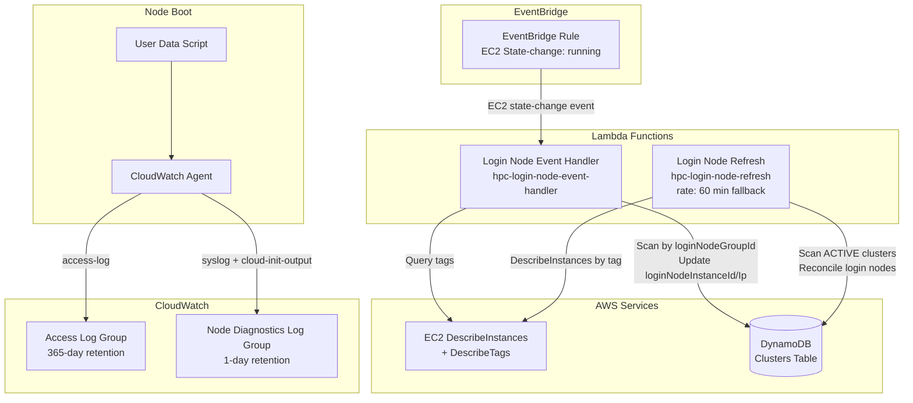
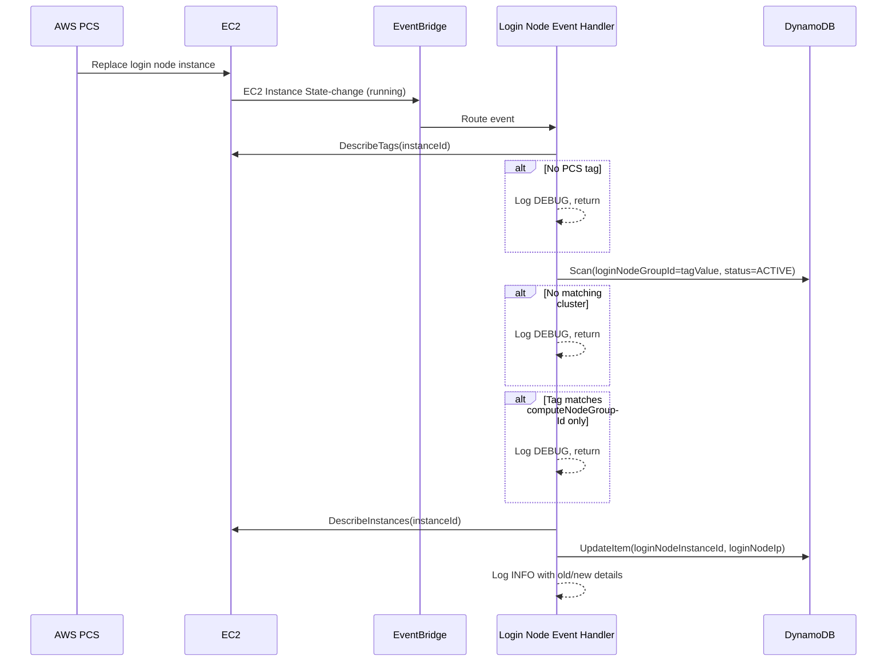

# Design Document: Event-Driven Node Relaunch

## Overview

This feature replaces the 5-minute polling mechanism for detecting login node replacements with an event-driven approach using Amazon EventBridge. When AWS PCS replaces a login node instance, EventBridge captures the EC2 Instance State-change Notification and routes it to a new Lambda function that immediately updates the cluster record in DynamoDB. The existing polling Lambda is retained as a 60-minute fallback safety net.

Additionally, the feature adds node diagnostic log shipping — configuring the CloudWatch Agent on cluster nodes to forward syslog and cloud-init output to a per-project CloudWatch Log Group, enabling crash diagnosis without SSH access.

### Key Design Decisions

1. **EventBridge rule matches all `running` state changes** rather than filtering by tag at the rule level. EventBridge event patterns cannot filter on EC2 instance tags (tags are not part of the state-change event payload). The Lambda performs tag-based filtering after receiving the event.

2. **DynamoDB Scan with filter** (not a GSI) for cluster lookup by `loginNodeGroupId`. Login node replacements are rare events (minutes to hours apart), so the scan cost is negligible. Adding a GSI would increase ongoing DynamoDB costs for a query pattern used only during node replacements. This matches the existing `login_node_refresh.py` approach.

3. **Separate Lambda function** rather than extending the existing `login_node_refresh.py`. The event-driven handler has a fundamentally different trigger (single event vs. scheduled scan), different input shape, and different error handling requirements. Separation follows the Single Responsibility Principle and allows independent scaling, timeout configuration, and monitoring.

4. **CloudWatch Agent `append-config` mode** for node diagnostics. The existing access log configuration uses `append-config`, and the diagnostics configuration follows the same pattern. This allows both configurations to coexist without overwriting each other, regardless of boot ordering.

5. **1-day retention for diagnostic logs** with DESTROY removal policy. These logs are ephemeral diagnostic data used for troubleshooting active issues, not long-term audit records. Short retention minimises cost.

## Architecture



### Event Flow



## Components and Interfaces

### 1. Login Node Event Handler Lambda (`login_node_event.py`)

New Lambda function in `lambda/cluster_operations/` that processes EC2 state-change events.

```python
def handler(event: dict[str, Any], context: Any) -> dict[str, Any]:
    """Process an EC2 Instance State-change Notification event.

    Parameters
    ----------
    event : dict
        EventBridge event with structure:
        {
            "detail-type": "EC2 Instance State-change Notification",
            "source": "aws.ec2",
            "detail": {
                "instance-id": "i-0123456789abcdef0",
                "state": "running"
            }
        }

    Returns
    -------
    dict
        Summary with keys: instance_id, action (updated|skipped|error),
        and optional cluster_name, reason.
    """
```

**Internal functions:**

| Function | Purpose |
|----------|---------|
| `_get_instance_node_group_tag(instance_id)` | Queries EC2 DescribeTags for the `aws:pcs:compute-node-group-id` tag. Returns the tag value or `None`. |
| `_find_clusters_by_login_node_group(node_group_id)` | Scans DynamoDB for ACTIVE clusters where `loginNodeGroupId` equals the tag value. Returns list of cluster records. |
| `_resolve_instance_details(instance_id)` | Calls EC2 DescribeInstances to get the public IP. Returns `(instance_id, public_ip)`. |
| `_update_cluster_login_node(project_id, cluster_name, instance_id, public_ip)` | Updates the `loginNodeInstanceId` and `loginNodeIp` fields in DynamoDB. |

### 2. EventBridge Rule (CDK)

Defined in `ClusterOperations` construct alongside the existing schedule rule.

```typescript
// Event pattern — matches all EC2 instances entering "running" state
{
  source: ['aws.ec2'],
  detailType: ['EC2 Instance State-change Notification'],
  detail: {
    state: ['running'],
  },
}
```

### 3. Updated `generate_cloudwatch_agent_commands()` (`posix_provisioning.py`)

Extended to produce two CloudWatch Agent config files:

| Config File | Log File | Log Group | Log Stream |
|-------------|----------|-----------|------------|
| `hpc-access-log.json` (existing) | `/var/log/hpc-access.log` | `/hpc-platform/clusters/{projectId}/access-logs` | `{instance_id}/access-log` |
| `hpc-node-diagnostics.json` (new) | `/var/log/messages` | `/hpc-platform/clusters/{projectId}/node-diagnostics` | `{instance_id}/syslog` |
| `hpc-node-diagnostics.json` (new) | `/var/log/cloud-init-output.log` | `/hpc-platform/clusters/{projectId}/node-diagnostics` | `{instance_id}/cloud-init-output` |
| `hpc-node-diagnostics.json` (new) | `/var/log/amazon/pcs/bootstrap.log` | `/hpc-platform/clusters/{projectId}/node-diagnostics` | `{instance_id}/pcs-bootstrap` |

Both configs use `append-config` mode so they coexist without overwriting each other.

### 4. Node Diagnostics Log Group (CDK)

New CloudWatch Log Group in `ProjectInfrastructureStack`:

```typescript
new logs.LogGroup(this, 'NodeDiagnosticsLogGroup', {
  logGroupName: `/hpc-platform/clusters/${props.projectId}/node-diagnostics`,
  retention: logs.RetentionDays.ONE_DAY,
  removalPolicy: cdk.RemovalPolicy.DESTROY,
});
```

### 5. Updated Schedule Rule (CDK)

The existing `LoginNodeRefreshScheduleRule` changes from `rate(5 minutes)` to `rate(60 minutes)` with an updated description reflecting its fallback role.

## Data Models

### EC2 State-Change Event (Input)

```json
{
  "version": "0",
  "id": "event-id",
  "detail-type": "EC2 Instance State-change Notification",
  "source": "aws.ec2",
  "account": "123456789012",
  "time": "2024-01-15T12:00:00Z",
  "region": "us-east-1",
  "detail": {
    "instance-id": "i-0123456789abcdef0",
    "state": "running"
  }
}
```

### DynamoDB Cluster Record (Existing — Relevant Fields)

| Field | Type | Description |
|-------|------|-------------|
| `PK` | String | `PROJECT#{projectId}` |
| `SK` | String | `CLUSTER#{clusterName}` |
| `clusterName` | String | Human-readable cluster name |
| `projectId` | String | Owning project ID |
| `loginNodeGroupId` | String | PCS login node group ID |
| `computeNodeGroupId` | String | PCS compute node group ID |
| `loginNodeInstanceId` | String | Current login node EC2 instance ID |
| `loginNodeIp` | String | Current login node public IP |
| `status` | String | Cluster lifecycle status (`ACTIVE`, `CREATING`, `FAILED`, etc.) |

### Lambda Response (Output)

```json
{
  "instance_id": "i-0123456789abcdef0",
  "action": "updated",
  "clusters_updated": 1,
  "details": [
    {
      "cluster_name": "my-cluster",
      "project_id": "proj-123",
      "old_instance_id": "i-old",
      "new_instance_id": "i-new",
      "old_ip": "1.2.3.4",
      "new_ip": "5.6.7.8"
    }
  ]
}
```

## Correctness Properties

*A property is a characteristic or behavior that should hold true across all valid executions of a system — essentially, a formal statement about what the system should do. Properties serve as the bridge between human-readable specifications and machine-verifiable correctness guarantees.*

### Property 1: Login-only filtering

*For any* EC2 instance with a `aws:pcs:compute-node-group-id` tag value, the Login Node Event Handler SHALL update DynamoDB only when that tag value matches an ACTIVE cluster's `loginNodeGroupId` field, and SHALL never update DynamoDB when the tag value matches only a cluster's `computeNodeGroupId` field.

**Validates: Requirements 2.2, 2.3, 5.1**

### Property 2: Update correctness

*For any* EC2 state-change event where the instance's node group ID matches an ACTIVE cluster's `loginNodeGroupId` and the instance ID or public IP differs from the stored values, the Login Node Event Handler SHALL update the cluster record's `loginNodeInstanceId` and `loginNodeIp` fields to the new instance's actual values.

**Validates: Requirements 2.4, 2.5**

### Property 3: Multi-cluster update

*For any* node group ID that matches the `loginNodeGroupId` of multiple ACTIVE cluster records, the Login Node Event Handler SHALL update all matching cluster records with the new instance details.

**Validates: Requirements 5.4**

### Property 4: Successful update logging completeness

*For any* successfully processed event that results in a DynamoDB update, the Login Node Event Handler's INFO-level log output SHALL contain the EC2 instance ID, instance state, cluster name, project ID, previous instance ID, new instance ID, previous IP, and new IP.

**Validates: Requirements 2.10, 7.1, 7.2**

### Property 5: Skip reason logging

*For any* event that is skipped (no PCS tag, no matching cluster by loginNodeGroupId, or instance belongs to a compute node group), the Login Node Event Handler SHALL emit a DEBUG-level log entry containing the reason for skipping.

**Validates: Requirements 7.3**

### Property 6: CloudWatch Agent diagnostics configuration

*For any* valid `project_id`, the `generate_cloudwatch_agent_commands` function SHALL produce commands that configure collection of `/var/log/messages` (with log stream `{instance_id}/syslog`), `/var/log/cloud-init-output.log` (with log stream `{instance_id}/cloud-init-output`), and `/var/log/amazon/pcs/bootstrap.log` (with log stream `{instance_id}/pcs-bootstrap`), targeting the log group `/hpc-platform/clusters/{project_id}/node-diagnostics`, using `append-config` mode.

**Validates: Requirements 8.1, 8.2, 8.5, 8.6**

## Error Handling

| Scenario | Behaviour | Log Level |
|----------|-----------|-----------|
| EC2 DescribeTags fails | Log error, return without update | ERROR |
| EC2 DescribeInstances fails | Log error with instance ID, return without update | ERROR |
| DynamoDB Scan fails | Log error, return without update | ERROR |
| DynamoDB UpdateItem fails | Log error with instance ID and cluster name, return failure response | ERROR |
| Instance has no PCS tag | Log reason, return (no-op) | DEBUG |
| No matching ACTIVE cluster by loginNodeGroupId | Log reason, return (no-op) | DEBUG |
| Tag matches computeNodeGroupId only | Log reason, return (no-op) | DEBUG |
| Instance ID and IP unchanged | No update needed, return (no-op) | DEBUG |

All errors are non-fatal to the Lambda execution — the function always returns a response (never raises an unhandled exception). EventBridge will not retry on success responses, and the 60-minute fallback polling Lambda provides eventual consistency for any missed events.

## Testing Strategy

### Unit Tests (pytest)

**Login Node Event Handler (`test_login_node_event.py`):**
- Example: Instance with no PCS tag → skipped, no DynamoDB call
- Example: Valid PCS tag but no matching ACTIVE cluster → skipped
- Example: EC2 DescribeInstances failure → error logged, no DynamoDB update
- Example: DynamoDB update failure → error logged, failure response returned
- Example: Instance ID and IP unchanged → no update performed

**CloudWatch Agent Commands (`test_posix_provisioning.py`):**
- Example: Existing access log config is preserved (backward compatibility)
- Example: Node diagnostics config file is written with correct paths

### Property-Based Tests (Hypothesis)

Property-based testing is appropriate for this feature because the Lambda handler and the CloudWatch agent command generator are pure-logic functions with clear input/output behaviour that varies meaningfully across a wide input space (different instance IDs, node group IDs, cluster records, project IDs).

**Library:** [Hypothesis](https://hypothesis.readthedocs.io/) (already used in this project — see `.hypothesis/` directory)

**Configuration:** Minimum 100 iterations per property test.

**Tag format:** `Feature: event-driven-node-relaunch, Property {number}: {property_text}`

| Property | Test Description | Key Generators |
|----------|-----------------|----------------|
| Property 1: Login-only filtering | Generate random cluster records with distinct loginNodeGroupId and computeNodeGroupId. Generate a random tag value. Mock DynamoDB scan to return clusters. Verify: update occurs iff tag matches loginNodeGroupId of an ACTIVE cluster; never when tag matches only computeNodeGroupId. | `st.text()` for IDs, `st.lists()` for cluster records |
| Property 2: Update correctness | Generate random instance IDs, IPs, and matching cluster records where values differ. Mock EC2 and DynamoDB. Verify: DynamoDB update is called with the new instance ID and IP from the mocked EC2 response. | `st.from_regex()` for instance IDs (`i-[a-f0-9]{17}`), `st.ip_addresses()` for IPs |
| Property 3: Multi-cluster update | Generate 2-5 cluster records sharing the same loginNodeGroupId. Mock DynamoDB scan to return all. Verify: DynamoDB update is called once per matching cluster. | `st.integers(min_value=2, max_value=5)` for cluster count |
| Property 4: Successful update logging | Generate random event data leading to a successful update. Capture log output. Verify: INFO log contains all required fields (instance_id, state, cluster_name, project_id, old/new instance IDs, old/new IPs). | Composite strategy combining instance, cluster, and IP generators |
| Property 5: Skip reason logging | Generate random events for each skip scenario (no tag, no cluster match, compute-only match). Capture log output. Verify: DEBUG log contains a reason string. | `st.sampled_from()` for skip scenarios |
| Property 6: CloudWatch agent diagnostics config | Generate random project IDs. Call `generate_cloudwatch_agent_commands`. Verify: output contains `/var/log/messages`, `/var/log/cloud-init-output.log`, `/var/log/amazon/pcs/bootstrap.log`, correct log group name, correct stream name patterns, and `append-config`. | `st.from_regex()` for project IDs |

### CDK Assertion Tests (Jest)

- EventBridge rule exists with correct event pattern (`aws.ec2`, `EC2 Instance State-change Notification`, state `running`)
- EventBridge rule targets the Login Node Event Handler Lambda
- Lambda permission grants EventBridge invoke access
- Login Node Event Handler Lambda has correct runtime (Python 3.13), timeout (30s), memory (256 MB), and shared layer
- Login Node Event Handler Lambda has `CLUSTERS_TABLE_NAME` environment variable
- Login Node Event Handler Lambda IAM policy includes `ec2:DescribeInstances`, `ec2:DescribeTags`, and DynamoDB read/write
- Login Node Event Handler Lambda is exposed as a public readonly property
- Login Node Refresh schedule rule uses `rate(60 minutes)`
- Login Node Refresh schedule rule description mentions "fallback"
- Node Diagnostics Log Group exists with correct name pattern and 1-day retention
- Node Diagnostics Log Group has DESTROY removal policy
