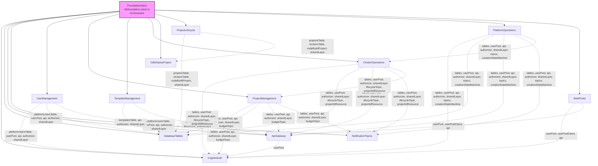

# Design Document

## Overview

This design decomposes the 2,559-line `FoundationStack` monolithic constructor into 11 focused CDK Construct classes, each in its own file under `lib/constructs/`. The refactored `FoundationStack` becomes a thin orchestrator that instantiates constructs, wires cross-references, and emits `CfnOutput`s.

The refactoring is purely structural — no AWS resources are added, removed, or modified. The synthesised CloudFormation template must remain functionally equivalent, all public properties must retain their types and names, and the existing 1,833-line test suite must pass without modification.

### Design Decisions

1. **Composition over inheritance**: Each construct is a standard CDK `Construct` (not a nested `Stack`), keeping all resources in a single CloudFormation stack and avoiding cross-stack reference complexity.
2. **Props interfaces per construct**: Each construct defines a typed props interface declaring its dependencies, making the dependency graph explicit and enabling isolated testing.
3. **Expose-and-assign pattern**: Constructs expose resources as `public readonly` properties. The `FoundationStack` assigns these to its own public properties, preserving the external API surface.
4. **Cross-reference wiring in the orchestrator**: Dependencies that span constructs (e.g., state machine ARNs injected into Lambda environment variables, `grantStartExecution` calls) are wired in `FoundationStack` after all constructs are instantiated, keeping constructs decoupled.
5. **Construct IDs preserved**: Each CDK resource retains its original construct ID (the first string argument to `new Resource(this, 'Id', ...)`), ensuring CloudFormation logical IDs remain unchanged and avoiding resource replacement on deploy.

## Architecture



### Instantiation Order

The `FoundationStack` constructor instantiates constructs in dependency order:

1. `CognitoAuth` — no dependencies
2. `DatabaseTables` — no dependencies
3. `ApiGateway` — depends on `CognitoAuth.userPool`
4. `NotificationTopics` — no dependencies
5. `UserManagement` — depends on `DatabaseTables`, `CognitoAuth`, `ApiGateway`
6. `ProjectManagement` — depends on `DatabaseTables`, `CognitoAuth`, `ApiGateway`, `NotificationTopics`
7. `TemplateManagement` — depends on `DatabaseTables`, `ApiGateway`
8. `ClusterOperations` — depends on `DatabaseTables`, `CognitoAuth`, `ApiGateway`, `NotificationTopics`, `ProjectManagement.projectIdResource`
9. `CdkDeployProject` — no dependencies
10. `ProjectLifecycle` — depends on `DatabaseTables`, `CdkDeployProject`
11. `PlatformOperations` — depends on `DatabaseTables`, `CognitoAuth`, `ApiGateway`, `NotificationTopics`, `ClusterOperations.clusterCreationStateMachine`
12. `WebPortal` — depends on `CognitoAuth`, `ApiGateway`

After all constructs are instantiated, the orchestrator performs cross-reference wiring:
- Injects state machine ARNs into `ClusterOperations` Lambda environment variables
- Calls `grantStartExecution` for cluster state machines → cluster operations Lambda
- Injects project lifecycle state machine ARNs into `ProjectManagement` Lambda environment variables
- Calls `grantStartExecution` for project lifecycle state machines → project management Lambda
- Grants Cost Explorer permissions to project management Lambda
- Creates the foundation timestamp custom resource
- Emits all `CfnOutput`s

## Components and Interfaces

### 1. CognitoAuth (`lib/constructs/cognito-auth.ts`)

**Props**: None (uses only `scope` and `id`)

**Exposed Properties**:
- `userPool: cognito.UserPool`
- `userPoolClient: cognito.UserPoolClient`

**Resources Created**:
- `HpcUserPool` (UserPool with email sign-in, password policy, RETAIN)
- `AdministratorsGroup` (CfnUserPoolGroup)
- `WebPortalClient` (UserPoolClient with SRP + password auth)

---

### 2. DatabaseTables (`lib/constructs/database-tables.ts`)

**Props**: None

**Exposed Properties**:
- `platformUsersTable: dynamodb.Table`
- `projectsTable: dynamodb.Table`
- `clusterTemplatesTable: dynamodb.Table`
- `clustersTable: dynamodb.Table`
- `clusterNameRegistryTable: dynamodb.Table`

**Resources Created**:
- 5 DynamoDB tables (PAY_PER_REQUEST, PITR, RETAIN)
- `StatusIndex` GSI on PlatformUsers
- `UserProjectsIndex` GSI on Projects
- `PosixUidCounterSeed` custom resource
- `DefaultTemplateCpuGeneralSeed` custom resource
- `DefaultTemplateGpuBasicSeed` custom resource

---

### 3. ApiGateway (`lib/constructs/api-gateway.ts`)

**Props**:
```typescript
interface ApiGatewayProps {
  userPool: cognito.UserPool;
}
```

**Exposed Properties**:
- `api: apigateway.RestApi`
- `cognitoAuthorizer: apigateway.CognitoUserPoolsAuthorizer`
- `sharedLayer: lambda.LayerVersion`

**Resources Created**:
- `HpcPlatformApi` (RestApi with CORS, access logging, prod stage)
- `ApiAccessLogGroup` (365-day retention)
- `CognitoAuthorizer` (bound to UserPool)
- `/health` mock endpoint (authorizer binding)
- `LambdaInfraLogGroup` (90-day retention)
- `SharedUtilsLayer` (Python 3.13 layer from `lambda/shared`)

---

### 4. NotificationTopics (`lib/constructs/notification-topics.ts`)

**Props**: None

**Exposed Properties**:
- `budgetNotificationTopic: sns.Topic`
- `clusterLifecycleNotificationTopic: sns.Topic`

**Resources Created**:
- `BudgetNotificationTopic` (SNS)
- `ClusterLifecycleNotificationTopic` (SNS)

---

### 5. UserManagement (`lib/constructs/user-management.ts`)

**Props**:
```typescript
interface UserManagementProps {
  platformUsersTable: dynamodb.Table;
  userPool: cognito.UserPool;
  api: apigateway.RestApi;
  cognitoAuthorizer: apigateway.CognitoUserPoolsAuthorizer;
  sharedLayer: lambda.LayerVersion;
}
```

**Exposed Properties**:
- `lambda: lambda.Function`

**Resources Created**:
- `UserManagementLambda` (Python 3.13, 256 MB, 30s timeout)
- IAM policies (DynamoDB read/write, Cognito admin actions)
- API routes: `/users`, `/users/{userId}`, `/users/{userId}/reactivate`, `/users/batch/deactivate`, `/users/batch/reactivate`

---

### 6. ProjectManagement (`lib/constructs/project-management.ts`)

**Props**:
```typescript
interface ProjectManagementProps {
  projectsTable: dynamodb.Table;
  clustersTable: dynamodb.Table;
  platformUsersTable: dynamodb.Table;
  userPool: cognito.UserPool;
  api: apigateway.RestApi;
  cognitoAuthorizer: apigateway.CognitoUserPoolsAuthorizer;
  sharedLayer: lambda.LayerVersion;
  budgetNotificationTopic: sns.Topic;
}
```

**Exposed Properties**:
- `lambda: lambda.Function`
- `projectIdResource: apigateway.Resource` (the `{projectId}` path segment, needed by ClusterOperations)

**Resources Created**:
- `ProjectManagementLambda` (Python 3.13, 256 MB, 30s timeout)
- IAM policies (DynamoDB, Cognito groups, Budgets, SNS publish, STS)
- API routes: `/projects`, `/projects/{projectId}`, `/projects/{projectId}/members`, `/projects/{projectId}/members/{userId}`, `/projects/{projectId}/budget`, `/projects/{projectId}/deploy`, `/projects/{projectId}/destroy`, `/projects/{projectId}/update`, `/projects/batch/update`, `/projects/batch/deploy`, `/projects/batch/destroy`

---

### 7. TemplateManagement (`lib/constructs/template-management.ts`)

**Props**:
```typescript
interface TemplateManagementProps {
  clusterTemplatesTable: dynamodb.Table;
  api: apigateway.RestApi;
  cognitoAuthorizer: apigateway.CognitoUserPoolsAuthorizer;
  sharedLayer: lambda.LayerVersion;
}
```

**Exposed Properties**:
- `lambda: lambda.Function`

**Resources Created**:
- `TemplateManagementLambda` (Python 3.13, 256 MB, 30s timeout)
- IAM policies (DynamoDB read/write, EC2 DescribeImages)
- API routes: `/templates`, `/templates/default-ami`, `/templates/{templateId}`, `/templates/batch/delete`

---

### 8. ClusterOperations (`lib/constructs/cluster-operations.ts`)

**Props**:
```typescript
interface ClusterOperationsProps {
  clustersTable: dynamodb.Table;
  projectsTable: dynamodb.Table;
  clusterNameRegistryTable: dynamodb.Table;
  platformUsersTable: dynamodb.Table;
  clusterTemplatesTable: dynamodb.Table;
  userPool: cognito.UserPool;
  cognitoAuthorizer: apigateway.CognitoUserPoolsAuthorizer;
  sharedLayer: lambda.LayerVersion;
  clusterLifecycleNotificationTopic: sns.Topic;
  projectIdResource: apigateway.Resource;
}
```

**Exposed Properties**:
- `clusterOperationsLambda: lambda.Function`
- `clusterCreationStateMachine: sfn.StateMachine`
- `clusterDestructionStateMachine: sfn.StateMachine`

**Resources Created**:
- `ClusterOperationsLambda` (Python 3.13, 256 MB, 60s timeout)
- `ClusterCreationStepLambda` (Python 3.13, 512 MB, 5min timeout)
- `ClusterDestructionStepLambda` (Python 3.13, 512 MB, 5min timeout)
- Cluster creation state machine (parallel FSx/PCS branches, wait loops, rollback, MarkClusterFailed SDK integration)
- Cluster destruction state machine (export → delete PCS → delete FSx → delete IAM → record)
- All associated IAM policies (PCS, FSx, EC2, S3, IAM, Secrets Manager, tagging)
- API routes: `/projects/{projectId}/clusters`, `/projects/{projectId}/clusters/{clusterName}`, `.../recreate`, `.../fail`

**Note**: The `clusterOperationsLambda` environment variables for state machine ARNs are set with placeholder empty strings. The orchestrator wires the real ARNs via `addEnvironment` after instantiation.

---

### 9. CdkDeployProject (`lib/constructs/cdk-deploy-project.ts`)

**Props**: None

**Exposed Properties**:
- `project: codebuild.Project`

**Resources Created**:
- `CdkSourceAsset` (S3 asset of the CDK project)
- `CdkDeployProject` (CodeBuild project with Node.js 20, buildspec for `npm ci` + `$CDK_COMMAND`)
- IAM policies (CloudFormation, EC2/VPC, EFS, S3, CloudWatch Logs, SSM, STS AssumeRole)

---

### 10. ProjectLifecycle (`lib/constructs/project-lifecycle.ts`)

**Props**:
```typescript
interface ProjectLifecycleProps {
  projectsTable: dynamodb.Table;
  clustersTable: dynamodb.Table;
  cdkDeployProject: codebuild.Project;
  sharedLayer: lambda.LayerVersion;
}
```

**Exposed Properties**:
- `projectDeployStateMachine: sfn.StateMachine`
- `projectDestroyStateMachine: sfn.StateMachine`
- `projectUpdateStateMachine: sfn.StateMachine`

**Resources Created**:
- `ProjectDeployStepLambda` (Python 3.13, 512 MB, 5min timeout)
- `ProjectDestroyStepLambda` (Python 3.13, 512 MB, 5min timeout)
- `ProjectUpdateStepLambda` (Python 3.13, 512 MB, 5min timeout)
- Project deploy state machine (validate → CDK deploy → wait loop → extract outputs → record)
- Project destroy state machine (validate → CDK destroy → wait loop → clear → archive)
- Project update state machine (validate → CDK update → wait loop → extract outputs → record)
- All associated IAM policies (CodeBuild, CloudFormation, DynamoDB)

**Note**: State machine ARN injection into the project management Lambda and `grantStartExecution` calls are performed by the orchestrator, not this construct (per Requirement 10.5).

---

### 11. PlatformOperations (`lib/constructs/platform-operations.ts`)

**Props**:
```typescript
interface PlatformOperationsProps {
  clustersTable: dynamodb.Table;
  projectsTable: dynamodb.Table;
  platformUsersTable: dynamodb.Table;
  userPool: cognito.UserPool;
  api: apigateway.RestApi;
  cognitoAuthorizer: apigateway.CognitoUserPoolsAuthorizer;
  sharedLayer: lambda.LayerVersion;
  budgetNotificationTopic: sns.Topic;
  clusterLifecycleNotificationTopic: sns.Topic;
  clusterCreationStateMachine: sfn.StateMachine;
}
```

**Exposed Properties**:
- `accountingQueryLambda: lambda.Function`
- `budgetNotificationLambda: lambda.Function`
- `fsxCleanupLambda: lambda.Function`
- `fsxCleanupScheduleRule: events.Rule`

**Resources Created**:
- `AccountingQueryLambda` + IAM policies (DynamoDB read, SSM, Cognito) + `/accounting/jobs` API route
- `BudgetNotificationLambda` + IAM policies (DynamoDB) + SNS subscription
- `FsxCleanupLambda` + IAM policies (DynamoDB read, FSx, SNS) + EventBridge schedule (every 6 hours)
- `ClusterCreationFailureHandler` Lambda + IAM policies (DynamoDB, states:DescribeExecution) + EventBridge rule (Step Functions status change)

---

### 12. WebPortal (`lib/constructs/web-portal.ts`)

**Props**:
```typescript
interface WebPortalProps {
  userPool: cognito.UserPool;
  userPoolClient: cognito.UserPoolClient;
  api: apigateway.RestApi;
}
```

**Exposed Properties**:
- `bucket: s3.Bucket`
- `distribution: cloudfront.Distribution`

**Resources Created**:
- `WebPortalBucket` (S3, BlockPublicAccess, S3_MANAGED encryption, DESTROY)
- `WebPortalDistribution` (CloudFront with OAC, HTTPS redirect, SPA error responses)
- `WebPortalDeployment` (frontend assets + generated `config.js`)
- `DocsDeployment` (documentation under `docs/` prefix)

## Data Models

No new data models are introduced. All DynamoDB table schemas, key structures, GSIs, and seed data remain identical. The refactoring only changes where the CDK resource definitions live in the TypeScript source — the synthesised CloudFormation template is unchanged.

## Error Handling

Error handling is not modified by this refactoring. All existing error handling patterns are preserved:

- **State machine catch/rollback chains**: Cluster creation, destruction, and project lifecycle state machines retain their `addCatch` configurations, failure handlers, and the `MarkClusterFailed` SDK integration fallback.
- **EventBridge failure detection**: The cluster creation failure handler EventBridge rule continues to detect timed-out/failed/aborted executions.
- **Lambda error responses**: All Lambda functions retain their existing error handling logic (unchanged Python code).
- **CDK removal policies**: All `RETAIN` and `DESTROY` removal policies are preserved on their respective resources.

## Testing Strategy

### Why Property-Based Testing Does Not Apply

This feature is an Infrastructure as Code (IaC) refactoring of CDK constructs. The work involves:
- Moving existing resource definitions between TypeScript files
- No new business logic, data transformations, or algorithms
- No functions with varying input/output behavior

PBT requires universal properties over a meaningful input space. CDK construct definitions are declarative configuration — there is no input space to vary. The correct testing approach is CDK assertion tests (`Template.fromStack`, `hasResourceProperties`, `resourceCountIs`) which verify the synthesised CloudFormation template matches expectations.

### Testing Approach

**1. Existing Integration Test (unchanged)**
- `test/foundation-stack.test.ts` (1,833 lines) continues to validate the full integrated stack
- Uses `Template.fromStack(new FoundationStack(...))` with `hasResourceProperties` and `resourceCountIs` assertions
- This is the primary regression gate — if it passes, CloudFormation output equivalence is confirmed

**2. New Construct-Level Unit Tests**
- One test file per construct in `test/constructs/`
- Each test instantiates the construct in an isolated test stack with minimal mock dependencies
- Verifies resource types, counts, and key configuration properties
- Uses `beforeAll` to instantiate the stack once per test file (per coding-style rules)

**Test files**:
| Construct | Test File |
|---|---|
| CognitoAuth | `test/constructs/cognito-auth.test.ts` |
| DatabaseTables | `test/constructs/database-tables.test.ts` |
| ApiGateway | `test/constructs/api-gateway.test.ts` |
| NotificationTopics | `test/constructs/notification-topics.test.ts` |
| UserManagement | `test/constructs/user-management.test.ts` |
| ProjectManagement | `test/constructs/project-management.test.ts` |
| TemplateManagement | `test/constructs/template-management.test.ts` |
| ClusterOperations | `test/constructs/cluster-operations.test.ts` |
| CdkDeployProject | `test/constructs/cdk-deploy-project.test.ts` |
| ProjectLifecycle | `test/constructs/project-lifecycle.test.ts` |
| PlatformOperations | `test/constructs/platform-operations.test.ts` |
| WebPortal | `test/constructs/web-portal.test.ts` |

**What each construct test verifies**:
- Correct resource count for the construct's resource types
- Key resource properties (names, configurations, key schemas, IAM policy actions)
- API Gateway routes are created with correct methods and authorizer
- Lambda environment variables contain expected keys
- State machine definitions are created (for ClusterOperations and ProjectLifecycle)

**Test pattern** (shared across all construct tests):
```typescript
import * as cdk from 'aws-cdk-lib';
import { Template } from 'aws-cdk-lib/assertions';
import { CognitoAuth } from '../../lib/constructs/cognito-auth';

describe('CognitoAuth', () => {
  let template: Template;

  beforeAll(() => {
    const app = new cdk.App();
    const stack = new cdk.Stack(app, 'TestStack');
    new CognitoAuth(stack, 'CognitoAuth');
    template = Template.fromStack(stack);
  });

  it('creates a UserPool', () => {
    template.resourceCountIs('AWS::Cognito::UserPool', 1);
  });
  // ...
});
```
