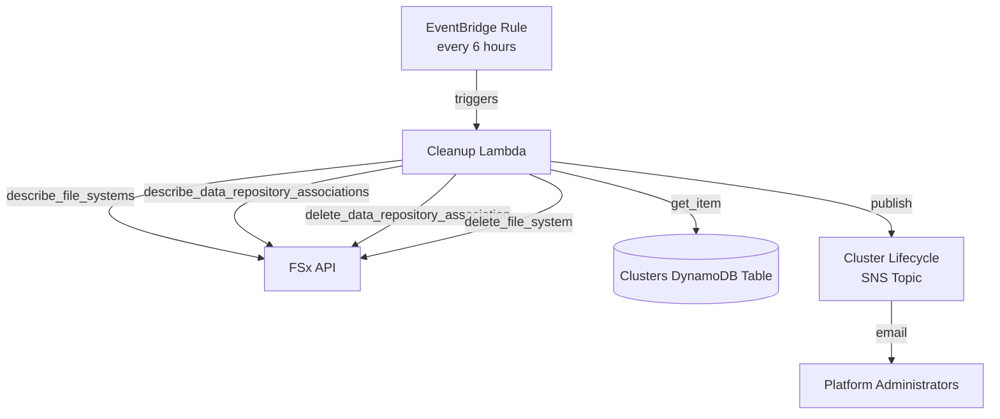
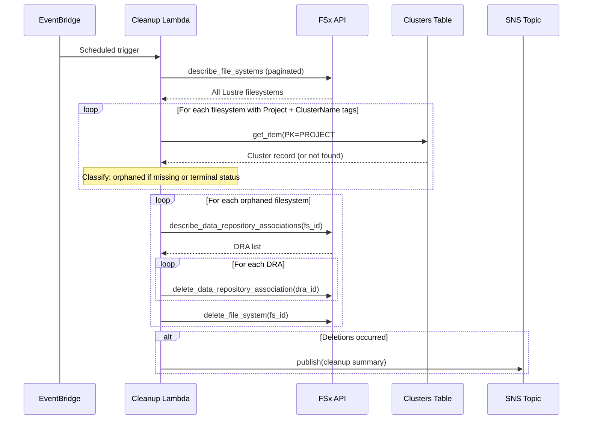

# Design Document: Orphaned FSx Cleanup

## Overview

This feature adds a scheduled Lambda function that automatically detects and deletes orphaned FSx for Lustre filesystems. An FSx filesystem becomes orphaned when the cluster creation Step Functions workflow fails partway through and the rollback handler does not successfully clean up the filesystem, or when a cluster reaches a terminal state (FAILED, DESTROYED) but its filesystem persists. These orphaned filesystems continue to incur costs with no associated active cluster.

The cleanup Lambda runs on a configurable EventBridge schedule (default: every 6 hours), scans all FSx for Lustre filesystems tagged with `Project` and `ClusterName`, cross-references the Clusters DynamoDB table, and deletes any filesystems belonging to clusters that no longer exist or are in a terminal state. It logs all actions and sends SNS notifications to administrators when cleanup occurs.

### Design Decisions

1. **Reuse the existing `clusterLifecycleNotificationTopic`** rather than creating a new SNS topic. Orphaned filesystem cleanup is a cluster lifecycle event, and administrators already subscribe to this topic for cluster creation/destruction notifications.

2. **Separate Lambda package** (`lambda/fsx_cleanup/`) rather than adding to `cluster_operations`. The cleanup function has a distinct execution model (scheduled, not API-driven) and different permission requirements (read-only DynamoDB, no PCS access). Separation follows the single-responsibility principle and limits blast radius.

3. **Pure-function core with thin I/O shell**. The classification logic, summary computation, and notification message building are implemented as pure functions that are easy to test with property-based testing. The handler orchestrates I/O (AWS API calls) around these pure functions.

4. **Paginated FSx API calls**. The `describe_file_systems` API returns at most 2048 filesystems per call. The Lambda paginates through all results to ensure complete coverage.

5. **Lambda timeout of 5 minutes**. FSx cleanup involves multiple API calls (describe filesystems, describe DRAs, delete DRAs, delete filesystems) but each is fast. 5 minutes provides ample headroom for accounts with many filesystems.

## Architecture



### Execution Flow



## Components and Interfaces

### 1. Cleanup Lambda (`lambda/fsx_cleanup/`)

#### Module: `handler.py`

The entry point for the Lambda function. Orchestrates the cleanup workflow.

```python
def handler(event: dict, context: Any) -> dict:
    """EventBridge scheduled event handler.

    Returns a summary dict with counts of scanned, orphaned,
    deleted, and failed filesystems.
    """
```

#### Module: `cleanup.py`

Core business logic, split into pure functions and I/O functions.

**Pure functions** (testable with property-based testing):

```python
def filter_tagged_filesystems(
    filesystems: list[dict],
) -> list[dict]:
    """Filter filesystems to only those with both Project and ClusterName tags.

    Args:
        filesystems: Raw FSx describe_file_systems response items.

    Returns:
        List of filesystem dicts that have both required tags.
    """

def classify_filesystem(
    filesystem_tags: dict[str, str],
    cluster_record: dict | None,
) -> tuple[bool, str]:
    """Classify a filesystem as orphaned or active.

    Args:
        filesystem_tags: Dict of tag key→value for the filesystem.
        cluster_record: The DynamoDB cluster record, or None if not found.

    Returns:
        (is_orphaned, reason) where reason is one of:
        - "cluster_not_found"
        - "terminal_status:{status}"
        - "active" (not orphaned)
    """

def build_cleanup_summary(
    total_scanned: int,
    orphaned: list[dict],
    deleted: list[dict],
    failed: list[dict],
) -> dict:
    """Build the cleanup execution summary.

    Returns a dict with total_scanned, total_orphaned,
    total_deleted, total_failed counts.
    """

def build_notification_message(
    deleted: list[dict],
    failed: list[dict],
) -> tuple[str, str]:
    """Build the SNS notification subject and message body.

    Args:
        deleted: List of successfully deleted filesystem records
            (each with filesystem_id, project_id, cluster_name).
        failed: List of failed filesystem records
            (each with filesystem_id, project_id, cluster_name, error).

    Returns:
        (subject, message_body) tuple for SNS publish.
    """
```

**I/O functions** (tested with moto mocks):

```python
def scan_fsx_filesystems() -> list[dict]:
    """Retrieve all FSx for Lustre filesystems via paginated API calls."""

def lookup_cluster_record(
    project_id: str,
    cluster_name: str,
) -> dict | None:
    """Query the Clusters DynamoDB table for a cluster record."""

def delete_filesystem_dras(filesystem_id: str) -> bool:
    """Delete all data repository associations for a filesystem.

    Returns True if all DRAs were deleted successfully, False otherwise.
    """

def delete_filesystem(filesystem_id: str) -> bool:
    """Delete an FSx filesystem. Returns True on success, False on failure."""

def publish_notification(subject: str, message: str) -> None:
    """Publish a cleanup notification to the SNS topic."""
```

### 2. CDK Infrastructure (additions to `lib/foundation-stack.ts`)

New resources added to the FoundationStack:

```typescript
// New Lambda function
fsxCleanupLambda: lambda.Function

// EventBridge rule
fsxCleanupScheduleRule: events.Rule
```

#### IAM Permissions (Least Privilege)

| Permission | Resource | Justification |
|---|---|---|
| `dynamodb:GetItem` | Clusters table | Look up cluster records by PK/SK |
| `fsx:DescribeFileSystems` | `*` | Scan all FSx filesystems in the account |
| `fsx:DescribeDataRepositoryAssociations` | `*` | List DRAs for orphaned filesystems |
| `fsx:DeleteDataRepositoryAssociation` | `*` | Remove DRAs before filesystem deletion |
| `fsx:DeleteFileSystem` | `*` | Delete orphaned filesystems |
| `sns:Publish` | Cluster lifecycle topic | Send cleanup notifications |

The Lambda explicitly does NOT receive `dynamodb:PutItem`, `dynamodb:UpdateItem`, `dynamodb:DeleteItem`, or any other write permission on the Clusters table.

### 3. EventBridge Schedule

- **Rule name**: `hpc-fsx-cleanup-schedule`
- **Schedule expression**: `rate(6 hours)` (configurable via CDK context or environment variable)
- **Target**: Cleanup Lambda function
- **Input**: Empty JSON object `{}`

## Data Models

### Filesystem Classification Record (internal to cleanup Lambda)

```python
@dataclass
class FilesystemRecord:
    filesystem_id: str
    project_id: str
    cluster_name: str
    lifecycle: str  # FSx lifecycle status (AVAILABLE, CREATING, etc.)
```

### Cleanup Result (returned by handler)

```python
{
    "total_scanned": 15,        # Total FSx Lustre filesystems found
    "total_tagged": 12,         # Filesystems with both Project and ClusterName tags
    "total_orphaned": 3,        # Classified as orphaned
    "total_deleted": 2,         # Successfully deleted
    "total_failed": 1,          # Failed to delete
    "errors": [                 # Details of failures
        {
            "filesystem_id": "fs-abc123",
            "project_id": "proj-1",
            "cluster_name": "cluster-a",
            "error": "FileSystemInUse: ..."
        }
    ]
}
```

### SNS Notification Message Format

**Subject**: `[HPC Platform] Orphaned FSx Cleanup: {count} filesystem(s) deleted`

**Body**:
```
Orphaned FSx Cleanup Report
============================
Time: 2024-01-15T12:00:00Z
Region: us-east-1

Successfully Deleted ({count}):
  - fs-abc123 (Project: proj-1, Cluster: cluster-a) — cluster_not_found
  - fs-def456 (Project: proj-2, Cluster: cluster-b) — terminal_status:DESTROYED

Errors ({count}):
  - fs-ghi789 (Project: proj-3, Cluster: cluster-c) — DRA deletion failed: ...
```

## Correctness Properties

*A property is a characteristic or behavior that should hold true across all valid executions of a system — essentially, a formal statement about what the system should do. Properties serve as the bridge between human-readable specifications and machine-verifiable correctness guarantees.*

### Property 1: Tag filtering correctness

*For any* list of FSx filesystem descriptions with arbitrary tag combinations, `filter_tagged_filesystems` SHALL return exactly those filesystems that have both a `Project` tag and a `ClusterName` tag, and no others.

**Validates: Requirements 2.1**

### Property 2: Orphan classification correctness

*For any* filesystem with `Project` and `ClusterName` tags, and *for any* cluster record state (missing, terminal status FAILED/DESTROYED, or active status CREATING/ACTIVE), `classify_filesystem` SHALL return `is_orphaned=True` if and only if the cluster record is missing or has a terminal status.

**Validates: Requirements 2.3, 2.4, 2.5**

### Property 3: Error resilience — individual failures do not block remaining processing

*For any* set of orphaned filesystems where one or more filesystem deletions fail, the cleanup function SHALL still attempt to process all remaining orphaned filesystems. The count of attempted deletions plus the count of skipped-due-to-DRA-failure SHALL equal the total number of orphaned filesystems.

**Validates: Requirements 4.2, 8.1**

### Property 4: Summary counts consistency

*For any* cleanup execution with a known set of scanned, orphaned, deleted, and failed filesystems, `build_cleanup_summary` SHALL return counts where `total_orphaned == total_deleted + total_failed` and `total_tagged >= total_orphaned` and `total_scanned >= total_tagged`.

**Validates: Requirements 5.3**

### Property 5: Notification message completeness

*For any* non-empty list of deleted filesystem records, `build_notification_message` SHALL produce a message body that contains the filesystem ID, project ID, and cluster name of every deleted filesystem, and the total count of deletions.

**Validates: Requirements 6.2**

## Error Handling

### Error Categories and Responses

| Error Scenario | Response | Continues? |
|---|---|---|
| FSx API unreachable during initial scan | Log error, terminate, return error summary | No |
| DynamoDB Clusters table unreachable | Log error, terminate, return error summary | No |
| Single cluster record lookup fails | Log error, skip filesystem, continue | Yes |
| DRA deletion fails for a filesystem | Log error, skip filesystem deletion, continue | Yes |
| Single filesystem deletion fails | Log error, record failure, continue | Yes |
| SNS publish fails | Log warning, continue (non-fatal) | Yes |

### Error Handling Strategy

1. **Fail-fast on infrastructure unavailability**: If the FSx API or DynamoDB table is unreachable at the start of execution, the Lambda terminates immediately without attempting any deletions. This prevents partial processing in a degraded state.

2. **Best-effort per-filesystem processing**: Once the initial scan succeeds, each filesystem is processed independently. A failure in one filesystem's lookup, DRA cleanup, or deletion does not affect processing of other filesystems.

3. **DRA deletion as a prerequisite**: If any DRA deletion fails for a filesystem, the filesystem deletion is skipped entirely. FSx requires all DRAs to be removed before a filesystem can be deleted, so attempting deletion would fail anyway.

4. **Non-fatal notification failures**: SNS publish failures are logged but do not affect the cleanup result. The cleanup actions have already been taken; notification is informational.

## Testing Strategy

### Property-Based Tests (Hypothesis)

Property-based tests validate the pure-function core of the cleanup logic. Each test runs a minimum of 100 iterations with generated inputs.

| Property | Test File | What It Tests |
|---|---|---|
| Property 1: Tag filtering | `test_property_fsx_cleanup.py` | `filter_tagged_filesystems` correctly selects filesystems with both tags |
| Property 2: Orphan classification | `test_property_fsx_cleanup.py` | `classify_filesystem` correctly identifies orphaned vs active filesystems |
| Property 3: Error resilience | `test_property_fsx_cleanup.py` | Cleanup processes all filesystems even when some fail |
| Property 4: Summary counts | `test_property_fsx_cleanup.py` | `build_cleanup_summary` produces consistent counts |
| Property 5: Notification completeness | `test_property_fsx_cleanup.py` | `build_notification_message` includes all required details |

**PBT library**: Hypothesis (already used in the project)
**Configuration**: `@settings(max_examples=100, deadline=None)`
**Tag format**: `# Feature: orphaned-fsx-cleanup, Property {N}: {title}`

### Unit Tests (pytest + moto)

Unit tests validate the I/O layer and integration between components using moto mocks.

| Test | What It Tests |
|---|---|
| Scan returns paginated results | `scan_fsx_filesystems` handles pagination correctly |
| DRA deletion before filesystem deletion | Correct ordering of API calls |
| DRA failure skips filesystem | Filesystem not deleted when DRA cleanup fails |
| SNS notification sent on deletions | `publish_notification` called when deletions occur |
| No notification when no orphans | SNS not called when all filesystems are active |
| Notification includes errors | Error details included in notification when failures occur |
| DynamoDB unreachable aborts | Lambda terminates without deletions when table is unreachable |
| FSx API unreachable aborts | Lambda terminates when initial scan fails |
| Handler returns correct summary | End-to-end handler test with mocked AWS services |

### CDK Infrastructure Tests

| Test | What It Tests |
|---|---|
| Lambda created with correct runtime and handler | CDK synthesizes the Lambda correctly |
| EventBridge rule with correct schedule | Schedule expression is `rate(6 hours)` |
| IAM policy grants only required permissions | Least-privilege verification |
| No DynamoDB write permissions | Clusters table access is read-only |
| SNS publish permission granted | Lambda can publish to lifecycle topic |
| Lambda environment variables set | Table name, topic ARN configured |
