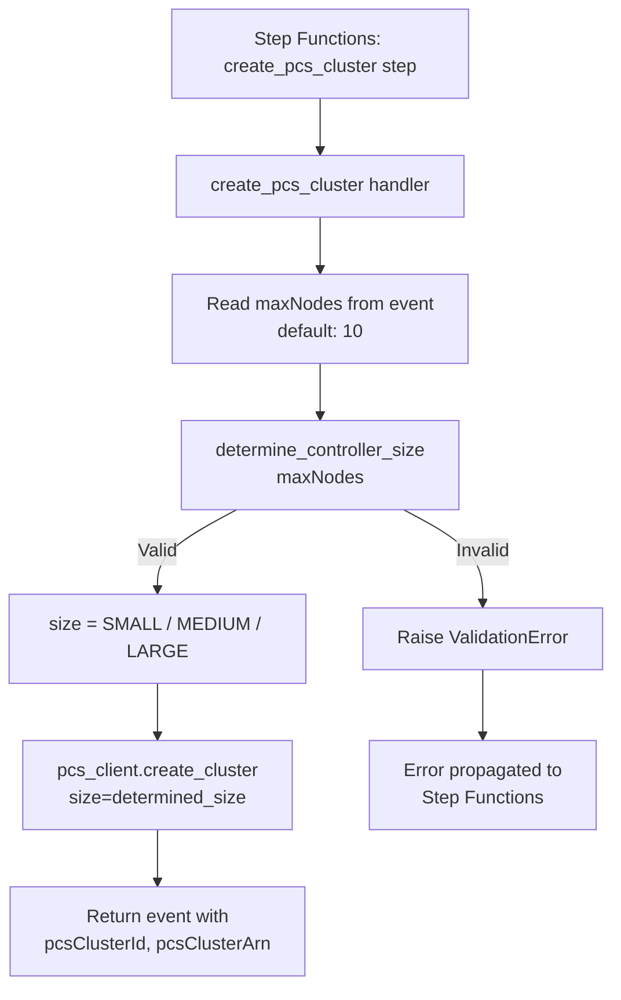

# Design Document: PCS Controller Sizing

## Overview

This feature replaces the hardcoded `size="SMALL"` in `create_pcs_cluster` with a pure sizing function that dynamically selects the correct AWS PCS controller tier based on the total number of managed instances (`maxNodes + 1` login node). The sizing function is a standalone, testable unit with no AWS dependencies, making it reusable for cost estimation and validation endpoints.

The change is minimal in scope: one new pure function, one call-site update in the existing handler, and documentation. The sizing function validates its input, maps the total instance count to the smallest sufficient tier, and raises `ValidationError` for out-of-range values — all before any AWS API call is made.

### Design Rationale

- **Pure function over configuration**: The tier boundaries are fixed by AWS PCS and unlikely to change frequently. A simple function with explicit thresholds is easier to test and reason about than a configuration-driven approach.
- **Fail-fast validation**: Invalid `maxNodes` values are rejected inside the sizing function, before `create_cluster` is called. This prevents creating AWS resources that would immediately be misconfigured.
- **Smallest sufficient tier**: The function always selects the cheapest tier that can handle the workload, avoiding unnecessary cost from over-provisioning.

## Architecture

The sizing logic is added as a pure function in a new module alongside the existing cluster creation code. The `create_pcs_cluster` handler calls this function before making the `pcs_client.create_cluster()` API call.



### Data Flow

1. The Step Functions state machine invokes `create_pcs_cluster` with the event payload containing `maxNodes`.
2. The handler reads `maxNodes` (defaulting to 10) and passes it to `determine_controller_size()`.
3. The sizing function validates the input and returns the appropriate tier string.
4. The handler passes the returned size to `pcs_client.create_cluster()`.
5. If the sizing function raises `ValidationError`, the handler lets it propagate — no AWS resources are created.

## Components and Interfaces

### New Module: `lambda/cluster_operations/pcs_sizing.py`

A single-purpose module containing the sizing function and tier constants.

```python
"""PCS controller sizing logic.

Maps the requested maxNodes count to the appropriate AWS PCS controller
size tier. This module contains no AWS API calls and no external state.
"""

from errors import ValidationError

# AWS PCS controller size tiers: (tier_name, max_managed_instances)
# Ordered from smallest to largest.
PCS_SIZE_TIERS: list[tuple[str, int]] = [
    ("SMALL", 32),
    ("MEDIUM", 512),
    ("LARGE", 2048),
]

# Maximum supported maxNodes value (LARGE tier capacity minus 1 login node)
MAX_SUPPORTED_MAX_NODES: int = PCS_SIZE_TIERS[-1][1] - 1  # 2047


def determine_controller_size(max_nodes: int) -> str:
    """Return the smallest PCS controller size that can manage the workload.

    Args:
        max_nodes: Maximum number of compute node instances. Must be a
            positive integer no greater than 2,047.

    Returns:
        One of ``"SMALL"``, ``"MEDIUM"``, or ``"LARGE"``.

    Raises:
        ValidationError: If *max_nodes* is not a positive integer or
            exceeds the PCS maximum capacity.
    """
    if not isinstance(max_nodes, int) or isinstance(max_nodes, bool):
        raise ValidationError(
            "maxNodes must be an integer.",
            {"field": "maxNodes", "value": str(max_nodes)},
        )

    if max_nodes < 1:
        raise ValidationError(
            "maxNodes must be at least 1.",
            {"field": "maxNodes", "value": max_nodes},
        )

    total_managed = max_nodes + 1  # compute nodes + 1 login node

    if total_managed > PCS_SIZE_TIERS[-1][1]:
        raise ValidationError(
            f"Total managed instance count ({total_managed}) exceeds "
            f"the maximum PCS cluster capacity of "
            f"{PCS_SIZE_TIERS[-1][1]} managed instances. "
            f"maxNodes must be at most {MAX_SUPPORTED_MAX_NODES}.",
            {
                "field": "maxNodes",
                "value": max_nodes,
                "totalManaged": total_managed,
                "maxCapacity": PCS_SIZE_TIERS[-1][1],
            },
        )

    for tier_name, tier_capacity in PCS_SIZE_TIERS:
        if total_managed <= tier_capacity:
            return tier_name

    # Unreachable — the capacity check above guarantees a match.
    raise ValidationError(
        f"No PCS tier found for {total_managed} managed instances.",
        {"field": "maxNodes", "value": max_nodes},
    )
```

### Modified Function: `create_pcs_cluster` in `cluster_creation.py`

The only change to the existing handler is:
1. Import `determine_controller_size` from `pcs_sizing`.
2. Read `maxNodes` from the event dict.
3. Call `determine_controller_size(max_nodes)` to get the size string.
4. Replace the hardcoded `size="SMALL"` with `size=controller_size`.

```python
# At the top of cluster_creation.py, add:
from pcs_sizing import determine_controller_size

# Inside create_pcs_cluster, before the retry loop:
max_nodes = event.get("maxNodes", 10)
controller_size = determine_controller_size(max_nodes)

# In the create_cluster call, replace:
#   size="SMALL",
# with:
#   size=controller_size,
```

The `ValidationError` raised by `determine_controller_size` propagates naturally — the existing Step Functions error handling already catches `ValidationError` at the state machine level.

## Data Models

### PCS Size Tier Lookup Table

| Tier     | Max Managed Instances | Max Tracked Jobs | maxNodes Range |
|----------|-----------------------|------------------|----------------|
| `SMALL`  | 32                    | 256              | 1–31           |
| `MEDIUM` | 512                   | 8,192            | 32–511         |
| `LARGE`  | 2,048                 | 16,384           | 512–2,047      |

### Input / Output Contract

**Input** (`determine_controller_size`):
- `max_nodes: int` — positive integer in range [1, 2047]

**Output**:
- `str` — one of `"SMALL"`, `"MEDIUM"`, `"LARGE"`

**Errors**:
- `ValidationError` with `code="VALIDATION_ERROR"`, `status_code=400` for:
  - Non-integer input
  - `max_nodes < 1`
  - `max_nodes > 2047` (total managed > 2048)

### Tier Boundary Values

| maxNodes | Total Managed | Selected Tier | Rationale                    |
|----------|---------------|---------------|------------------------------|
| 1        | 2             | SMALL         | Minimum valid input          |
| 31       | 32            | SMALL         | Upper boundary of SMALL      |
| 32       | 33            | MEDIUM        | First value requiring MEDIUM |
| 511      | 512           | MEDIUM        | Upper boundary of MEDIUM     |
| 512      | 513           | LARGE         | First value requiring LARGE  |
| 2047     | 2048          | LARGE         | Upper boundary of LARGE      |
| 2048     | 2049          | Error          | Exceeds PCS maximum          |

## Correctness Properties

*A property is a characteristic or behavior that should hold true across all valid executions of a system — essentially, a formal statement about what the system should do. Properties serve as the bridge between human-readable specifications and machine-verifiable correctness guarantees.*

The prework analysis identified four non-redundant properties after consolidation. Requirements 1.1–1.3 and 1.5 are all subsumed by the "smallest sufficient tier" property (1.6). Requirements 1.4 and 3.3 are consolidated into a single over-capacity property. Requirement 4.3 (determinism) is implied by the smallest-sufficient-tier property — a pure function that always returns the correct answer is necessarily deterministic.

### Property 1: Smallest sufficient tier selection

*For any* integer `maxNodes` in [1, 2047], `determine_controller_size(maxNodes)` SHALL return the smallest PCS tier whose capacity is greater than or equal to `maxNodes + 1`. That is, the returned tier's capacity ≥ `maxNodes + 1`, and either there is no smaller tier or the next-smaller tier's capacity < `maxNodes + 1`.

**Validates: Requirements 1.1, 1.2, 1.3, 1.5, 1.6, 4.3**

### Property 2: Over-capacity rejection

*For any* integer `maxNodes` greater than 2,047, `determine_controller_size(maxNodes)` SHALL raise a `ValidationError`.

**Validates: Requirements 1.4, 3.3**

### Property 3: Non-positive input rejection

*For any* integer `maxNodes` less than 1, `determine_controller_size(maxNodes)` SHALL raise a `ValidationError`.

**Validates: Requirements 3.1**

### Property 4: Non-integer input rejection

*For any* value that is not an integer (floats, strings, None, booleans, lists), `determine_controller_size(value)` SHALL raise a `ValidationError`.

**Validates: Requirements 3.2**

## Error Handling

### Sizing Function Errors

All errors raised by `determine_controller_size` are `ValidationError` instances (HTTP 400) with structured `details` dicts:

| Condition | Error Message | Details |
|-----------|---------------|---------|
| `maxNodes` is not an integer | `"maxNodes must be an integer."` | `{"field": "maxNodes", "value": "<str repr>"}` |
| `maxNodes < 1` | `"maxNodes must be at least 1."` | `{"field": "maxNodes", "value": <value>}` |
| `maxNodes > 2047` | `"Total managed instance count (<N>) exceeds the maximum PCS cluster capacity of 2048 managed instances. maxNodes must be at most 2047."` | `{"field": "maxNodes", "value": <value>, "totalManaged": <N>, "maxCapacity": 2048}` |

### Integration Error Handling

The `create_pcs_cluster` handler does **not** catch `ValidationError` from the sizing function. The error propagates up to the Step Functions state machine, which already has error-handling states for `ValidationError`. This is consistent with how other validation errors (e.g., cluster name validation) are handled in the existing workflow.

The existing retry logic for `ConflictException` from `pcs_client.create_cluster()` is unchanged — it only applies after the sizing function has successfully returned a tier.

## Testing Strategy

### Property-Based Tests (Hypothesis)

The project already uses [Hypothesis](https://hypothesis.readthedocs.io/) for property-based testing (see `tests/test_cluster_destruction_properties.py`). The sizing function is an ideal PBT candidate: it's a pure function with a well-defined input domain and clear universal properties.

**File**: `tests/test_pcs_sizing_properties.py`

Each property test runs a minimum of 100 iterations and references its design document property.

| Property | Strategy | Assertion |
|----------|----------|-----------|
| Property 1: Smallest sufficient tier | `st.integers(min_value=1, max_value=2047)` | Returned tier capacity ≥ `maxNodes + 1` AND no smaller tier has sufficient capacity |
| Property 2: Over-capacity rejection | `st.integers(min_value=2048, max_value=100_000)` | `ValidationError` raised |
| Property 3: Non-positive rejection | `st.integers(max_value=0)` | `ValidationError` raised |
| Property 4: Non-integer rejection | `st.one_of(st.floats(), st.text(), st.none(), st.booleans())` | `ValidationError` raised |

**Tag format**: `Feature: pcs-controller-sizing, Property {N}: {title}`

### Example-Based Unit Tests

**File**: `tests/test_pcs_sizing.py`

| Test | Input | Expected |
|------|-------|----------|
| Boundary: SMALL upper | `maxNodes=31` | `"SMALL"` |
| Boundary: MEDIUM lower | `maxNodes=32` | `"MEDIUM"` |
| Boundary: MEDIUM upper | `maxNodes=511` | `"MEDIUM"` |
| Boundary: LARGE lower | `maxNodes=512` | `"LARGE"` |
| Boundary: LARGE upper | `maxNodes=2047` | `"LARGE"` |
| Default maxNodes (10) | `maxNodes=10` | `"SMALL"` |
| Minimum valid | `maxNodes=1` | `"SMALL"` |

### Integration Tests

**File**: `tests/test_pcs_sizing_integration.py`

These tests mock `pcs_client` and verify the wiring between `create_pcs_cluster` and `determine_controller_size`:

| Test | Scenario | Assertion |
|------|----------|-----------|
| Handler passes sizing result | `maxNodes=100` in event | `create_cluster` called with `size="MEDIUM"` |
| Handler uses default maxNodes | No `maxNodes` in event | `create_cluster` called with `size="SMALL"` (default 10 → SMALL) |
| Handler propagates ValidationError | `maxNodes=5000` in event | `ValidationError` raised, `create_cluster` not called |
| No hardcoded size | Any valid event | `size` param to `create_cluster` matches `determine_controller_size` output |

