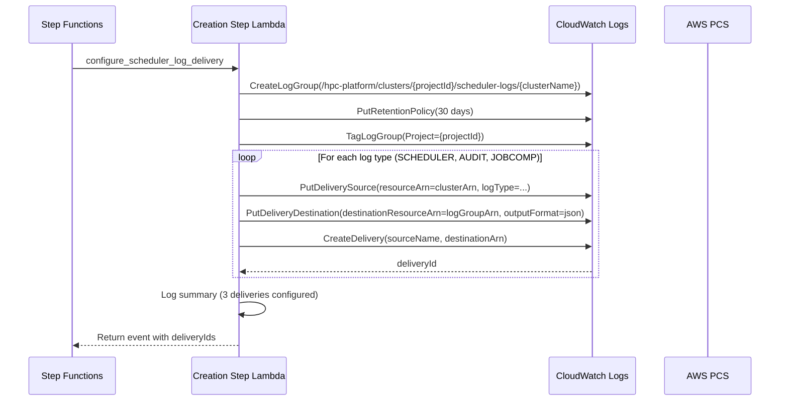
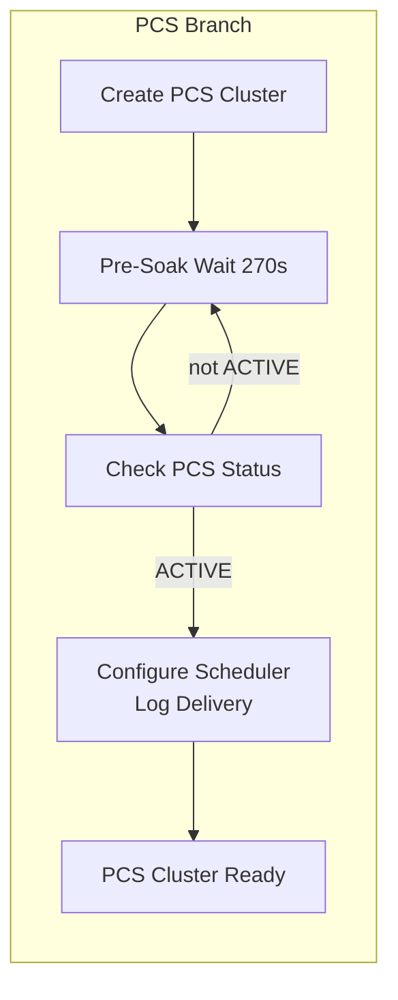

# Design Document: PCS Scheduler Log Delivery

## Overview

This feature adds automatic configuration of AWS PCS vended log delivery to the cluster creation workflow. When a new PCS cluster reaches the ACTIVE state, the creation state machine configures all three PCS log types — scheduler logs, audit logs, and job completion logs — to stream to a per-cluster CloudWatch Log Group. On cluster destruction, the delivery resources and log group are cleaned up.

PCS exposes three vended log types through the CloudWatch Logs delivery APIs:

| Log Type                   | Contents                                    | Key Record Fields                                                                                                                                         |
| ----------------------------| ---------------------------------------------| -----------------------------------------------------------------------------------------------------------------------------------------------------------|
| `PCS_SCHEDULER_LOGS`       | slurmctld, slurmdbd, slurmrestd daemon logs | `resource_id`, `event_timestamp`, `log_level`, `log_name`, `scheduler_type`, `scheduler_major_version`, `scheduler_patch_version`, `node_type`, `message` |
| `PCS_SCHEDULER_AUDIT_LOGS` | slurmctld audit/RPC tracking logs           | Same as above plus `log_type`                                                                                                                             |
| `PCS_JOBCOMP_LOGS`         | Slurm job completion records                | `resource_id`, `event_timestamp`, `scheduler_type`, `scheduler_major_version`, `fields`                                                                   |

Each log type requires three CloudWatch Logs resources: a Delivery Source (registers the PCS cluster as log origin), a Delivery Destination (registers the target log group), and a Delivery (links source to destination). All nine resources (3 per log type) are created during cluster creation and deleted during cluster destruction.

### Key Design Decisions

1. **Dynamic log group creation in the step function** rather than in `ProjectInfrastructureStack`. The log group name includes the cluster name (`/hpc-platform/clusters/{projectId}/scheduler-logs/{clusterName}`), which is only known at cluster creation time. Creating it in the step Lambda keeps the lifecycle tied to the cluster, not the project infrastructure.

2. **Single log group for all three log types.** PCS automatically creates separate log streams per log type within the group (pattern: `AWSLogs/PCS/{cluster_id}/{log_name}_{scheduler_major_version}.log`), so a single log group provides clean separation without requiring three separate groups.

3. **30-day retention** balances cost with operational usefulness. Scheduler logs are primarily used for troubleshooting active or recent issues, not long-term audit. This matches the console default and keeps CloudWatch costs predictable.

4. **ConflictException treated as success** for all delivery API calls. The cluster creation state machine can retry steps on transient failures, so the delivery configuration must be idempotent. If a source, destination, or delivery already exists from a previous attempt, the step adopts it and continues. This matches the existing `create_pcs_cluster` pattern that adopts existing clusters.

5. **Cleanup step added to `consolidated_cleanup`** in the destruction workflow rather than as a separate state machine step. Log delivery cleanup is fast (API calls only, no polling), so it fits naturally into the existing consolidated cleanup pattern alongside IAM resource deletion, launch template cleanup, and cluster name deregistration.

6. **Deterministic resource naming** using `{clusterName}-{suffix}` for sources and `{projectId}-{clusterName}-{suffix}` for destinations. This makes resources discoverable without storing delivery IDs in DynamoDB, and enables cleanup by name rather than requiring stored state.

## Architecture

```mermaid
flowchart TB
    subgraph Creation["Cluster Creation State Machine"]
        direction TB
        CPC[Create PCS Cluster]
        CPCS[Check PCS Cluster Status<br/>wait loop until ACTIVE]
        CSLD[Configure Scheduler<br/>Log Delivery<br/><i>new step</i>]
        CLN[Create Login Node Group]

        CPC --> CPCS
        CPCS --> CSLD
        CSLD --> CLN
    end

    subgraph CSLD_Detail["configure_scheduler_log_delivery internals"]
        direction TB
        CLG[Create Log Group<br/>/hpc-platform/clusters/{projectId}/<br/>scheduler-logs/{clusterName}]
        DS1[PutDeliverySource × 3]
        DD1[PutDeliveryDestination × 3]
        CD1[CreateDelivery × 3]

        CLG --> DS1 --> DD1 --> CD1
    end

    subgraph Destruction["Cluster Destruction — consolidated_cleanup"]
        direction TB
        DEL_D[DeleteDelivery × 3]
        DEL_DD[DeleteDeliveryDestination × 3]
        DEL_DS[DeleteDeliverySource × 3]
        DEL_LG[DeleteLogGroup]

        DEL_D --> DEL_DD --> DEL_DS --> DEL_LG
    end

    subgraph CloudWatch["CloudWatch Logs"]
        LG[Log Group<br/>/hpc-platform/clusters/{projectId}/<br/>scheduler-logs/{clusterName}]
        LS1[AWSLogs/PCS/{cluster_id}/<br/>slurmctld_25.11.log]
        LS2[AWSLogs/PCS/{cluster_id}/<br/>slurmdbd_25.11.log]
        LS3[AWSLogs/PCS/{cluster_id}/<br/>slurmrestd_25.11.log]
        LS4[AWSLogs/PCS/{cluster_id}/<br/>slurmctld_audit_25.11.log]
        LS5[AWSLogs/PCS/{cluster_id}/<br/>jobcomp_25.11.log]

        LG --- LS1
        LG --- LS2
        LG --- LS3
        LG --- LS4
        LG --- LS5
    end

    CSLD -.->|creates| LG
    CD1 -.->|activates log flow| LG
    DEL_LG -.->|deletes| LG
```

### Delivery Configuration Flow



## Components and Interfaces

### 1. `configure_scheduler_log_delivery` Step (cluster_creation.py)

New step function added to the cluster creation workflow, registered in `_STEP_DISPATCH`.

```python
def configure_scheduler_log_delivery(event: dict[str, Any]) -> dict[str, Any]:
    """Configure PCS vended log delivery for all three log types.

    Creates a CloudWatch Log Group and configures delivery sources,
    destinations, and deliveries for PCS_SCHEDULER_LOGS,
    PCS_SCHEDULER_AUDIT_LOGS, and PCS_JOBCOMP_LOGS.

    Parameters
    ----------
    event : dict
        State machine payload containing:
        - projectId: str
        - clusterName: str
        - pcsClusterId: str
        - pcsClusterArn: str

    Returns
    -------
    dict
        Original event merged with schedulerLogGroupName and
        schedulerDeliveryIds (list of delivery IDs).
    """
```

**Internal functions:**

| Function | Purpose |
|----------|---------|
| `_create_scheduler_log_group(project_id, cluster_name)` | Creates the CloudWatch Log Group with 30-day retention and Project tag. Handles `ResourceAlreadyExistsException` for idempotency. Returns the log group ARN. |
| `_configure_delivery_for_log_type(cluster_name, project_id, cluster_arn, log_group_arn, log_type, suffix)` | Calls `PutDeliverySource`, `PutDeliveryDestination`, and `CreateDelivery` for a single log type. Handles `ConflictException` for idempotency. Returns the delivery ID. |

**Log type configuration table:**

| Log Type | Source Name | Destination Name | Suffix |
|----------|-------------|------------------|--------|
| `PCS_SCHEDULER_LOGS` | `{clusterName}-scheduler-logs` | `{projectId}-{clusterName}-scheduler-logs` | `scheduler-logs` |
| `PCS_SCHEDULER_AUDIT_LOGS` | `{clusterName}-scheduler-audit-logs` | `{projectId}-{clusterName}-scheduler-audit-logs` | `scheduler-audit-logs` |
| `PCS_JOBCOMP_LOGS` | `{clusterName}-jobcomp-logs` | `{projectId}-{clusterName}-jobcomp-logs` | `jobcomp-logs` |

### 2. `cleanup_scheduler_log_delivery` Function (cluster_destruction.py)

New function added to the destruction workflow, called from within `consolidated_cleanup`.

```python
def cleanup_scheduler_log_delivery(event: dict[str, Any]) -> dict[str, Any]:
    """Delete all vended log delivery resources and the scheduler log group.

    Deletes in the required order: deliveries → destinations → sources → log group.
    Handles ResourceNotFoundException for idempotency (already deleted).

    Parameters
    ----------
    event : dict
        State machine payload containing:
        - projectId: str
        - clusterName: str

    Returns
    -------
    dict
        Original event (unchanged — cleanup is side-effect only).
    """
```

**Internal functions:**

| Function | Purpose |
|----------|---------|
| `_delete_deliveries_by_name(source_names)` | Lists deliveries matching the source names and deletes them. Handles `ResourceNotFoundException`. |
| `_delete_delivery_destinations(destination_names)` | Deletes delivery destinations by name. Handles `ResourceNotFoundException`. |
| `_delete_delivery_sources(source_names)` | Deletes delivery sources by name. Handles `ResourceNotFoundException`. |
| `_delete_scheduler_log_group(project_id, cluster_name)` | Deletes the scheduler log group. Handles `ResourceNotFoundException`. |

### 3. CDK Changes (cluster-operations.ts)

**Creation state machine changes:**
- New `ConfigureSchedulerLogDelivery` Lambda invoke step inserted between `IsPcsClusterActive` (PCS cluster ready) and `CreateLoginNodeGroup` in the PCS branch
- The step uses the same `clusterCreationStepLambda` with `step: 'configure_scheduler_log_delivery'`
- Error catch routes to the existing `failureChain` for rollback

**IAM policy additions for creation step Lambda:**

```typescript
// Vended log delivery configuration
clusterCreationStepLambda.addToRolePolicy(new iam.PolicyStatement({
  actions: [
    'logs:PutDeliverySource',
    'logs:PutDeliveryDestination',
    'logs:CreateDelivery',
    'logs:GetDelivery',
    'logs:CreateLogGroup',
    'logs:PutRetentionPolicy',
    'logs:TagLogGroup',
    'logs:DescribeLogGroups',
  ],
  resources: ['*'],
}));

clusterCreationStepLambda.addToRolePolicy(new iam.PolicyStatement({
  actions: ['pcs:AllowVendedLogDeliveryForResource'],
  resources: ['*'],  // PCS cluster ARNs are dynamic
}));
```

**IAM policy additions for destruction step Lambda:**

```typescript
// Vended log delivery cleanup
clusterDestructionStepLambda.addToRolePolicy(new iam.PolicyStatement({
  actions: [
    'logs:DeleteDelivery',
    'logs:DeleteDeliverySource',
    'logs:DeleteDeliveryDestination',
    'logs:DeleteLogGroup',
    'logs:ListDeliveries',
    'logs:ListDeliverySources',
    'logs:ListDeliveryDestinations',
  ],
  resources: ['*'],
}));
```

### 4. State Machine Integration

The `configure_scheduler_log_delivery` step is inserted into the PCS branch of the parallel provision block. After the PCS cluster status check confirms ACTIVE, the new step runs before the parallel branches converge and node group creation begins.



## Data Models

### Step Input (configure_scheduler_log_delivery)

```json
{
  "projectId": "proj-abc123",
  "clusterName": "my-cluster",
  "pcsClusterId": "pcs_szls0cjyty",
  "pcsClusterArn": "arn:aws:pcs:us-east-1:123456789012:cluster/pcs_szls0cjyty"
}
```

### Step Output (configure_scheduler_log_delivery)

```json
{
  "projectId": "proj-abc123",
  "clusterName": "my-cluster",
  "pcsClusterId": "pcs_szls0cjyty",
  "pcsClusterArn": "arn:aws:pcs:us-east-1:123456789012:cluster/pcs_szls0cjyty",
  "schedulerLogGroupName": "/hpc-platform/clusters/proj-abc123/scheduler-logs/my-cluster",
  "schedulerDeliveryIds": [
    "delivery-abc123",
    "delivery-def456",
    "delivery-ghi789"
  ]
}
```

### Delivery Resource Naming Convention

| Resource Type | Name Pattern | Example |
|---------------|-------------|---------|
| Delivery Source | `{clusterName}-{suffix}` | `my-cluster-scheduler-logs` |
| Delivery Destination | `{projectId}-{clusterName}-{suffix}` | `proj-abc123-my-cluster-scheduler-logs` |
| Log Group | `/hpc-platform/clusters/{projectId}/scheduler-logs/{clusterName}` | `/hpc-platform/clusters/proj-abc123/scheduler-logs/my-cluster` |
| Log Streams (PCS-managed) | `AWSLogs/PCS/{cluster_id}/{log_name}_{version}.log` | `AWSLogs/PCS/pcs_szls0cjyty/slurmctld_25.11.log` |

### PCS Log Type Configuration

```python
_PCS_LOG_TYPES = [
    {
        "logType": "PCS_SCHEDULER_LOGS",
        "suffix": "scheduler-logs",
        "service": "pcs",
    },
    {
        "logType": "PCS_SCHEDULER_AUDIT_LOGS",
        "suffix": "scheduler-audit-logs",
        "service": "pcs",
    },
    {
        "logType": "PCS_JOBCOMP_LOGS",
        "suffix": "jobcomp-logs",
        "service": "pcs",
    },
]
```

## Correctness Properties

*A property is a characteristic or behavior that should hold true across all valid executions of a system — essentially, a formal statement about what the system should do. Properties serve as the bridge between human-readable specifications and machine-verifiable correctness guarantees.*

### Property 1: Log group creation correctness

*For any* valid `projectId` and `clusterName`, the `configure_scheduler_log_delivery` step SHALL create a CloudWatch Log Group named `/hpc-platform/clusters/{projectId}/scheduler-logs/{clusterName}` with a 30-day retention policy and a `Project` tag matching the `projectId`.

**Validates: Requirements 1.1, 1.2, 1.4, 3.4**

### Property 2: Delivery configuration completeness and correctness

*For any* valid cluster details (`clusterName`, `projectId`, `pcsClusterArn`), the `configure_scheduler_log_delivery` step SHALL call `PutDeliverySource`, `PutDeliveryDestination`, and `CreateDelivery` exactly once for each of the three PCS log types (`PCS_SCHEDULER_LOGS`, `PCS_SCHEDULER_AUDIT_LOGS`, `PCS_JOBCOMP_LOGS`), with source names matching `{clusterName}-{suffix}`, destination names matching `{projectId}-{clusterName}-{suffix}`, and all destinations targeting the same log group ARN.

**Validates: Requirements 2.1, 2.2, 2.3, 2.4, 2.6**

### Property 3: Cleanup ordering and completeness

*For any* cluster with delivery resources, the `cleanup_scheduler_log_delivery` function SHALL delete all deliveries before any destinations, all destinations before any sources, and the log group only after all sources are deleted.

**Validates: Requirements 5.1, 5.2, 5.3, 5.4, 5.6**

### Property 4: Successful configuration logging

*For any* successful delivery configuration, the `configure_scheduler_log_delivery` step SHALL emit an INFO-level log entry for each log type containing the log type name, delivery source name, and delivery ID, and SHALL emit a summary INFO-level log entry containing the cluster name and the count of deliveries configured (3).

**Validates: Requirements 6.1, 6.4**

## Error Handling

| Scenario | Behaviour | Log Level |
|----------|-----------|-----------|
| `CreateLogGroup` raises `ResourceAlreadyExistsException` | Reuse existing log group, continue | INFO |
| `PutDeliverySource` raises `ConflictException` | Treat as success, continue to next API call | INFO |
| `PutDeliveryDestination` raises `ConflictException` | Treat as success, continue to next API call | INFO |
| `CreateDelivery` raises `ConflictException` | Treat as success, continue to next log type | INFO |
| Any delivery API raises unexpected `ClientError` | Log error details (API action, resource name, exception), raise exception | ERROR |
| `DeleteDelivery` raises `ResourceNotFoundException` | Treat as success, continue | DEBUG |
| `DeleteDeliveryDestination` raises `ResourceNotFoundException` | Treat as success, continue | DEBUG |
| `DeleteDeliverySource` raises `ResourceNotFoundException` | Treat as success, continue | DEBUG |
| `DeleteLogGroup` raises `ResourceNotFoundException` | Treat as success, continue | DEBUG |
| Creation step fails with unhandled exception | State machine routes to `handle_creation_failure` for rollback | ERROR |
| Destruction cleanup fails | Error propagates through `consolidated_cleanup` catch to `record_cluster_destruction_failed` | ERROR |

All `ConflictException` handling during creation and `ResourceNotFoundException` handling during destruction ensures both paths are fully idempotent, supporting safe retries by the state machine.

## Testing Strategy

### Unit Tests (pytest)

**Creation step (`test_configure_scheduler_log_delivery.py`):**
- Example: Step is registered in `_STEP_DISPATCH` as `configure_scheduler_log_delivery`
- Example: Missing required payload fields (`pcsClusterArn`, `projectId`, etc.) raises appropriate error
- Example: `CreateLogGroup` raises `ResourceAlreadyExistsException` → step continues without error
- Example: `PutDeliverySource` raises `ConflictException` → step continues, logs INFO
- Example: `CreateDelivery` raises unexpected `ClientError` → step logs ERROR and raises
- Example: All three log types are configured in a single invocation

**Destruction cleanup (`test_cleanup_scheduler_log_delivery.py`):**
- Example: All delivery resources exist → deleted in correct order
- Example: Some delivery resources already deleted (`ResourceNotFoundException`) → step continues
- Example: Log group does not exist → step continues without error
- Example: `DeleteDelivery` raises unexpected error → error propagates

### Property-Based Tests (Hypothesis)

Property-based testing is appropriate for this feature because the delivery configuration and cleanup functions are logic-heavy with clear input/output behaviour that varies meaningfully across a wide input space (different project IDs, cluster names, cluster ARNs, and combinations of existing/missing resources).

**Library:** [Hypothesis](https://hypothesis.readthedocs.io/) (already used in this project — see `.hypothesis/` directory)

**Configuration:** Minimum 100 iterations per property test.

**Tag format:** `Feature: pcs-scheduler-log-delivery, Property {number}: {property_text}`

| Property | Test Description | Key Generators |
|----------|-----------------|----------------|
| Property 1: Log group creation correctness | Generate random `projectId` and `clusterName` strings. Call `configure_scheduler_log_delivery` with mocked CloudWatch client. Verify: `CreateLogGroup` called with correct name pattern, `PutRetentionPolicy` called with 30 days, `TagLogGroup` called with `{"Project": projectId}`. | `st.from_regex(r'[a-z][a-z0-9-]{2,20}')` for projectId and clusterName |
| Property 2: Delivery configuration completeness | Generate random cluster details. Call `configure_scheduler_log_delivery` with mocked CloudWatch client. Verify: `PutDeliverySource` called 3 times with correct `resourceArn`, `logType`, and source name pattern; `PutDeliveryDestination` called 3 times with same `destinationResourceArn` and correct destination name pattern; `CreateDelivery` called 3 times linking correct sources to destinations. | Composite strategy for cluster details |
| Property 3: Cleanup ordering and completeness | Generate random cluster details. Mock `ListDeliveries`/`ListDeliverySources`/`ListDeliveryDestinations` to return matching resources. Call `cleanup_scheduler_log_delivery`. Verify: all `DeleteDelivery` calls precede all `DeleteDeliveryDestination` calls, which precede all `DeleteDeliverySource` calls, which precede `DeleteLogGroup`. | `st.from_regex()` for IDs, `st.lists()` for delivery records |
| Property 4: Successful configuration logging | Generate random cluster details. Call `configure_scheduler_log_delivery` with mocked CloudWatch client. Capture log output. Verify: 3 INFO entries each containing log type, source name, and delivery ID; 1 summary INFO entry containing cluster name and count 3. | Composite strategy reusing cluster detail generators |

### CDK Assertion Tests (Jest)

- `ConfigureSchedulerLogDelivery` step exists in the creation state machine with correct step name
- `ConfigureSchedulerLogDelivery` step has catch block routing to failure handler
- Creation step Lambda IAM policy includes `logs:PutDeliverySource`, `logs:PutDeliveryDestination`, `logs:CreateDelivery`, `logs:GetDelivery`, `logs:CreateLogGroup`, `logs:PutRetentionPolicy`, `logs:TagLogGroup`, `logs:DescribeLogGroups`
- Creation step Lambda IAM policy includes `pcs:AllowVendedLogDeliveryForResource`
- Destruction step Lambda IAM policy includes `logs:DeleteDelivery`, `logs:DeleteDeliverySource`, `logs:DeleteDeliveryDestination`, `logs:DeleteLogGroup`, `logs:ListDeliveries`, `logs:ListDeliverySources`, `logs:ListDeliveryDestinations`
