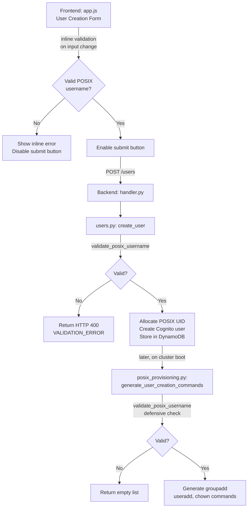

# Design Document: POSIX Username Validation

## Overview

This feature adds consistent POSIX username validation across the HPC self-service platform to prevent invalid Linux usernames from reaching Cognito, DynamoDB, or shell commands. Today, the `userId` field in `POST /users` is interpolated directly into bash commands (`groupadd`, `useradd`, `chown`) with no format validation. Invalid values silently fail on cluster nodes (masked by `2>/dev/null || true`) and present a command injection risk.

The design introduces a single `validate_posix_username()` function in a shared Python module, called from the backend API before any side effects. The frontend mirrors the same rules with inline validation on the user creation form. The POSIX provisioning module adds a defensive guard that rejects unvalidated usernames. Documentation is updated to describe the format constraints.

### Key Design Decisions

1. **Single shared validator in Python** — The validation function lives in `lambda/shared/validators.py` so both `user_management` and `cluster_operations` can import it. The frontend reimplements the same regex in JavaScript since the two runtimes cannot share code directly.
2. **Regex-based validation** — The POSIX username rules map cleanly to a single regex `^[a-z_][a-z0-9_-]{0,31}$`. A regex is simpler, faster, and easier to audit than procedural checks. Specific error messages are produced by checking each rule sequentially when the regex fails.
3. **Validation before side effects** — The backend validates `userId` in `create_user()` before calling `_allocate_posix_uid()`, `_create_cognito_user()`, or `table.put_item()`. This avoids orphaned Cognito users or wasted UID allocations on invalid input.
4. **Defensive check in provisioning** — `generate_user_creation_commands()` calls the validator as a safety net. Even though the API layer validates first, the provisioning module should never produce shell commands for an invalid username.
5. **No Cognito construct changes needed** — Cognito accepts usernames matching `[a-zA-Z0-9_.-@+]` with length 1–128. Every valid POSIX username is a strict subset of this, so no CDK changes are required.

## Architecture

The validation logic flows through three layers:



### Validation Points

| Layer | File | When | Action on Invalid |
|-------|------|------|-------------------|
| Frontend | `frontend/js/app.js` | On each input change in User ID field | Show inline error, disable submit |
| Backend API | `lambda/user_management/users.py` | Start of `create_user()`, before any side effects | Raise `ValidationError` (HTTP 400) |
| Provisioning | `lambda/cluster_operations/posix_provisioning.py` | Start of `generate_user_creation_commands()` | Return empty command list |

## Components and Interfaces

### 1. Shared Validator Module — `lambda/shared/validators.py`

New module providing the canonical POSIX username validation function.

```python
import re

# Canonical POSIX username regex: starts with lowercase letter or underscore,
# followed by 0-31 lowercase letters, digits, underscores, or hyphens.
POSIX_USERNAME_REGEX = re.compile(r"^[a-z_][a-z0-9_-]{0,31}$")
POSIX_USERNAME_MAX_LENGTH = 32


def validate_posix_username(username: str) -> tuple[bool, str]:
    """Validate a string as a POSIX username.

    Parameters
    ----------
    username : str
        The candidate username to validate.

    Returns
    -------
    tuple[bool, str]
        A tuple of (is_valid, error_message). When valid, error_message
        is an empty string. When invalid, error_message describes the
        first rule violated.
    """
```

**Validation rules (checked in order, first failure returned):**

1. Must not be empty → `"userId is required."`
2. Must not exceed 32 characters → `"userId must be at most 32 characters (got {n})."`
3. Must start with a lowercase letter or underscore → `"userId must start with a lowercase letter (a-z) or underscore (_)."`
4. Must contain only `[a-z0-9_-]` → `"userId contains invalid characters. Only lowercase letters (a-z), digits (0-9), underscores (_), and hyphens (-) are allowed."`

The sequential check provides specific error messages. The compiled regex `POSIX_USERNAME_REGEX` is used as the fast-path acceptance check.

### 2. Backend Integration — `lambda/user_management/users.py`

The `create_user()` function gains a validation call at the top, before `_allocate_posix_uid()`:

```python
from validators import validate_posix_username

def create_user(...):
    is_valid, error_msg = validate_posix_username(user_id)
    if not is_valid:
        raise ValidationError(error_msg, {"field": "userId"})
    # ... existing logic unchanged
```

The handler (`handler.py`) already catches `ValidationError` and returns HTTP 400 with the structured error response. No handler changes are needed.

### 3. Frontend Validation — `frontend/js/app.js`

Add a JavaScript reimplementation of the POSIX username regex and wire it to the User ID input field:

```javascript
const POSIX_USERNAME_REGEX = /^[a-z_][a-z0-9_-]{0,31}$/;

function validatePosixUsername(username) {
  if (!username) return 'User ID is required.';
  if (username.length > 32) return `User ID must be at most 32 characters (got ${username.length}).`;
  if (!/^[a-z_]/.test(username)) return 'User ID must start with a lowercase letter (a-z) or underscore (_).';
  if (!/^[a-z0-9_-]+$/.test(username)) return 'User ID contains invalid characters. Only lowercase letters (a-z), digits (0-9), underscores (_), and hyphens (-) are allowed.';
  return '';
}
```

The User ID input field (`#new-user-id`) gets an `input` event listener that:
1. Calls `validatePosixUsername()` on the current value.
2. Shows/hides an inline error `<div>` below the field.
3. Enables/disables the "Create User" button (`#btn-submit-user`).

An inline error element is added to the form HTML:

```html
<div class="form-group">
  <label for="new-user-id">User ID</label>
  <input type="text" id="new-user-id" placeholder="jsmith" maxlength="32" />
  <div id="user-id-error" class="field-error" role="alert" aria-live="polite"></div>
</div>
```

### 4. Provisioning Defensive Check — `lambda/cluster_operations/posix_provisioning.py`

`generate_user_creation_commands()` adds a validation guard after the existing empty check:

```python
from validators import validate_posix_username

def generate_user_creation_commands(user_id: str, uid: int, gid: int) -> list[str]:
    if not user_id:
        return []
    is_valid, _ = validate_posix_username(user_id)
    if not is_valid:
        return []
    # ... existing command generation unchanged
```

### 5. Documentation Update — `docs/admin/user-management.md`

The `userId` field description in the "Creating a User" section is updated to include:
- The POSIX username format rules (allowed characters, start character, max length)
- Examples of valid usernames: `jsmith`, `_admin01`, `dev-user`
- Examples of invalid usernames: `Jane.Smith` (uppercase, dot), `admin@corp` (@ symbol)
- The `VALIDATION_ERROR` response for invalid `userId`

## Data Models

No new data models are introduced. The existing `PlatformUsers` DynamoDB table schema is unchanged. The `userId` field gains a validation constraint but its storage format remains a plain string.

### Validation Contract

The POSIX username validation is defined by a single regex pattern:

```
^[a-z_][a-z0-9_-]{0,31}$
```

| Rule | Constraint |
|------|-----------|
| Allowed characters | Lowercase ASCII letters `a-z`, digits `0-9`, underscore `_`, hyphen `-` |
| Start character | Must be a lowercase letter `a-z` or underscore `_` |
| Length | 1 to 32 characters inclusive |
| Disallowed | Uppercase letters, `@`, `.`, spaces, any other characters |

## Correctness Properties

*A property is a characteristic or behavior that should hold true across all valid executions of a system — essentially, a formal statement about what the system should do. Properties serve as the bridge between human-readable specifications and machine-verifiable correctness guarantees.*

### Property 1: Validator matches reference specification (model-based)

*For any* arbitrary string, the `validate_posix_username()` function SHALL return `(True, "")` if and only if the string matches the reference regex `^[a-z_][a-z0-9_-]{0,31}$`. Equivalently, it SHALL return `(False, <non-empty message>)` for all strings that do not match.

**Validates: Requirements 1.3, 1.4, 1.5, 1.7, 2.3, 2.4**

### Property 2: Invalid inputs produce descriptive error messages

*For any* string that does not match the POSIX username specification, the `validate_posix_username()` function SHALL return a non-empty, human-readable error message as the second element of the result tuple.

**Validates: Requirements 2.2**

### Property 3: Valid usernames produce well-formed shell commands

*For any* valid POSIX username and any positive integer UID/GID pair, `generate_user_creation_commands(user_id, uid, gid)` SHALL return a non-empty list of commands where: (a) the list contains exactly 3 commands for `groupadd`, `useradd`, and `chown`; (b) the `user_id` appears only as a command argument or in the `/home/{user_id}` path; and (c) no shell metacharacters are introduced beyond those in the command template.

**Validates: Requirements 5.1, 5.3**

### Property 4: Invalid usernames produce empty command lists

*For any* string that does not match the POSIX username specification, `generate_user_creation_commands(user_id, uid, gid)` SHALL return an empty list, regardless of the UID/GID values provided.

**Validates: Requirements 5.2**

## Error Handling

### Backend Validation Errors

All validation failures use the existing `ValidationError` exception class, which produces a structured HTTP 400 response:

```json
{
  "error": {
    "code": "VALIDATION_ERROR",
    "message": "userId must start with a lowercase letter (a-z) or underscore (_).",
    "details": { "field": "userId" }
  }
}
```

The error messages are ordered by rule priority:
1. Empty/missing → `"userId is required."`
2. Too long → `"userId must be at most 32 characters (got {n})."`
3. Invalid start character → `"userId must start with a lowercase letter (a-z) or underscore (_)."`
4. Invalid characters → `"userId contains invalid characters. Only lowercase letters (a-z), digits (0-9), underscores (_), and hyphens (-) are allowed."`

### Provisioning Defensive Failure

`generate_user_creation_commands()` returns an empty list for invalid usernames. This is a silent safety net — the invalid username should never reach this point in normal operation because the API layer validates first. The function logs a warning when it rejects a username so operators can investigate.

### Frontend Validation

The frontend displays inline error messages below the User ID field. The submit button is disabled while the field is invalid, preventing the API call entirely. If the user bypasses frontend validation (e.g., via curl), the backend validation catches the invalid input.

## Testing Strategy

### Property-Based Tests (Hypothesis)

Property-based tests use the [Hypothesis](https://hypothesis.readthedocs.io/) library (already used in the project) with a minimum of 100 iterations per property. Tests live in `tests/test_posix_username_validation_properties.py`.

| Property | Test Description | Generator Strategy |
|----------|-----------------|-------------------|
| Property 1 | Validator matches reference regex for arbitrary strings | `st.text(min_size=0, max_size=64)` — arbitrary Unicode strings |
| Property 2 | Invalid inputs produce non-empty error messages | `st.text(min_size=0, max_size=64).filter(lambda s: not re.match(r'^[a-z_][a-z0-9_-]{0,31}$', s))` |
| Property 3 | Valid usernames produce well-formed commands | `st.from_regex(r'[a-z_][a-z0-9_-]{0,31}', fullmatch=True)` combined with `st.integers(min_value=1000, max_value=65534)` for UID/GID |
| Property 4 | Invalid usernames produce empty command lists | Same invalid string generator as Property 2, combined with arbitrary UID/GID |

Each test is tagged with: `Feature: posix-username-validation, Property {N}: {description}`

### Unit Tests (Example-Based)

Example-based unit tests in `tests/test_posix_username_validation.py` cover:

- **Valid username examples**: `"a"`, `"jsmith"`, `"_admin"`, `"dev-user-01"`, `"a" * 32` (max length)
- **Invalid username examples**: `""`, `"A"`, `"1user"`, `"-user"`, `"user@corp"`, `"user.name"`, `"user name"`, `"a" * 33` (too long)
- **Error message specificity**: Each rule violation produces the expected message text
- **Frontend/backend parity**: The JavaScript regex and Python validator agree on a set of test vectors
- **Integration**: `create_user()` raises `ValidationError` for invalid usernames before calling Cognito/DynamoDB (mocked)
- **Edge cases**: Single-character usernames (`"a"`, `"_"`), all-digit body (`"a123"`), all-hyphen body (`"a---"`)

### Integration Tests

- Verify `create_user()` with mocked Cognito/DynamoDB does not call external services when `userId` is invalid
- Verify `generate_user_creation_commands()` returns empty list for invalid usernames and correct commands for valid ones

### What Is NOT Property-Tested

- **Frontend UI behavior** (button enable/disable, error display) — tested with example-based tests
- **Cognito acceptance** — external service behavior, tested with 1-2 integration examples
- **Documentation content** — verified by manual review
- **CDK construct configuration** — verified by existing CDK snapshot tests
