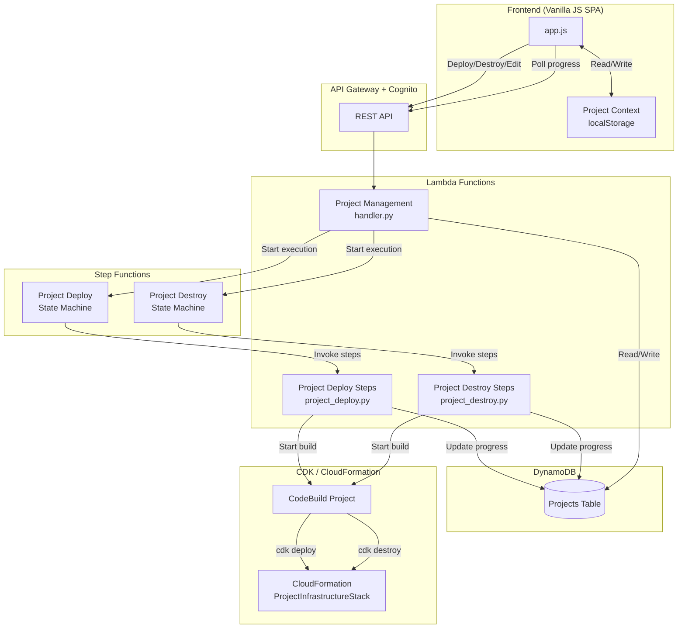
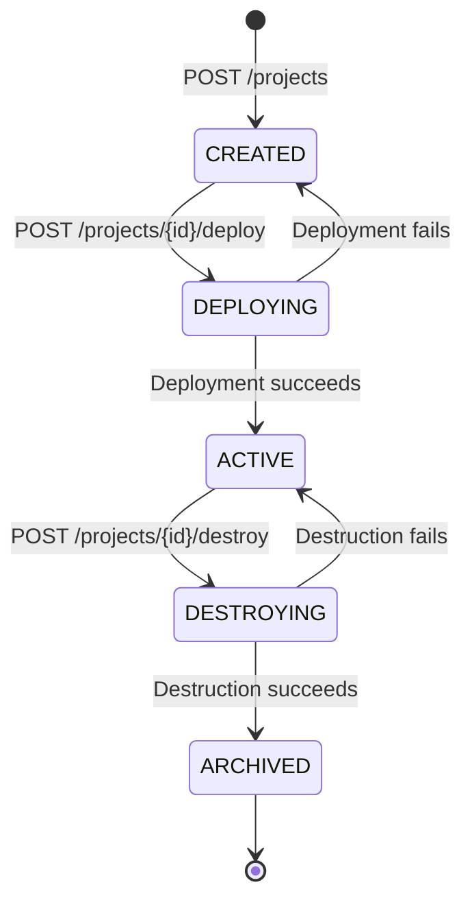
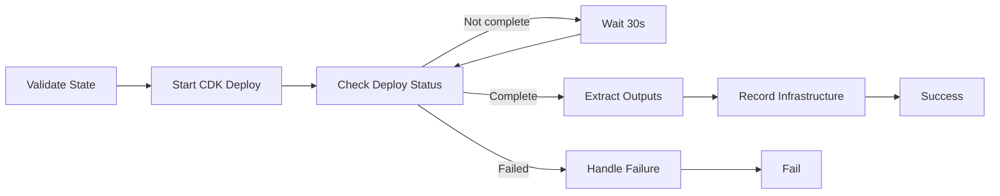

# Design Document: Project Lifecycle Management

## Overview

This design introduces a full project lifecycle state machine, Step Functions-based infrastructure orchestration, and supporting UI/API changes to the self-service HPC platform. Currently, `create_project()` in `lambda/project_management/projects.py` writes a DynamoDB record with `status: "ACTIVE"` and empty infrastructure fields — no actual cloud resources are provisioned. This feature decouples project record creation from infrastructure deployment, giving administrators a review step before committing cloud resources.

The design mirrors the existing cluster creation/destruction pattern (Step Functions → Lambda step handlers → DynamoDB progress tracking → UI polling) but applies it at the project level. It also adds budget type selection (MONTHLY vs TOTAL), immediate budget enforcement on change, persistent project selection context in the frontend, and context-sensitive UI actions tied to lifecycle state.

### Key Design Decisions

1. **Reuse the Step Functions orchestration pattern** from cluster creation/destruction rather than inventing a new mechanism. This keeps the codebase consistent and leverages proven progress-tracking infrastructure.
2. **CDK deployment via SDK calls** — The project deployment Step Function invokes `cdk deploy` via a CodeBuild project (not inline Lambda) because CDK synthesis and CloudFormation deployment can exceed Lambda's 15-minute timeout. The Step Function polls for completion.
3. **State machine transitions enforced server-side** — The API validates every transition against the allowed state graph, returning descriptive errors for invalid transitions.
4. **Budget breach clearing is synchronous** — When a budget is increased above current spend, the `budgetBreached` flag is cleared in the same API request, restoring access immediately without waiting for the AWS Budgets async cycle.
5. **Project context stored in `localStorage`** — Consistent with the existing session storage pattern for auth tokens.

## Architecture

### System Architecture Diagram



### State Machine Diagram



### Valid State Transitions

| From | To | Trigger |
|------|-----|---------|
| CREATED | DEPLOYING | Administrator triggers deploy |
| DEPLOYING | ACTIVE | Step Function completes successfully |
| DEPLOYING | CREATED | Step Function fails (rollback) |
| ACTIVE | DESTROYING | Administrator triggers destroy |
| DESTROYING | ARCHIVED | Step Function completes successfully |
| DESTROYING | ACTIVE | Step Function fails (rollback) |

## Components and Interfaces

### 1. Project Management Lambda — New/Modified Routes

The existing `lambda/project_management/handler.py` gains three new routes and one modified route:

#### POST /projects/{projectId}/deploy (New)

Initiates infrastructure deployment for a project in CREATED status.

```python
def _handle_deploy_project(event, project_id):
    """Start project infrastructure deployment."""
    # 1. Verify caller is Administrator
    # 2. Verify project exists and status == CREATED
    # 3. Transition status to DEPLOYING, set currentStep=0, totalSteps=N
    # 4. Start project deploy Step Functions execution
    # 5. Return 202 Accepted
```

**Request:** No body required.
**Response (202):**
```json
{
  "message": "Project 'my-project' deployment started.",
  "projectId": "my-project",
  "status": "DEPLOYING"
}
```

#### POST /projects/{projectId}/destroy (New)

Initiates infrastructure destruction for a project in ACTIVE status.

```python
def _handle_destroy_project_infra(event, project_id):
    """Start project infrastructure destruction."""
    # 1. Verify caller is Administrator
    # 2. Verify project exists and status == ACTIVE
    # 3. Verify no active/creating clusters exist
    # 4. Transition status to DESTROYING, set currentStep=0, totalSteps=N
    # 5. Start project destroy Step Functions execution
    # 6. Return 202 Accepted
```

**Request:** No body required.
**Response (202):**
```json
{
  "message": "Project 'my-project' destruction started.",
  "projectId": "my-project",
  "status": "DESTROYING"
}
```

#### PUT /projects/{projectId} (New — Edit)

Updates editable project fields (budget only) for a project in ACTIVE status.

```python
def _handle_edit_project(event, project_id):
    """Update editable project fields (budget and budget type)."""
    # 1. Verify caller is Project Admin or Administrator
    # 2. Verify project exists and status == ACTIVE
    # 3. Validate budgetLimit > 0 (zero not allowed) and budgetType in (MONTHLY, TOTAL)
    # 4. Update AWS Budget with new limit and time configuration
    # 5. If new limit > current spend, clear budgetBreached flag
    # 6. Store budgetLimit and budgetType in DynamoDB
    # 7. Return 200 with updated project
```

**Request:**
```json
{
  "budgetLimit": 5000,
  "budgetType": "MONTHLY"
}
```

#### GET /projects/{projectId} (Modified)

The existing get-project endpoint is enhanced to include progress fields when the project is in DEPLOYING or DESTROYING status.

```python
# In _handle_get_project, after retrieving the project:
if project.get("status") in ("DEPLOYING", "DESTROYING"):
    project["progress"] = {
        "currentStep": int(project.get("currentStep", 0)),
        "totalSteps": int(project.get("totalSteps", 0)),
        "stepDescription": project.get("stepDescription", ""),
    }
```

### 2. Project Deploy Step Function

A new Step Functions state machine orchestrates project infrastructure deployment, mirroring the cluster creation pattern.

#### Deployment Steps

| Step | Description | Lambda Handler |
|------|-------------|----------------|
| 1 | Validate project state | `project_deploy.validate_project_state` |
| 2 | Start CDK deploy via CodeBuild | `project_deploy.start_cdk_deploy` |
| 3 | Poll CodeBuild status (wait loop) | `project_deploy.check_deploy_status` |
| 4 | Extract stack outputs | `project_deploy.extract_stack_outputs` |
| 5 | Record infrastructure IDs | `project_deploy.record_infrastructure` |



Each step calls `_update_project_progress(project_id, step_number)` to write `currentStep`, `totalSteps`, and `stepDescription` to the Projects DynamoDB record, exactly as `_update_step_progress()` does for clusters in `cluster_creation.py`.

#### CodeBuild Integration

The CDK deploy/destroy is executed via a CodeBuild project because:
- CDK synthesis + CloudFormation deployment can take 10-30 minutes (exceeds Lambda 15-min limit)
- CodeBuild provides a full Node.js environment with CDK CLI
- The Step Function polls CodeBuild status with a wait loop (same pattern as FSx availability polling)

The CodeBuild project receives the project parameters as environment variables and runs:
```bash
npx cdk deploy HpcProject-${PROJECT_ID} --require-approval never
```

### 3. Project Destroy Step Function

| Step | Description | Lambda Handler |
|------|-------------|----------------|
| 1 | Validate project state and check clusters | `project_destroy.validate_and_check_clusters` |
| 2 | Start CDK destroy via CodeBuild | `project_destroy.start_cdk_destroy` |
| 3 | Poll CodeBuild status (wait loop) | `project_destroy.check_destroy_status` |
| 4 | Clear infrastructure IDs | `project_destroy.clear_infrastructure` |
| 5 | Archive project | `project_destroy.archive_project` |

On failure, the state machine transitions the project back to ACTIVE and stores the error message.

### 4. Budget Module Changes (`lambda/project_management/budget.py`)

The `set_budget()` function is modified to:

1. **Accept `budget_type` parameter** — `"MONTHLY"` or `"TOTAL"` (default: `"MONTHLY"`)
2. **Configure TimeUnit based on budget_type:**
   - `MONTHLY` → `TimeUnit: "MONTHLY"` (current behavior)
   - `TOTAL` → `TimeUnit: "ANNUALLY"` with `TimePeriod` from project creation date to 2099-12-31
3. **Store `budgetType` in the DynamoDB project record**
4. **Clear `budgetBreached` synchronously** when the new limit exceeds current spend

```python
def set_budget(
    projects_table_name: str,
    budget_sns_topic_arn: str,
    project_id: str,
    budget_limit: float,
    budget_type: str = "MONTHLY",  # NEW parameter
) -> dict[str, Any]:
```

#### Immediate Budget Breach Clearing

When `budgetLimit` is updated, the function:
1. Calls `ce_client.get_cost_and_usage()` to get current month spend (for MONTHLY) or total spend (for TOTAL)
2. If `new_limit > current_spend`, sets `budgetBreached = False` in the same DynamoDB update
3. Logs the breach clearing event with previous limit, new limit, and caller identity

### 5. State Transition Validation Module (`lambda/project_management/lifecycle.py`)

A new module encapsulating the state machine logic:

```python
VALID_TRANSITIONS: dict[str, list[str]] = {
    "CREATED": ["DEPLOYING"],
    "DEPLOYING": ["ACTIVE", "CREATED"],
    "ACTIVE": ["DESTROYING"],
    "DESTROYING": ["ARCHIVED", "ACTIVE"],
    "ARCHIVED": [],
}

def validate_transition(current_status: str, target_status: str) -> None:
    """Raise ConflictError if the transition is not valid."""

def transition_project(
    table_name: str,
    project_id: str,
    target_status: str,
    error_message: str = "",
) -> dict[str, Any]:
    """Atomically transition a project to a new status with timestamp."""
```

### 6. Frontend Changes

#### 6.1 Project Context (Persistent Selection)

A new `state.projectContext` field stored in `localStorage`:

```javascript
// In state object
state.projectContext = localStorage.getItem('hpc_project_context') || null;

// Context indicator in header (after auth)
<div class="project-context-indicator">
  Project: ${state.projectContext || 'None selected'}
</div>
```

When a user clicks a project in the project list or sets a project on the clusters page, `state.projectContext` is updated and persisted. The clusters page reads it to pre-populate the project ID field.

#### 6.2 Context-Sensitive Actions in Project List

The project list table replaces the current single "Delete" button with state-dependent actions:

| Status | Actions Shown | Behavior |
|--------|--------------|----------|
| CREATED | Deploy | Calls POST /projects/{id}/deploy |
| DEPLOYING | (disabled) + progress bar | Shows step N of M with description |
| ACTIVE | Edit, Destroy | Edit opens dialog; Destroy shows confirmation |
| DESTROYING | (disabled) + progress bar | Shows step N of M with description |
| ARCHIVED | (none) | Read-only row |

#### 6.3 Edit Dialog

A modal/panel with:
- **projectId** — disabled input (greyed out)
- **projectName** — disabled input (greyed out)
- **costAllocationTag** — disabled input (greyed out)
- **budgetLimit** — editable number input
- **budgetType** — editable select (MONTHLY / TOTAL)
- Save and Cancel buttons

#### 6.4 Destroy Confirmation

A modal requiring the user to type the project ID:
```
Are you sure you want to destroy project 'my-project'?
This will delete all infrastructure (VPC, EFS, S3 bucket, security groups).
Type the project ID to confirm: [____________]
[Cancel] [Destroy] (disabled until input matches)
```

#### 6.5 Progress Display for DEPLOYING/DESTROYING

Reuses the existing progress bar component from cluster creation:
```html
<div class="progress-container">
  <div class="progress-label">Deploying VPC (2/5)</div>
  <div class="progress-bar-track">
    <div class="progress-bar-fill" style="width:40%">40%</div>
  </div>
</div>
```

Polling uses the same `setInterval` pattern as `startClusterListPolling()`, calling `GET /projects` every 5 seconds while any project is in DEPLOYING or DESTROYING status.

### 7. CDK Infrastructure Changes

#### 7.1 Foundation Stack Additions

- **CodeBuild project** for CDK deploy/destroy operations
- **Project Deploy Step Functions state machine** (mirrors cluster creation SM pattern)
- **Project Destroy Step Functions state machine**
- **New Lambda function** for project deploy/destroy step handlers
- **New API Gateway routes**: `POST /projects/{projectId}/deploy`, `POST /projects/{projectId}/destroy`, `PUT /projects/{projectId}`

#### 7.2 Project Infrastructure Stack

No changes to `ProjectInfrastructureStack` itself — it already creates all required resources (VPC, EFS, S3, security groups, CloudWatch log groups). The deploy Step Function invokes it via `cdk deploy` with the project's parameters.

## Data Models

### DynamoDB Projects Table — Updated Schema

The existing project record (PK=`PROJECT#{id}`, SK=`METADATA`) gains new fields:

| Field | Type | Description | New? |
|-------|------|-------------|------|
| PK | String | `PROJECT#{projectId}` | Existing |
| SK | String | `METADATA` | Existing |
| projectId | String | Unique project identifier | Existing |
| projectName | String | Human-readable name | Existing |
| costAllocationTag | String | AWS cost allocation tag value | Existing |
| status | String | `CREATED \| DEPLOYING \| ACTIVE \| DESTROYING \| ARCHIVED` | **Modified** (was always "ACTIVE") |
| vpcId | String | VPC ID (empty until deployed) | Existing |
| efsFileSystemId | String | EFS filesystem ID (empty until deployed) | Existing |
| s3BucketName | String | S3 bucket name (empty until deployed) | Existing |
| s3BucketProvided | Boolean | Whether S3 bucket was pre-existing | Existing |
| cdkStackName | String | CloudFormation stack name | Existing |
| budgetLimit | Number | Budget amount in USD (default: 50, must be > 0) | **Modified** (default changed from 0 to 50) |
| budgetBreached | Boolean | Whether budget is exceeded | Existing |
| budgetType | String | `MONTHLY \| TOTAL` (default: `MONTHLY`) | **New** |
| currentStep | Number | Current deployment/destruction step (0 when idle) | **New** |
| totalSteps | Number | Total steps in current operation | **New** |
| stepDescription | String | Human-readable description of current step | **New** |
| errorMessage | String | Last deployment/destruction error (empty on success) | **New** |
| createdAt | String | ISO 8601 creation timestamp | Existing |
| updatedAt | String | ISO 8601 last-update timestamp | Existing |
| statusChangedAt | String | ISO 8601 timestamp of last status transition | **New** |
| trustedCidrRanges | List[String] | CIDR ranges for security group ingress | **New** |

### Initial Project Record (on creation)

```python
project_record = {
    "PK": f"PROJECT#{project_id}",
    "SK": "METADATA",
    "projectId": project_id,
    "projectName": project_name,
    "costAllocationTag": tag_value,
    "status": "CREATED",          # Changed from "ACTIVE"
    "vpcId": "",
    "efsFileSystemId": "",
    "s3BucketName": "",
    "s3BucketProvided": False,
    "cdkStackName": "",
    "budgetLimit": 50,             # Default $50 budget
    "budgetBreached": False,
    "budgetType": "MONTHLY",       # New
    "currentStep": 0,              # New
    "totalSteps": 0,               # New
    "stepDescription": "",         # New
    "errorMessage": "",            # New
    "statusChangedAt": now,        # New
    "createdAt": now,
    "updatedAt": now,
}
```

### State Transition Update Pattern

```python
table.update_item(
    Key={"PK": f"PROJECT#{project_id}", "SK": "METADATA"},
    UpdateExpression=(
        "SET #st = :status, statusChangedAt = :ts, updatedAt = :ts, "
        "currentStep = :step, totalSteps = :total, stepDescription = :desc"
    ),
    ConditionExpression="#st = :expected",
    ExpressionAttributeNames={"#st": "status"},
    ExpressionAttributeValues={
        ":status": target_status,
        ":expected": current_status,
        ":ts": now,
        ":step": 0,
        ":total": total_steps,
        ":desc": "",
    },
)
```

The `ConditionExpression` ensures atomic transitions — if another process has already changed the status, the update fails with `ConditionalCheckFailedException`, which is caught and returned as a `ConflictError`.

