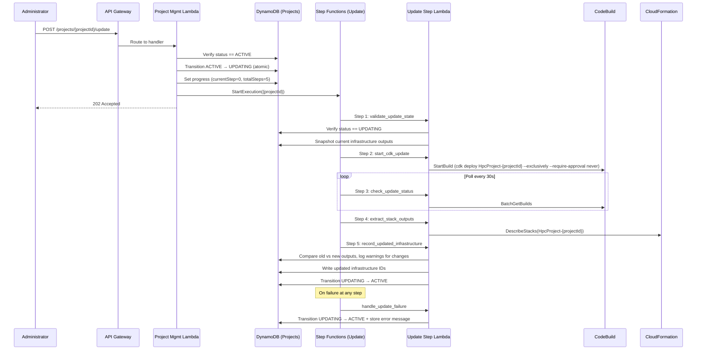
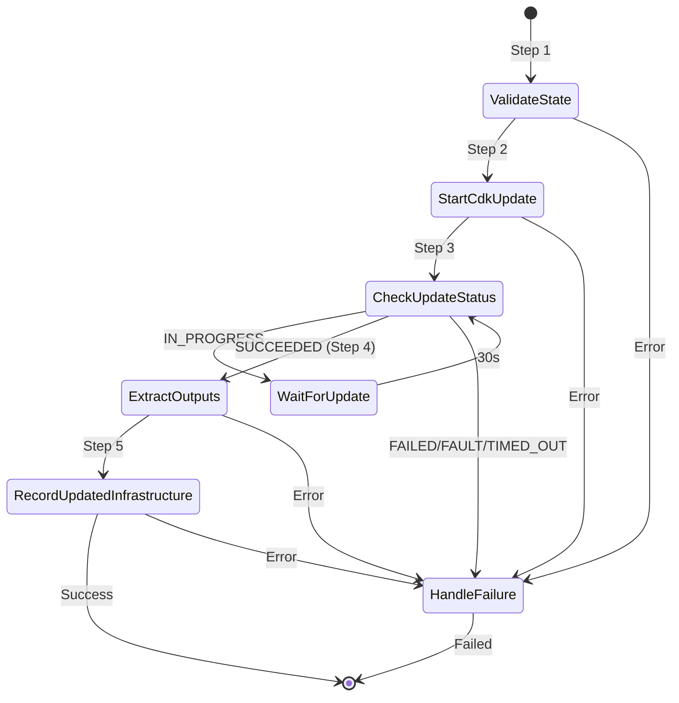

# Design Document: Project Update

## Overview

This design adds an update capability to the project lifecycle, allowing Administrators to update a project's infrastructure stack without destroying and recreating it. Update leverages CloudFormation's update-in-place behaviour via `cdk deploy`, applying only the delta between the current and desired stack state. Resources with stable logical IDs (VPC, EFS, S3, security groups) are preserved, so running clusters are not disrupted.

The feature introduces:
- A new `UPDATING` lifecycle state with atomic DynamoDB-backed transitions
- A `POST /projects/{projectId}/update` API endpoint (Administrator only)
- A Step Functions workflow (`hpc-project-update`) that orchestrates the CDK deploy, polls CodeBuild, extracts updated stack outputs, and records them in DynamoDB
- UI changes to display update progress and an "Update" action button
- Documentation updates covering the new state, endpoint, and operational guidance

### Design Rationale

The update workflow closely mirrors the existing deploy workflow (`project_deploy.py`) to maintain consistency and reduce cognitive overhead. Key differences:

1. **Source state**: Deploy starts from `CREATED`; update starts from `ACTIVE`.
2. **Failure rollback**: Deploy rolls back to `CREATED`; update rolls back to `ACTIVE` (infrastructure remains intact).
3. **Cluster safety**: During update, cluster operations remain available because the underlying VPC, subnets, and security groups are preserved by CloudFormation.
4. **Infrastructure diff detection**: The update workflow compares old and new infrastructure outputs and logs warnings if critical resource IDs change, since existing clusters reference the previous IDs.

## Architecture



### State Machine Flow



## Components and Interfaces

### 1. Lifecycle State Machine Extension (`lambda/project_management/lifecycle.py`)

**Changes**: Add `UPDATING` to `VALID_TRANSITIONS`:

```python
VALID_TRANSITIONS: dict[str, list[str]] = {
    "CREATED": ["DEPLOYING"],
    "DEPLOYING": ["ACTIVE", "CREATED"],
    "ACTIVE": ["DESTROYING", "UPDATING"],   # Added UPDATING
    "UPDATING": ["ACTIVE"],                  # New state
    "DESTROYING": ["ARCHIVED", "ACTIVE"],
    "ARCHIVED": [],
}
```

The existing `transition_project()` function handles atomic transitions via DynamoDB ConditionExpressions. No changes needed to the function itself — only the `VALID_TRANSITIONS` dict.

Key constraints:
- `UPDATING` can only transition to `ACTIVE` (success or failure with error message)
- `UPDATING` cannot transition to `DESTROYING` (must complete or fail first)
- `ACTIVE` gains a new outbound transition to `UPDATING`

### 2. Update API Handler (`lambda/project_management/handler.py`)

**New route**: `POST /projects/{projectId}/update`

**Handler function**: `_handle_update_project(event, project_id)`

Logic:
1. Verify caller is Administrator (`is_administrator(event)`)
2. Fetch project record, verify status is `ACTIVE`
3. Call `lifecycle.transition_project()` to move to `UPDATING`
4. Set initial progress: `currentStep=0, totalSteps=5`
5. Start Step Functions execution with `{"projectId": project_id}`
6. Return 202 Accepted

**Environment variable**: `PROJECT_UPDATE_STATE_MACHINE_ARN`

**GET /projects/{projectId} change**: Add `UPDATING` to the list of transitional statuses that include the `progress` object in the response.

### 3. Update Workflow Step Handlers (`lambda/project_management/project_update.py`)

New module following the same pattern as `project_deploy.py`. Five steps plus a failure handler:

| Step | Function | Description |
|------|----------|-------------|
| 1 | `validate_update_state` | Verify project exists, status is `UPDATING`. Snapshot current infrastructure outputs for diff detection. |
| 2 | `start_cdk_update` | Start CodeBuild with `npx cdk deploy HpcProject-{projectId} --exclusively --require-approval never` |
| 3 | `check_update_status` | Poll CodeBuild build status. Return `updateComplete: True/False` |
| 4 | `extract_stack_outputs` | Describe CloudFormation stack, extract infrastructure outputs |
| 5 | `record_updated_infrastructure` | Compare old vs new outputs (log warnings for changes), write updated IDs to DynamoDB, transition to `ACTIVE` |
| — | `handle_update_failure` | Transition back to `ACTIVE`, store error message |

**Infrastructure diff detection** (Step 5): Before writing the new outputs, the handler compares each critical field (vpcId, efsFileSystemId, s3BucketName, security group IDs, subnet IDs) against the snapshot taken in Step 1. If any differ, a WARNING-level log entry is emitted identifying the changed resource. This is informational only — the update proceeds regardless.

**Step dispatch**: Uses the same `step_handler(event, context)` pattern as `project_deploy.py`:

```python
STEP_DISPATCH = {
    "validate_update_state": validate_update_state,
    "start_cdk_update": start_cdk_update,
    "check_update_status": check_update_status,
    "extract_stack_outputs": extract_stack_outputs,
    "record_updated_infrastructure": record_updated_infrastructure,
    "handle_update_failure": handle_update_failure,
}
```

### 4. CDK Infrastructure (`lib/foundation-stack.ts`)

New resources to add:

1. **Lambda function** (`hpc-project-update-steps`): Handles update workflow steps. Same code bundle as project management (`lambda/project_management`), handler `project_update.step_handler`.

2. **Step Functions state machine** (`hpc-project-update`): 5-step workflow with 30-second wait loop for CodeBuild polling. Catch-all failure handler. 2-hour timeout. Same pattern as `projectDeployStateMachine`.

3. **IAM permissions**:
   - Update step Lambda: read/write on Projects table, CodeBuild `StartBuild`/`BatchGetBuilds`, CloudFormation `DescribeStacks`
   - Project Management Lambda: `states:StartExecution` on the update state machine
   - Reuses existing `cdkDeployProject` (CodeBuild) — no new CodeBuild project needed

4. **API Gateway route**: `POST /projects/{projectId}/update` with Cognito authorisation, integrated with the Project Management Lambda.

5. **Environment variable**: `PROJECT_UPDATE_STATE_MACHINE_ARN` added to the Project Management Lambda.

### 5. Frontend Changes (`frontend/js/app.js`)

Changes to the `loadProjects()` function:

1. **UPDATING status handling**: Add `UPDATING` to the transitional states that display a progress bar (alongside `DEPLOYING` and `DESTROYING`).

2. **Update button**: Add an "Update" button in the actions column for `ACTIVE` projects, next to the existing "Edit" and "Destroy" buttons.

3. **Polling**: Add `UPDATING` to the list of transitional statuses that trigger 5-second polling.

4. **Toast notifications**: Detect `UPDATING → ACTIVE` transitions in the status cache and show success/failure toasts (check for `errorMessage` to distinguish).

5. **`updateProject()` function**: New async function that calls `POST /projects/{projectId}/update` and refreshes the project list.

### 6. Documentation Updates

- `docs/admin/project-management.md`: Add UPDATING to lifecycle states table, state transitions diagram, and a new "Updating a Project" section.
- `docs/api/reference.md`: Add `POST /projects/{projectId}/update` endpoint documentation.

## Data Models

### DynamoDB Projects Table — Project Record

No schema changes. The existing record structure supports update:

| Field | Type | Usage During Update |
|-------|------|---------------------|
| `status` | String | Transitions: `ACTIVE` → `UPDATING` → `ACTIVE` |
| `currentStep` | Number | Progress tracking (0–5) |
| `totalSteps` | Number | Always 5 for update |
| `stepDescription` | String | Human-readable step label |
| `errorMessage` | String | Populated on failure, cleared on success |
| `vpcId` | String | Updated with latest stack output |
| `efsFileSystemId` | String | Updated with latest stack output |
| `s3BucketName` | String | Updated with latest stack output |
| `publicSubnetIds` | List | Updated with latest stack output |
| `privateSubnetIds` | List | Updated with latest stack output |
| `securityGroupIds` | Map | Updated with latest stack output |
| `cdkStackName` | String | Unchanged (`HpcProject-{projectId}`) |
| `statusChangedAt` | String | Updated on each transition |
| `updatedAt` | String | Updated on each transition |

### Step Functions Payload

```json
{
  "projectId": "genomics-team",
  "buildId": "hpc-cdk-deploy:build-id",
  "updateComplete": true,
  "previousOutputs": {
    "vpcId": "vpc-old",
    "efsFileSystemId": "fs-old",
    "s3BucketName": "bucket-old",
    "publicSubnetIds": ["subnet-pub-old"],
    "privateSubnetIds": ["subnet-priv-old"],
    "securityGroupIds": {
      "headNode": "sg-head-old",
      "computeNode": "sg-compute-old",
      "efs": "sg-efs-old",
      "fsx": "sg-fsx-old"
    }
  },
  "vpcId": "vpc-new",
  "efsFileSystemId": "fs-new",
  "s3BucketName": "bucket-new",
  "cdkStackName": "HpcProject-genomics-team",
  "publicSubnetIds": ["subnet-pub-new"],
  "privateSubnetIds": ["subnet-priv-new"],
  "securityGroupIds": {
    "headNode": "sg-head-new",
    "computeNode": "sg-compute-new",
    "efs": "sg-efs-new",
    "fsx": "sg-fsx-new"
  }
}
```

### API Request/Response

**POST /projects/{projectId}/update**

Request body: None required.

Response (202 Accepted):
```json
{
  "message": "Project 'genomics-team' update started.",
  "projectId": "genomics-team",
  "status": "UPDATING"
}
```

Error responses follow the existing error format (403, 404, 409).

## Correctness Properties

*A property is a characteristic or behavior that should hold true across all valid executions of a system — essentially, a formal statement about what the system should do. Properties serve as the bridge between human-readable specifications and machine-verifiable correctness guarantees.*

### Property 1: Update lifecycle round-trip

*For any* project in ACTIVE status, transitioning to UPDATING and then back to ACTIVE should produce a project whose status is ACTIVE and whose `errorMessage` is empty.

**Validates: Requirements 1.2, 1.3, 3.7**

### Property 2: Update failure preserves ACTIVE status with error message

*For any* project in UPDATING status and *any* non-empty error message string, the failure handler should transition the project to ACTIVE and the stored `errorMessage` should exactly match the provided error string.

**Validates: Requirements 1.4, 3.8**

### Property 3: UPDATING blocks DESTROYING transition

*For any* project in UPDATING status, attempting to transition to DESTROYING should raise a ConflictError, and the project status should remain UPDATING.

**Validates: Requirements 1.5**

### Property 4: Non-admin callers are rejected from update

*For any* non-Administrator caller identity, calling the update endpoint should return a 403 status code, and the project status should remain unchanged.

**Validates: Requirements 2.2**

### Property 5: Only ACTIVE projects can be updated

*For any* project status that is not ACTIVE (CREATED, DEPLOYING, UPDATING, DESTROYING, ARCHIVED), calling the update endpoint should return a 409 Conflict error, and the project status should remain unchanged.

**Validates: Requirements 2.3, 3.1**

### Property 6: Valid update triggers transition and returns 202

*For any* project in ACTIVE status and *any* Administrator caller, calling the update endpoint should transition the project to UPDATING, set `currentStep` to 0, set `totalSteps` to 5, and return HTTP 202.

**Validates: Requirements 2.5, 2.6**

### Property 7: CDK command format is correct for any project ID

*For any* valid project ID string, the `start_cdk_update` step should pass a CodeBuild environment variable `CDK_COMMAND` whose value equals `npx cdk deploy HpcProject-{projectId} --exclusively --require-approval never`.

**Validates: Requirements 3.2, 3.3**

### Property 8: Infrastructure outputs round-trip through DynamoDB

*For any* set of valid infrastructure output values (vpcId, efsFileSystemId, s3BucketName, subnet IDs, security group IDs), after the `record_updated_infrastructure` step writes them to DynamoDB, reading the project record back should return the same values.

**Validates: Requirements 3.5, 3.6, 4.3**

### Property 9: Changed infrastructure IDs trigger warnings

*For any* pair of old and new infrastructure output maps where at least one critical field (vpcId, efsFileSystemId, security group IDs) differs, the `record_updated_infrastructure` step should emit a WARNING-level log entry identifying each changed resource.

**Validates: Requirements 4.4**

## Error Handling

### API-Level Errors

| Scenario | Error Code | HTTP Status | Handler |
|----------|-----------|-------------|---------|
| Caller is not Administrator | `AUTHORISATION_ERROR` | 403 | `_handle_update_project` |
| Project does not exist | `NOT_FOUND` | 404 | `_handle_update_project` |
| Project not in ACTIVE status | `CONFLICT` | 409 | `_handle_update_project` |
| Concurrent status change (race) | `CONFLICT` | 409 | `lifecycle.transition_project` |

### Workflow-Level Errors

| Scenario | Recovery | Handler |
|----------|----------|---------|
| Project status is not UPDATING at validation | Fail execution | `validate_update_state` raises `ValidationError` |
| CodeBuild start fails | Transition to ACTIVE + store error | `handle_update_failure` |
| CodeBuild build fails/times out | Transition to ACTIVE + store error | `handle_update_failure` |
| CloudFormation DescribeStacks fails | Transition to ACTIVE + store error | `handle_update_failure` |
| DynamoDB update fails | Transition to ACTIVE + store error | `handle_update_failure` |
| CloudFormation rollback (CDK deploy fails) | Stack reverts to previous state; project transitions to ACTIVE with error | `handle_update_failure` |

### Failure Semantics

On any failure, the project returns to `ACTIVE` status (not `CREATED` as in the deploy workflow). This is because the infrastructure already exists and remains functional — CloudFormation automatically rolls back failed updates to the previous known-good state. The error message is stored in the project record for Administrator review.

### Progress Tracking Failure

Progress tracking updates (`_update_project_progress`) are non-fatal. If a progress write fails, the step continues execution. This matches the existing pattern in `project_deploy.py`.

## Testing Strategy

### Unit Tests (Python, pytest + moto)

Following the existing pattern in `test_unit_project_deploy.py`:

**`test_unit_project_update.py`** — Update workflow step handlers:
- `validate_update_state`: succeeds for UPDATING, fails for other statuses
- `start_cdk_update`: passes correct CDK command to CodeBuild
- `check_update_status`: returns correct completion flag for each build status
- `extract_stack_outputs`: correctly parses CloudFormation outputs (reuses existing deploy logic)
- `record_updated_infrastructure`: writes correct fields, detects changed IDs, transitions to ACTIVE
- `handle_update_failure`: transitions to ACTIVE, stores error message
- Progress tracking: each step updates DynamoDB with correct step number and description

**`test_unit_project_management.py`** (additions) — Handler-level tests:
- Update route returns 202 for valid ACTIVE project with admin caller
- Update route returns 403 for non-admin caller
- Update route returns 409 for non-ACTIVE project
- Update route returns 404 for nonexistent project
- GET project includes progress object for UPDATING status

**`test_unit_lifecycle.py`** (additions) — Lifecycle state machine:
- UPDATING is a valid status in VALID_TRANSITIONS
- ACTIVE → UPDATING transition succeeds
- UPDATING → ACTIVE transition succeeds
- UPDATING → DESTROYING transition is rejected

### Property-Based Tests (Python, Hypothesis)

Property-based testing library: **Hypothesis** (already used in the project).

Configuration: Low example counts per workspace rules. Each test references its design property.

**`test_property_update_lifecycle.py`**:
- Property 1: Update lifecycle round-trip
- Property 2: Update failure preserves ACTIVE status with error message
- Property 3: UPDATING blocks DESTROYING transition

**`test_property_update_api.py`**:
- Property 4: Non-admin callers are rejected
- Property 5: Only ACTIVE projects can be updated
- Property 6: Valid update triggers transition and returns 202

**`test_property_update_workflow.py`**:
- Property 7: CDK command format is correct for any project ID
- Property 8: Infrastructure outputs round-trip through DynamoDB
- Property 9: Changed infrastructure IDs trigger warnings

Each property test:
- Runs a minimum of 100 iterations (kept low per workspace rules)
- Is tagged with: `Feature: project-update, Property {N}: {title}`
- Uses `@mock_aws` for DynamoDB and mocks for CodeBuild/CloudFormation

### CDK Snapshot Tests (TypeScript, Jest)

**`test/foundation-stack.test.ts`** (additions):
- Verify the update state machine is synthesised
- Verify the update step Lambda is created with correct environment variables
- Verify the API Gateway includes the `/update` route
- Verify IAM permissions for the update Lambda

### Integration Tests

Not in scope for this feature — the existing integration test pattern (`test_integration_e2e.py`) can be extended separately to cover the update endpoint against a deployed stack.
