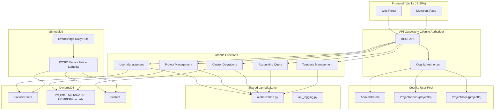
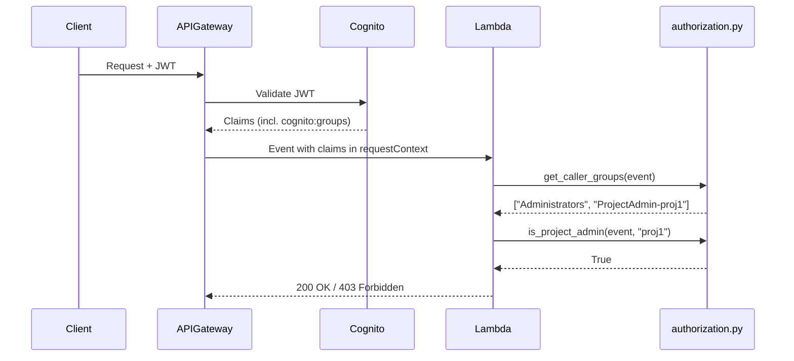
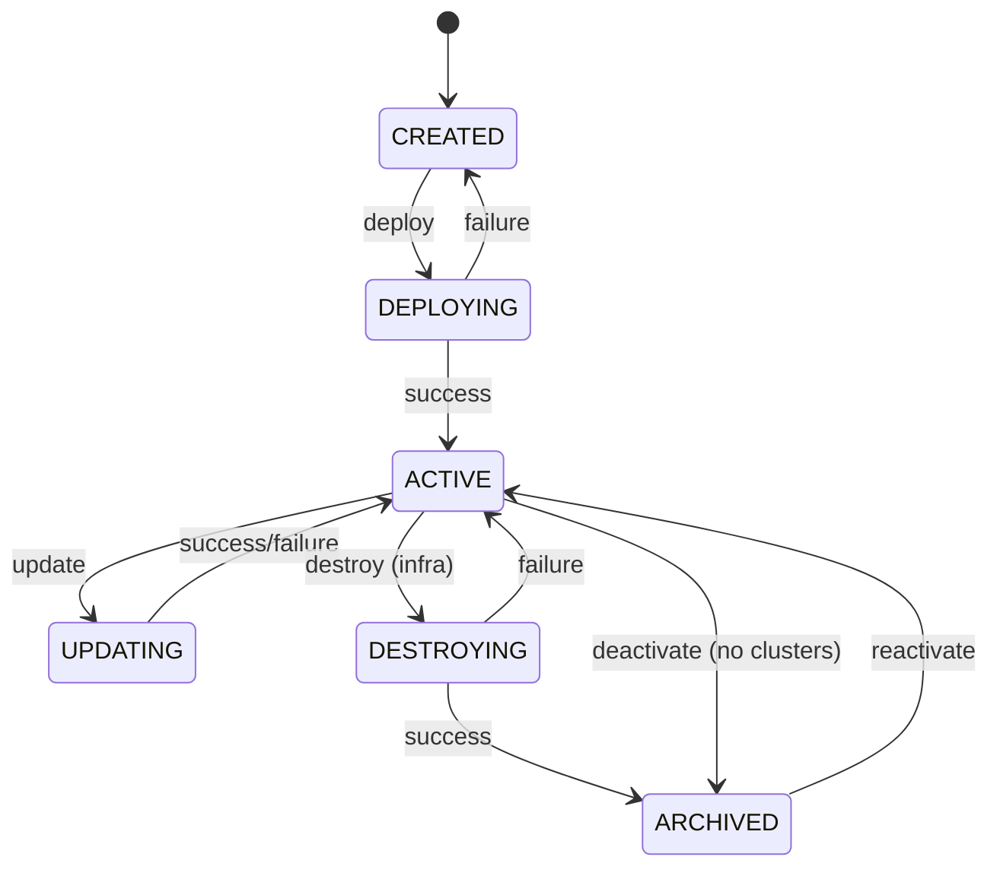

# Design Document: Role-Based Access Control

## Overview

This design transforms the HPC Self-Service Platform from a two-tier role model (Administrator / User) to a three-tier model (Platform Administrator / Project Administrator / End User) with Amazon Cognito groups as the single authoritative source for role assignments. The design builds on the existing `members.py` module which already manages Cognito group creation and membership, and extends it with a unified authorization module, a membership management UI, scoped POSIX provisioning, daily reconciliation, project deactivation/reactivation lifecycle, and consistent authorization enforcement across all API endpoints.

### Key Design Decisions

1. **Shared authorization module**: Replace the four duplicated `auth.py` files with a single `lambda/shared/authorization.py` module distributed via the existing Lambda Layer. This eliminates drift and ensures consistent role evaluation everywhere.

2. **Cognito groups as source of truth**: All authorization decisions derive from the `cognito:groups` JWT claim. The DynamoDB `role` field is retained for display only and updated as a side-effect, never read for access control.

3. **Build on existing `members.py`**: The current `add_member`/`remove_member` functions already handle Cognito group creation, membership records, and POSIX propagation. The design extends this with role changes, list members, and deprovisioning — not a rewrite.

4. **Daily full-audit reconciliation**: The existing `posix_reconciliation.py` only retries `PENDING_PROPAGATION` records. The new design replaces it with a full membership-vs-cluster audit that also detects and corrects drift (missing accounts, stale accounts).

5. **Project lifecycle extensions**: Deactivation deletes Cognito groups (revoking access) while preserving membership records. Reactivation recreates groups and restores memberships. Clusters must be destroyed before deactivation, so no POSIX concerns arise.

## Architecture



### Authorization Flow



## Components and Interfaces

### 1. Shared Authorization Module (`lambda/shared/authorization.py`)

Replaces the four separate `auth.py` files. Distributed via the existing `SharedUtilsLayer`.

```python
# Public API
def get_caller_identity(event: dict) -> str
def get_caller_groups(event: dict) -> list[str]
def is_administrator(event: dict) -> bool
def is_project_admin(event: dict, project_id: str) -> bool
def is_project_user(event: dict, project_id: str) -> bool
def get_admin_project_ids(event: dict) -> list[str]  # NEW: extract project IDs from ProjectAdmin-* groups
def get_member_project_ids(event: dict) -> list[str]  # NEW: extract project IDs from any project group
```

The `get_admin_project_ids` and `get_member_project_ids` functions parse Cognito group names to extract project IDs, enabling the scoped project listing (Requirement 12).

Each per-package `auth.py` is replaced with a thin re-export:
```python
# lambda/*/auth.py
from authorization import *  # noqa: F401,F403
```

### 2. Project Management Lambda — Extended Membership Operations

**New/modified endpoints:**

| Method | Resource | Handler | Auth |
|--------|----------|---------|------|
| GET | `/projects/{projectId}/members` | `_handle_list_members` | Project Admin or Platform Admin |
| POST | `/projects/{projectId}/members` | `_handle_add_member` (existing) | Project Admin or Platform Admin |
| DELETE | `/projects/{projectId}/members/{userId}` | `_handle_remove_member` (existing) | Project Admin or Platform Admin |
| PUT | `/projects/{projectId}/members/{userId}` | `_handle_change_member_role` | Project Admin or Platform Admin |
| GET | `/projects` | `_handle_list_projects` (modified) | Scoped by role |
| POST | `/projects/{projectId}/deactivate` | `_handle_deactivate_project` | Platform Admin |
| POST | `/projects/{projectId}/reactivate` | `_handle_reactivate_project` | Platform Admin |

**Modified `_handle_list_projects`**: Instead of requiring Platform Admin, it returns:
- All projects for Platform Administrators (existing behavior)
- Only projects where the caller has `ProjectAdmin-*` or `ProjectUser-*` membership for non-admins (queries `UserProjectsIndex` GSI)

**New `members.py` functions:**

```python
def list_members(projects_table_name: str, project_id: str) -> list[dict]
def change_member_role(projects_table_name: str, user_pool_id: str, project_id: str, user_id: str, new_role: str) -> dict
def deprovision_user_from_clusters(user_id: str, project_id: str, clusters_table_name: str) -> str
```

**New `lifecycle.py` additions:**

Extended valid transitions:
```
ACTIVE → ARCHIVED  (deactivation — no infrastructure destruction needed, just Cognito group removal)
ARCHIVED → ACTIVE  (reactivation — recreate Cognito groups, restore memberships)
```

New functions:
```python
def deactivate_project(table_name: str, user_pool_id: str, project_id: str, clusters_table_name: str) -> dict
def reactivate_project(table_name: str, user_pool_id: str, project_id: str) -> dict
```

### 3. POSIX Reconciliation Lambda — Full Audit

The existing `posix_reconciliation.py` is extended from a simple `PENDING_PROPAGATION` retry to a full membership audit:

```python
def handler(event, context) -> dict:
    """Daily reconciliation entry point.
    
    1. Scan all ACTIVE clusters across all projects.
    2. For each cluster, compare Linux accounts vs. project membership.
    3. Create missing accounts, disable stale accounts.
    4. Continue retrying PENDING_PROPAGATION records.
    5. Log summary.
    """
```

The reconciliation Lambda needs SSM `SendCommand` + `GetCommandInvocation` permissions to query existing accounts on nodes and create/disable accounts.

### 4. Membership Management UI

A new "Members" tab in the frontend, accessible from project context. Follows the existing vanilla JS SPA patterns (table-module, toast notifications, apiCall).

**Visibility rules:**
- Platform Admins: see "Members" tab on all projects
- Project Admins: see "Members" tab only on their projects
- End Users: no "Members" tab

**UI components:**
- Members table (userId, displayName, role, addedAt)
- Add member form (userId input, role dropdown)
- Remove member button per row
- Role change dropdown per row (for Project Admins changing End Users, or Platform Admins changing any role)

### 5. CDK Infrastructure Changes

**`cognito-auth.ts`**: No changes needed — the `Administrators` group already exists, and project-specific groups are created dynamically by `members.py`.

**`project-management.ts`**: Add new API Gateway routes:
- `GET /projects/{projectId}/members`
- `PUT /projects/{projectId}/members/{userId}`
- `POST /projects/{projectId}/deactivate`
- `POST /projects/{projectId}/reactivate`

Add Cognito permissions for `ListUsersInGroup` (needed for reactivation to verify users still exist).

**`cluster-operations.ts`**: Add SSM permissions to the POSIX reconciliation Lambda for querying existing accounts.

**`platform-operations.ts`**: Change the reconciliation EventBridge rule from the current schedule to a daily `cron(0 2 * * ? *)` (2 AM UTC daily).

**`api-gateway.ts` / Shared Layer**: The `authorization.py` module is added to the existing `lambda/shared/` directory and automatically included in the layer.

## Data Models

### Existing DynamoDB Records (unchanged)

**PlatformUsers table — User Profile:**
```
PK: USER#{userId}
SK: PROFILE
userId, displayName, email, role (display only), posixUid, posixGid, status, cognitoSub, createdAt, updatedAt
```

**Projects table — Project Metadata:**
```
PK: PROJECT#{projectId}
SK: METADATA
projectId, projectName, status (CREATED|DEPLOYING|ACTIVE|UPDATING|DESTROYING|ARCHIVED), ...
```

**Projects table — Membership Record (existing):**
```
PK: PROJECT#{projectId}
SK: MEMBER#{userId}
userId, projectId, role (PROJECT_ADMIN|PROJECT_USER), addedAt, propagationStatus?
```

### Existing GSI (used for scoped project listing)

**UserProjectsIndex** on Projects table:
```
PK: userId
SK: projectId
```

This GSI already exists and is used to query which projects a user belongs to. For the scoped project listing (Requirement 12), we query this GSI with the caller's userId to get their project memberships, then fetch metadata for each.

### Cognito Group Naming Convention (existing)

| Role | Group Name | Created By |
|------|-----------|------------|
| Platform Admin | `Administrators` | CDK (static) |
| Project Admin | `ProjectAdmin-{projectId}` | `members.py` (dynamic) |
| End User | `ProjectUser-{projectId}` | `members.py` (dynamic) |

### New Fields

**Membership Record — additional field for reactivation failures:**
```
propagationStatus: "PENDING_PROPAGATION" | "PENDING_RESTORATION" | null
```

The `PENDING_RESTORATION` status is set when a Cognito group add fails during project reactivation (Requirement 14.7).

### Project Lifecycle State Machine (extended)



Note: The `ACTIVE → ARCHIVED` transition for deactivation is direct (no Step Functions needed) because it only involves Cognito group deletion and a status update — no infrastructure teardown. The prerequisite is that all clusters must already be destroyed.

