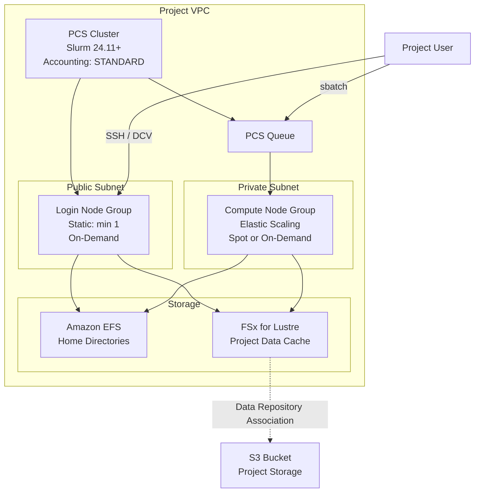
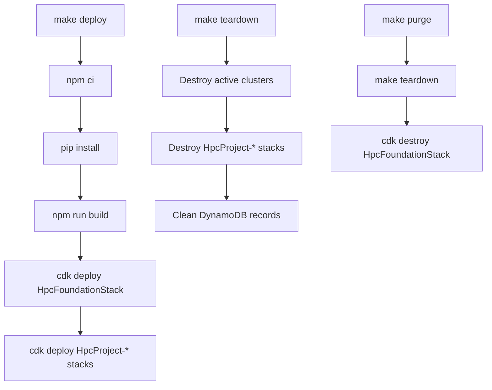

# Design Document: Self-Service HPC Platform

## Overview

This document describes the design for a self-service High Performance Computing (HPC) platform on AWS. The platform enables administrators to manage users, projects, and cluster templates through a serverless web portal, while project users can provision ephemeral HPC clusters on demand using AWS Parallel Computing Service (PCS). The architecture emphasises project-based isolation, persistent storage, centralised job accounting, and cost controls.

### Key Design Decisions

1. **AWS Parallel Computing Service (PCS)** for HPC clusters — provides managed Slurm scheduling, compute node lifecycle management, and built-in accounting. PCS has CloudFormation support (`AWS::PCS::Cluster`, `AWS::PCS::ComputeNodeGroup`, `AWS::PCS::Queue`) with CDK L1 constructs (`CfnCluster`, `CfnComputeNodeGroup`, `CfnQueue`). No L2 constructs exist yet, so L1 constructs are used for PCS resources only.
2. **PCS Managed Slurm Accounting** — PCS (Slurm 24.11+) manages the accounting database internally, eliminating the need for a separate Aurora Serverless or MySQL database. Accounting is enabled per-cluster with `mode=STANDARD`. Users query accounting data via `sacct`/`sreport` on login nodes. The Web Portal provides an API for administrators to run accounting queries across clusters by invoking commands on login nodes via SSM.
3. **Serverless Web Portal** — API Gateway + Lambda (Python) + DynamoDB for the control plane, keeping running costs near zero when idle.
4. **Amazon Cognito** for authentication and role-based authorisation (Administrator, Project_Administrator, Project_User).
5. **Amazon EFS** for persistent per-project home directories — supports POSIX permissions, NFS mount on clusters, and survives cluster lifecycle.
6. **S3 + FSx for Lustre** for project bulk storage — S3 for durable storage, FSx for Lustre with data repository association for high-performance cluster access.
7. **Per-project VPC** for network isolation between projects.
8. **AWS CDK in TypeScript** for all infrastructure, with Lambda functions in Python.

### Research Findings

- **AWS PCS CloudFormation/CDK support**: PCS resources (`AWS::PCS::Cluster`, `AWS::PCS::ComputeNodeGroup`, `AWS::PCS::Queue`) are available as L1 CDK constructs in `aws-cdk-lib.aws_pcs`. No L2 constructs exist, so this is the one exception to the L2-preferred rule.
- **PCS Managed Accounting**: Since Slurm 24.11, PCS manages the accounting database in an AWS-owned account. No external database is needed. Accounting is enabled at cluster creation time and incurs additional per-hour and per-GB charges. Users access accounting data via standard Slurm commands (`sacct`, `sreport`, `sacctmgr`) on login nodes.
- **PCS Login Nodes**: Implemented as a compute node group with static scaling (minimum 1 instance), on-demand purchase option, placed on a public or protected subnet for SSH/DCV access.
- **PCS Compute Nodes**: Implemented as a compute node group with elastic scaling, placed on private subnets.
- **FSx for Lustre Data Repository Association**: Supports automatic import/export with S3. When a cluster is destroyed, data can be exported back to S3 via a data repository task before the filesystem is deleted.
- **One cluster in "Creating" state per region per account**: Cluster creation must be serialised. The platform should handle this constraint gracefully with queuing or retry logic.

## Architecture

### High-Level Architecture Diagram

```mermaid
graph TB
    subgraph "Web Portal (Serverless)"
        CF[CloudFront] --> APIGW[API Gateway]
        APIGW --> LambdaAuth[Lambda: Auth]
        APIGW --> LambdaUsers[Lambda: User Mgmt]
        APIGW --> LambdaProjects[Lambda: Project Mgmt]
        APIGW --> LambdaTemplates[Lambda: Template Mgmt]
        APIGW --> LambdaClusters[Lambda: Cluster Ops]
        APIGW --> LambdaAccounting[Lambda: Accounting]
        Cognito[Amazon Cognito] --> APIGW
    end

    subgraph "Data Layer"
        DDB[(DynamoDB: Platform State)]
        S3Static[S3: Web Portal Static Assets]
    end

    subgraph "Project A VPC"
        subgraph "Public Subnet"
            LoginNodeA[Login Node - Head Node]
        end
        subgraph "Private Subnet"
            ComputeNodesA[Compute Nodes]
        end
        EFSA[EFS: Home Directories]
        FSxA[FSx for Lustre]
        S3A[S3: Project Storage]
        PCSClusterA[PCS Cluster]
    end

    subgraph "Project B VPC"
        subgraph "Public Subnet "
            LoginNodeB[Login Node - Head Node]
        end
        subgraph "Private Subnet "
            ComputeNodesB[Compute Nodes]
        end
        EFSB[EFS: Home Directories]
        FSxB[FSx for Lustre]
        S3B[S3: Project Storage]
        PCSClusterB[PCS Cluster]
    end

    LambdaUsers --> DDB
    LambdaProjects --> DDB
    LambdaTemplates --> DDB
    LambdaClusters --> DDB
    LambdaClusters --> PCSClusterA
    LambdaClusters --> PCSClusterB
    LambdaAccounting --> LoginNodeA
    LambdaAccounting --> LoginNodeB
    CF --> S3Static
    FSxA --> S3A
    FSxB --> S3B

    Budgets[AWS Budgets] --> SNS[SNS Notifications]
    CW[CloudWatch Logs]
```



### Cluster Architecture Diagram



## Components and Interfaces

### 1. Authentication and Authorisation (Amazon Cognito)

**Purpose**: Manage user identities and role-based access control.

**Implementation**:
- Cognito User Pool for user identity management
- Cognito Groups for role mapping: `Administrators`, `ProjectAdmin-{projectId}`, `ProjectUser-{projectId}`
- API Gateway Cognito Authoriser validates JWT tokens on every request
- Lambda functions check group membership for fine-grained authorisation

**Interfaces**:
- `POST /auth/login` — authenticate user, return JWT tokens
- `POST /auth/refresh` — refresh access token

### 2. User Management Service (Lambda + DynamoDB)

**Purpose**: CRUD operations for platform users, including POSIX UID/GID assignment.

**Implementation**:
- Python Lambda function behind API Gateway
- DynamoDB table stores user records with auto-assigned POSIX UID/GID
- UID/GID allocation uses an atomic counter in DynamoDB to guarantee global uniqueness
- User deactivation revokes Cognito sessions and marks user inactive

**Interfaces**:
- `POST /users` — create user (Admin only)
- `DELETE /users/{userId}` — deactivate user (Admin only)
- `GET /users` — list users (Admin only)
- `GET /users/{userId}` — get user details (Admin or self)

### 3. Project Management Service (Lambda + DynamoDB)

**Purpose**: CRUD operations for projects, including VPC provisioning and storage setup.

**Implementation**:
- Python Lambda function behind API Gateway
- Project creation triggers a CDK deployment (via CodeBuild or Step Functions) that provisions:
  - Dedicated VPC with public and private subnets
  - EFS filesystem for home directories
  - S3 bucket for project storage (or links to a user-provided bucket)
  - Security groups
  - Cost allocation tags
- Project deletion verifies no active clusters exist, then tears down the project CDK stack

**Interfaces**:
- `POST /projects` — create project (Admin only)
- `DELETE /projects/{projectId}` — delete project (Admin only, no active clusters)
- `GET /projects` — list projects (Admin: all, Users: their projects)
- `GET /projects/{projectId}` — get project details
- `POST /projects/{projectId}/members` — add member (Project Admin only)
- `DELETE /projects/{projectId}/members/{userId}` — remove member (Project Admin only)
- `PUT /projects/{projectId}/budget` — set budget limit (Project Admin only)

### 4. Cluster Template Management Service (Lambda + DynamoDB)

**Purpose**: CRUD operations for cluster templates.

**Implementation**:
- Python Lambda function behind API Gateway
- Templates stored in DynamoDB with instance types, node counts, AMI, software stack
- Two default templates seeded on platform deployment:
  - **cpu-general**: Cost-effective CPU instances (e.g., `c7g.medium` or `hpc7a.12xlarge` for small PoC)
  - **gpu-basic**: Low-end GPU instances (e.g., `g4dn.xlarge`)

**Interfaces**:
- `POST /templates` — create template (Admin only)
- `DELETE /templates/{templateId}` — delete template (Admin only)
- `GET /templates` — list templates (all authenticated users)
- `GET /templates/{templateId}` — get template details

### 5. Cluster Operations Service (Lambda + DynamoDB + Step Functions)

**Purpose**: Orchestrate cluster creation and destruction using AWS PCS.

**Implementation**:
- Python Lambda functions orchestrated by Step Functions for long-running operations
- Cluster creation workflow:
  1. Validate cluster name uniqueness (global registry in DynamoDB)
  2. Check project budget status
  3. Update cluster status to `CREATING` with `currentStep` field in DynamoDB
  4. Create FSx for Lustre filesystem with data repository association to project S3 bucket
  5. Wait for FSx to become available
  6. Create PCS cluster (Slurm 24.11+, accounting enabled)
  7. Create login node compute node group (public subnet, static scaling)
  8. Create compute node compute node group (private subnet, elastic scaling)
  9. Create PCS queue linked to compute node group
  10. Configure POSIX users on login and compute nodes via launch template user data
  11. Tag all resources with project Cost_Allocation_Tag and ClusterName
  12. Record cluster as `ACTIVE` in DynamoDB
  13. Send completion notification to the creating user via SNS
- Each step updates the `currentStep` and `stepDescription` fields in the DynamoDB Clusters record so the UI can display progress
- Cluster creation failure triggers automatic rollback of all partially created resources and marks the cluster as `FAILED` with an error description. A failure notification is sent to the creating user.
- Cluster destruction workflow:
  1. Create FSx data repository export task (sync back to S3)
  2. Wait for export to complete
  3. Delete PCS compute node groups, queue, and cluster
  4. Delete FSx for Lustre filesystem
  5. Update DynamoDB record
- Login credentials (SSH/DCV connection info) are only provided for clusters in `ACTIVE` status. Clusters in `CREATING`, `FAILED`, or `DESTROYING` status do not expose connection details.

**Interfaces**:
- `POST /projects/{projectId}/clusters` — create cluster (Project User)
- `DELETE /projects/{projectId}/clusters/{clusterName}` — destroy cluster (Project User)
- `GET /projects/{projectId}/clusters` — list clusters with status (Project User)
- `GET /projects/{projectId}/clusters/{clusterName}` — get cluster details with SSH/DCV info (only if ACTIVE), current deployment step (if CREATING)

### 6. Accounting Query Service (Lambda + SSM)

**Purpose**: Provide administrators with cross-cluster job accounting data.

**Implementation**:
- Python Lambda function that uses AWS Systems Manager (SSM) Run Command to execute `sacct`/`sreport` queries on login nodes of active clusters
- Aggregates results across clusters and returns to the caller
- Since PCS manages the accounting database per-cluster, cross-cluster queries require querying each active cluster's login node

**Interfaces**:
- `GET /accounting/jobs` — query job records across clusters (Admin only)
- `GET /accounting/jobs?projectId={projectId}` — query job records for a project (Admin or Project Admin)

### 7. Budget Management (AWS Budgets + SNS)

**Purpose**: Track project spending and alert on budget thresholds.

**Implementation**:
- When a Project Admin sets a budget, the Lambda creates/updates an AWS Budget filtered by the project's Cost_Allocation_Tag
- Budget notifications at 80% and 100% thresholds via SNS
- 80% notification goes to Project Admin email
- 100% notification goes to Project Admin and all Administrators
- Budget breach status is stored in DynamoDB and checked during cluster creation and login

### 8. POSIX User Provisioning

**Purpose**: Ensure consistent user identity across all clusters.

### 7b. Cluster Lifecycle Notifications (SNS + DynamoDB)

**Purpose**: Notify users of cluster creation progress, completion, and failure.

**Implementation**:
- Each Step Functions step updates the cluster record in DynamoDB with `currentStep` (step number), `stepDescription` (human-readable label), and `totalSteps` (total workflow steps)
- The Web Portal UI polls `GET /projects/{projectId}/clusters/{clusterName}` to display progress (the user can navigate away and return — the status is always available via the API)
- On successful creation, a Lambda at the end of the Step Functions workflow publishes to an SNS topic with the creating user's email. The user receives an email notification with the cluster name and connection details.
- On failure, the rollback handler publishes a failure notification to the same SNS topic with the error description.
- The SNS topic (`hpc-cluster-lifecycle-notifications`) is subscribed to by the creating user's email address (looked up from the PlatformUsers table using `createdBy`).
- In-app notifications are supported by the frontend polling the cluster status endpoint. A cluster transitioning from `CREATING` to `ACTIVE` or `FAILED` triggers a visual notification in the UI.

**Cluster status lifecycle**:
```
CREATING → ACTIVE    (success)
CREATING → FAILED    (failure, resources rolled back)
ACTIVE   → DESTROYING → DESTROYED
```

**DynamoDB Clusters record additions for progress tracking**:
| Attribute | Type | Description |
|-----------|------|-------------|
| `currentStep` | Number | Current step number in the workflow (1-based) |
| `totalSteps` | Number | Total number of steps in the workflow |
| `stepDescription` | String | Human-readable description of the current step |
| `errorMessage` | String | Error description (only for FAILED status) |


**Implementation**:
- Each platform user gets a globally unique UID and GID assigned at creation time (stored in DynamoDB)
- EC2 launch templates include user data scripts that:
  - Fetch the project's user list from DynamoDB (via a Lambda-backed API or SSM parameter)
  - Create POSIX user accounts with the correct UID/GID
  - Set home directory ownership
  - Disable interactive login for generic accounts (ec2-user, centos, ubuntu)
- When a new user is added to a project with active clusters, an SSM Run Command propagates the new user to all active cluster nodes

### 9. Logging and Monitoring

**Purpose**: Centralised logging for infrastructure, user access, and API actions.

**Implementation**:
- API Gateway access logs to CloudWatch Logs (365-day retention for user access)
- Lambda function logs to CloudWatch Logs (90-day retention)
- PCS cluster logs to CloudWatch Logs (90-day retention)
- User SSH/DCV login events logged via `pam_exec` or `auditd` on cluster nodes, forwarded to CloudWatch Logs (365-day retention)
- CloudWatch Log Groups use resource policies for cross-account access where needed

## Data Models

### DynamoDB Table: PlatformUsers

| Attribute | Type | Description |
|-----------|------|-------------|
| `PK` | String | `USER#{userId}` |
| `SK` | String | `PROFILE` |
| `userId` | String | Unique user identifier (email or username) |
| `displayName` | String | User display name |
| `posixUid` | Number | Globally unique POSIX UID |
| `posixGid` | Number | Globally unique POSIX GID |
| `status` | String | `ACTIVE` or `INACTIVE` |
| `cognitoSub` | String | Cognito user pool subject ID |
| `createdAt` | String | ISO 8601 timestamp |
| `updatedAt` | String | ISO 8601 timestamp |

**GSI: StatusIndex** — `status` (PK), `userId` (SK) — for listing active users.

### DynamoDB Table: PlatformUsers — POSIX Counter

| Attribute | Type | Description |
|-----------|------|-------------|
| `PK` | String | `COUNTER` |
| `SK` | String | `POSIX_UID` |
| `currentValue` | Number | Last assigned UID (starts at 10000) |

Atomic increment via `UpdateItem` with `ADD` ensures uniqueness.

### DynamoDB Table: Projects

| Attribute | Type | Description |
|-----------|------|-------------|
| `PK` | String | `PROJECT#{projectId}` |
| `SK` | String | `METADATA` |
| `projectId` | String | Unique project identifier |
| `projectName` | String | Human-readable project name |
| `costAllocationTag` | String | Value for the `Project` tag |
| `vpcId` | String | Dedicated VPC ID |
| `efsFileSystemId` | String | EFS filesystem ID for home directories |
| `s3BucketName` | String | Project storage S3 bucket name |
| `s3BucketProvided` | Boolean | Whether the S3 bucket was user-provided |
| `budgetLimit` | Number | Budget limit in USD (0 = no limit) |
| `budgetBreached` | Boolean | Whether the budget has been breached |
| `cdkStackName` | String | CDK stack name for the project infrastructure |
| `status` | String | `ACTIVE`, `CREATING`, `DELETING` |
| `createdAt` | String | ISO 8601 timestamp |

### DynamoDB Table: Projects — Membership Records

| Attribute | Type | Description |
|-----------|------|-------------|
| `PK` | String | `PROJECT#{projectId}` |
| `SK` | String | `MEMBER#{userId}` |
| `userId` | String | User identifier |
| `role` | String | `PROJECT_ADMIN` or `PROJECT_USER` |
| `addedAt` | String | ISO 8601 timestamp |

**GSI: UserProjectsIndex** — `userId` (PK), `projectId` (SK) — for listing a user's projects.

### DynamoDB Table: ClusterTemplates

| Attribute | Type | Description |
|-----------|------|-------------|
| `PK` | String | `TEMPLATE#{templateId}` |
| `SK` | String | `METADATA` |
| `templateId` | String | Unique template identifier |
| `templateName` | String | Human-readable name |
| `description` | String | Template description |
| `instanceTypes` | List | EC2 instance types for compute nodes |
| `loginInstanceType` | String | EC2 instance type for login node |
| `minNodes` | Number | Minimum compute nodes |
| `maxNodes` | Number | Maximum compute nodes |
| `amiId` | String | AMI ID for cluster nodes |
| `softwareStack` | Map | Software configuration details |
| `createdAt` | String | ISO 8601 timestamp |

### DynamoDB Table: Clusters

| Attribute | Type | Description |
|-----------|------|-------------|
| `PK` | String | `PROJECT#{projectId}` |
| `SK` | String | `CLUSTER#{clusterName}` |
| `clusterName` | String | Human-readable cluster name |
| `projectId` | String | Owning project identifier |
| `templateId` | String | Template used for creation |
| `pcsClusterId` | String | AWS PCS cluster ID |
| `pcsClusterArn` | String | AWS PCS cluster ARN |
| `loginNodeGroupId` | String | PCS login node group ID |
| `computeNodeGroupId` | String | PCS compute node group ID |
| `queueId` | String | PCS queue ID |
| `fsxFilesystemId` | String | FSx for Lustre filesystem ID |
| `loginNodeIp` | String | Login node public/private IP |
| `sshPort` | Number | SSH port (default 22) |
| `dcvPort` | Number | DCV port (default 8443) |
| `status` | String | `CREATING`, `ACTIVE`, `DESTROYING`, `DESTROYED`, `FAILED` |
| `currentStep` | Number | Current step number in the creation workflow (1-based, only during CREATING) |
| `totalSteps` | Number | Total number of steps in the creation workflow |
| `stepDescription` | String | Human-readable description of the current step (only during CREATING) |
| `errorMessage` | String | Error description (only for FAILED status) |
| `createdBy` | String | User who created the cluster |
| `createdAt` | String | ISO 8601 timestamp |
| `destroyedAt` | String | ISO 8601 timestamp (if destroyed) |

### DynamoDB Table: ClusterNameRegistry

| Attribute | Type | Description |
|-----------|------|-------------|
| `PK` | String | `CLUSTERNAME#{clusterName}` |
| `SK` | String | `REGISTRY` |
| `clusterName` | String | The cluster name |
| `projectId` | String | Project that owns this name |
| `registeredAt` | String | ISO 8601 timestamp |

Cluster name uniqueness is enforced using a DynamoDB conditional put: the put succeeds only if the item does not exist or the existing `projectId` matches the requesting project.

## Correctness Properties

*A property is a characteristic or behavior that should hold true across all valid executions of a system — essentially, a formal statement about what the system should do. Properties serve as the bridge between human-readable specifications and machine-verifiable correctness guarantees.*

### Property 1: User creation assigns globally unique POSIX identity

*For any* sequence of user creation requests with valid and distinct user identifiers, every created user SHALL be assigned a POSIX UID and GID that is unique across all users on the platform, and the creation response SHALL include the user identifier.

**Validates: Requirements 1.1, 17.1**

### Property 2: Duplicate user creation is rejected

*For any* user identifier that already exists on the platform, a subsequent request to create a user with the same identifier SHALL be rejected with a descriptive error message, and the existing user record SHALL remain unchanged.

**Validates: Requirements 1.3**

### Property 3: Admin-only operations reject non-administrators

*For any* user who is not in the Administrator role, and *for any* admin-only operation (user management, project creation/deletion, template management), the Web Portal SHALL reject the request with an authorisation error.

**Validates: Requirements 1.4, 2.4, 3.4**

### Property 4: Project admin operations reject non-project-administrators

*For any* user who is not a Project Administrator for a given project, and *for any* project admin operation (membership management, budget modification), the Web Portal SHALL reject the request with an authorisation error.

**Validates: Requirements 4.4, 5.4**

### Property 5: Project-scoped operations reject unauthorised users

*For any* user who is not authorised for a given project (neither Project User nor Project Administrator), and *for any* project-scoped operation (cluster destruction, cluster access), the Web Portal SHALL reject the request with an authorisation error.

**Validates: Requirements 7.4, 8.6**

### Property 6: Project deletion is blocked by active clusters

*For any* project that has one or more clusters in ACTIVE or CREATING status, a deletion request SHALL be rejected with an error message that lists all active cluster names. *For any* project with zero active clusters, the deletion request SHALL be accepted.

**Validates: Requirements 2.2, 2.3**

### Property 7: Cluster template storage round-trip

*For any* valid cluster template definition (with instance types, node configuration, and software stack), storing the template and then retrieving it SHALL return a template with all fields equal to the original definition.

**Validates: Requirements 3.1**

### Property 8: Non-existent user cannot be added to a project

*For any* user identifier that does not exist on the platform, a request to add that user to any project SHALL be rejected with a descriptive error message.

**Validates: Requirements 4.3**

### Property 9: Cluster name validation

*For any* string, the cluster name validation function SHALL accept the string if and only if it is non-empty and contains only alphanumeric characters, hyphens, and underscores (matching the pattern `^[a-zA-Z0-9_-]+$`).

**Validates: Requirements 18.1**

### Property 10: Cluster name cross-project uniqueness

*For any* cluster name that has been registered to project A, a request to use that cluster name from project B (where B ≠ A) SHALL be rejected with a descriptive error message indicating the name is reserved.

**Validates: Requirements 6.7, 18.3**

### Property 11: Cluster name same-project reuse

*For any* cluster name that has been previously used within a project, a subsequent request to use that same cluster name within the same project SHALL be accepted.

**Validates: Requirements 6.8, 18.4**

### Property 12: Budget breach blocks cluster creation

*For any* project whose budget has been breached, a cluster creation request within that project SHALL be rejected with an error message indicating the budget limit has been exceeded.

**Validates: Requirements 6.9**

### Property 13: Budget breach blocks cluster access

*For any* project whose budget has been breached, a request to obtain cluster connection details (SSH/DCV) for any cluster in that project SHALL be denied.

**Validates: Requirements 8.5**

### Property 14: API action logging contains required fields

*For any* API action performed by any user in the Web Portal, the log entry SHALL contain the user identifier, the action type, and a timestamp.

**Validates: Requirements 13.3**

### Property 15: Resource tagging correctness

*For any* project identifier and cluster name, the tag set constructed for cluster resources SHALL include a tag with key `Project` and value equal to the project identifier, and a tag with key `ClusterName` and value equal to the cluster name.

**Validates: Requirements 14.2, 14.3**

### Property 16: No open security groups

*For any* security group defined in the CDK stack output, no ingress rule SHALL have a source CIDR of `0.0.0.0/0`.

**Validates: Requirements 15.2**

### Property 17: Cluster name registry preserves association

*For any* cluster name registered with a project identifier, querying the registry for that cluster name SHALL return the associated project identifier.

**Validates: Requirements 18.2**

### Property 18: Non-ACTIVE clusters do not expose login credentials

*For any* cluster that is not in ACTIVE status (CREATING, FAILED, DESTROYING, DESTROYED), a request for cluster details SHALL NOT include SSH or DCV connection information.

**Validates: Requirements 8.7, 19.6**

## Error Handling

### API Error Responses

All API endpoints return structured error responses with consistent format:

```json
{
  "error": {
    "code": "AUTHORISATION_ERROR",
    "message": "You do not have permission to perform this action.",
    "details": {}
  }
}
```

**Error codes**:
| Code | HTTP Status | Description |
|------|-------------|-------------|
| `AUTHORISATION_ERROR` | 403 | User lacks required role/permission |
| `VALIDATION_ERROR` | 400 | Invalid input (e.g., bad cluster name format) |
| `DUPLICATE_ERROR` | 409 | Resource already exists (e.g., duplicate user) |
| `NOT_FOUND` | 404 | Resource does not exist |
| `CONFLICT` | 409 | Operation conflicts with current state (e.g., active clusters block project deletion) |
| `BUDGET_EXCEEDED` | 403 | Project budget has been breached |
| `INTERNAL_ERROR` | 500 | Unexpected server error |

### Cluster Lifecycle Error Handling

- **Cluster creation failure**: If any step in the Step Functions workflow fails, the state machine rolls back completed steps (delete partially created PCS resources, FSx filesystems) and marks the cluster as `FAILED` in DynamoDB. The creating user is notified via SNS email with the error description. All partially provisioned resources are cleaned up to avoid unnecessary costs.
- **Cluster creation progress**: Each step in the creation workflow updates the `currentStep`, `stepDescription`, and `totalSteps` fields in the DynamoDB Clusters record. The frontend polls the GET cluster endpoint to display real-time progress. The user can navigate away and return at any time — the status is always available.
- **Login prevention during creation**: Clusters in `CREATING` status do not expose SSH/DCV connection details. The GET cluster detail endpoint returns the current deployment step instead. This prevents users from attempting to log in before the cluster is fully provisioned.
- **PCS rate limiting**: Only one cluster can be in "Creating" state per region per account. The Step Functions workflow includes a retry with exponential backoff when a `ConflictException` is received from PCS.
- **FSx export failure on destruction**: If the data repository export task fails, the destruction workflow pauses and alerts the Project Administrator. The FSx filesystem is not deleted until the export succeeds or the user explicitly confirms data loss is acceptable.

### Budget Breach Handling

- Budget breach status is updated asynchronously via SNS notification from AWS Budgets → Lambda → DynamoDB
- The `budgetBreached` flag in the Projects table is checked synchronously during cluster creation and access requests
- Race condition mitigation: budget checks use DynamoDB consistent reads

### POSIX UID Allocation Failure

- The atomic counter uses DynamoDB `UpdateItem` with `ADD`, which is idempotent on retry
- If the counter update succeeds but the user creation fails, the UID is "leaked" (unused gap in the sequence). This is acceptable as UIDs are not required to be contiguous.

### User Propagation to Active Clusters

- SSM Run Command failures are retried up to 3 times with exponential backoff
- If propagation fails after retries, the membership addition succeeds but the user is flagged as `PENDING_PROPAGATION` in the membership record. A periodic reconciliation Lambda retries failed propagations.

## Testing Strategy

### Unit Tests

Unit tests cover the pure business logic in Lambda functions:
- Input validation (cluster name format, required fields)
- Authorisation logic (role checking, project membership verification)
- Tag construction
- Cluster name suggestion generation
- Budget breach checking
- Log entry formatting

Unit tests use **pytest** with **moto** for mocking AWS services (DynamoDB, Cognito, SSM).

### Property-Based Tests

Property-based tests use **Hypothesis** (Python) to verify universal properties across generated inputs. Each property test runs a minimum of 100 iterations.

Properties to test:
- Cluster name validation (Property 9)
- POSIX UID uniqueness (Property 1)
- Authorisation rejection for all role/operation combinations (Properties 3, 4, 5)
- Cluster name registry uniqueness semantics (Properties 10, 11, 17)
- Template storage round-trip (Property 7)
- Tag construction correctness (Property 15)
- Budget breach blocking (Properties 12, 13)
- Duplicate user rejection (Property 2)
- Project deletion with active clusters (Property 6)
- Non-existent user membership rejection (Property 8)
- API logging completeness (Property 14)
- Security group validation (Property 16)

Each property test is tagged with a comment referencing the design property:
```python
# Feature: self-service-hpc, Property 9: Cluster name validation
@given(st.text())
def test_cluster_name_validation(name: str):
    ...
```

### Integration Tests

Integration tests verify end-to-end workflows against real or localstack AWS services:
- User creation → project creation → cluster creation → cluster destruction
- Budget alert configuration and notification flow
- EFS access point creation and mount configuration
- FSx for Lustre data repository association lifecycle
- PCS cluster creation with accounting enabled
- SSM-based user propagation to active clusters

### CDK Snapshot Tests

CDK snapshot tests verify infrastructure configuration:
- VPC isolation between projects
- Security group rules (no 0.0.0.0/0, least privilege)
- EFS and FSx security group configuration
- S3 bucket policies
- CloudWatch log retention periods
- Tag propagation
- Lambda runtime is Python
- PCS cluster accounting configuration

### Smoke Tests

Post-deployment smoke tests verify:
- Default cluster templates exist
- Cognito user pool is configured
- API Gateway endpoints are reachable
- DynamoDB tables are created
- Cost allocation tags are enabled


---

## Addendum: Requirements 20 & 21

The following sections extend the design to cover Deployment Automation (Requirement 20) and Platform Documentation (Requirement 21).

### 10. Deployment Automation (Makefile)

**Purpose**: Provide single-command lifecycle management for the entire platform — deploy, teardown (remove workloads but keep foundation), and purge (remove everything).

**Implementation**:

A `Makefile` at the repository root exposes three targets. All targets use the `thecutts` AWS profile (inherited from `cdk.json`). The Python virtual environment at `.venv/` is activated where Python scripts are needed.

#### `make deploy`

Full platform deployment in dependency order:

1. Install/update Node.js dependencies (`npm ci`).
2. Install/update Python dependencies into `.venv/` (`pip install -r requirements.txt`).
3. Build the TypeScript CDK app (`npm run build`).
4. Deploy the foundation stack: `npx cdk deploy HpcFoundationStack --require-approval never`.
5. Deploy any additional dependent stacks (e.g., sample project stacks) that are defined in the CDK app.

The `--require-approval never` flag is used because the Makefile is intended for automated/scripted use; interactive approval would block CI pipelines. The CDK dependency graph ensures `HpcFoundationStack` deploys before any `HpcProject-*` stacks.

#### `make teardown`

Remove all clusters and projects while retaining the foundation infrastructure:

1. **Scan DynamoDB Clusters table** for records with `status` in (`ACTIVE`, `CREATING`). For each active cluster, invoke the cluster destruction workflow (or directly call the PCS/FSx cleanup APIs) and wait for completion.
2. **Scan DynamoDB Projects table** for all project records. For each project:
   a. Destroy the project CDK stack: `npx cdk destroy HpcProject-{projectId} --force`.
   b. Remove all membership and project records from DynamoDB.
3. **Clean up the ClusterNameRegistry table** — delete all entries.
4. The foundation stack (`HpcFoundationStack`) is left intact, preserving Cognito user pool, DynamoDB table schemas, API Gateway, and the CloudFront distribution.

The DynamoDB scan and cleanup logic is implemented as a Python helper script (`scripts/teardown_workloads.py`) invoked by the Makefile. It uses boto3 with the `thecutts` profile.

#### `make purge`

Complete removal of everything:

1. Run the teardown sequence (same as `make teardown`).
2. Destroy the foundation stack: `npx cdk destroy HpcFoundationStack --force`.

Because the foundation stack has `RemovalPolicy.RETAIN` on DynamoDB tables and the Cognito User Pool, `cdk destroy` will remove the CloudFormation stack but leave the retained resources. The purge target should note this in its output so the operator knows manual cleanup of retained resources may be needed.

#### Dependency Ordering



#### Error Handling

- If a cluster destruction fails during teardown, the script logs the error and continues with remaining clusters, then reports all failures at the end.
- If a CDK stack destroy fails (e.g., due to resource dependencies), the script retries once after a 30-second wait, then reports the failure.
- The purge target will not destroy the foundation stack if the teardown step failed, to avoid leaving orphaned project resources.

### 11. Platform Documentation (Markdown + CloudFront)

**Purpose**: Provide comprehensive documentation for all platform audiences, served both as Markdown files in the repository and as web pages via the existing CloudFront distribution.

**Implementation**:

#### Documentation Structure

Documentation source files live in a `docs/` directory at the repository root, organised by audience:

```
docs/
├── index.html                          # Documentation landing page with navigation
├── admin/
│   ├── deploying-foundation.md         # Deploying the foundation infrastructure
│   ├── user-management.md              # Creating, updating, and removing users
│   └── project-management.md           # Creating, updating, and removing projects
├── project-admin/
│   ├── project-management.md           # Managing project membership and budgets
│   └── cluster-management.md           # Creating, updating, and removing clusters
├── user/
│   ├── accessing-clusters.md           # Accessing clusters via SSH/DCV and submitting jobs
│   └── data-management.md              # Uploading and downloading data from a project
└── api/
    └── reference.md                    # API reference: endpoints, request/response formats, auth roles, error codes
```

Each Markdown file includes front matter or a heading structure that identifies the target audience and topic. The `index.html` landing page provides navigation links to all documentation sections.

#### Documentation Topics

| Topic | Audience | File |
|-------|----------|------|
| Deploying foundation infrastructure | Administrator | `docs/admin/deploying-foundation.md` |
| User management (create, update, remove) | Administrator | `docs/admin/user-management.md` |
| Project management (create, update, remove) | Administrator, Project Admin | `docs/admin/project-management.md`, `docs/project-admin/project-management.md` |
| Cluster management (create, update, remove) | Project Admin | `docs/project-admin/cluster-management.md` |
| Accessing clusters and submitting jobs | User | `docs/user/accessing-clusters.md` |
| Uploading and downloading data | User | `docs/user/data-management.md` |
| API reference | All | `docs/api/reference.md` |

#### Serving via CloudFront

The existing CloudFront distribution (already serving the web portal from an S3 bucket) is extended with an additional origin path behaviour:

- **Path pattern**: `/docs/*`
- **Origin**: The same S3 web portal bucket, with documentation files deployed under a `docs/` prefix in the bucket.
- The `docs/` directory is deployed to S3 alongside the `frontend/` assets using the existing `s3deploy.BucketDeployment` construct (or an additional deployment source).

In the CDK `FoundationStack`, the `s3deploy.BucketDeployment` is updated to include the `docs/` directory as an additional source:

```typescript
new s3deploy.BucketDeployment(this, 'DocsDeployment', {
  sources: [s3deploy.Source.asset(path.join(__dirname, '..', 'docs'))],
  destinationBucket: this.webPortalBucket,
  destinationKeyPrefix: 'docs/',
  distribution: this.webPortalDistribution,
  distributionPaths: ['/docs/*'],
});
```

The `distributionPaths` parameter triggers a CloudFront cache invalidation on redeployment, ensuring updated documentation is served immediately.

Since the CloudFront distribution already has a default behaviour (`/*`) pointing to the S3 bucket, the `/docs/*` path is automatically served without needing an additional CloudFront behaviour — the files are simply placed under the `docs/` prefix in the same S3 bucket.

#### Markdown Rendering

For the initial implementation, documentation Markdown files are served as-is (raw Markdown). A lightweight client-side Markdown renderer (e.g., [marked.js](https://marked.js.org/) or [zero-md](https://zerodevx.github.io/zero-md/)) can be included in the `docs/index.html` landing page to render Markdown files as styled HTML in the browser. This avoids a build step for documentation while still providing a readable web experience.

#### Documentation Updates

When documentation source files are updated in the repository and the platform is redeployed (`make deploy` or `cdk deploy`), the `BucketDeployment` construct uploads the new files to S3 and invalidates the CloudFront cache at `/docs/*`, ensuring users see the latest content.

### Correctness Properties — Requirements 20 & 21

After analysing all acceptance criteria for Requirements 20 and 21 using the prework tool, none are suitable for property-based testing:

- **Requirement 20** (Deployment Automation): All criteria test fixed Makefile targets and their interaction with AWS infrastructure (CDK CLI commands, DynamoDB scans). The behaviour does not vary meaningfully with input — these are SMOKE and INTEGRATION tests.
- **Requirement 21** (Platform Documentation): All criteria test static content existence, documentation structure, and CDK infrastructure configuration for serving files. No pure functions with varying inputs exist.

**No new correctness properties are added for Requirements 20 and 21.** These requirements are validated through:
- **Smoke tests**: Verify Makefile targets exist, documentation files exist, CloudFront serves the `/docs/*` path.
- **Integration tests**: Verify the deploy/teardown/purge sequences execute correctly against real infrastructure.
- **CDK snapshot tests**: Verify the S3 bucket deployment and CloudFront distribution configuration include the documentation assets.

### Error Handling — Requirements 20 & 21

#### Deployment Automation Errors

| Scenario | Handling |
|----------|----------|
| `npm ci` fails (dependency issue) | `make deploy` aborts immediately with the npm error |
| `cdk deploy` fails (CloudFormation error) | `make deploy` aborts with the CDK error output |
| Cluster destruction fails during teardown | Script logs the error, continues with remaining clusters, reports all failures at the end |
| CDK stack destroy fails during teardown | Script retries once after 30s, then reports the failure and continues |
| Purge teardown step fails | Purge aborts before destroying the foundation stack to avoid orphaned resources |

#### Documentation Errors

| Scenario | Handling |
|----------|----------|
| `docs/` directory missing | `BucketDeployment` construct fails at synth time with a clear error |
| CloudFront invalidation fails | CDK reports the failure; stale content may be served until the next invalidation or TTL expiry |
| Markdown file has invalid content | No build-time validation; content is served as-is. Authors should review rendered output. |

### Testing Strategy — Requirements 20 & 21

#### Deployment Automation Tests

- **Smoke test**: Verify the Makefile contains `deploy`, `teardown`, and `purge` targets (parse the Makefile).
- **Integration test**: In a test environment, run `make deploy` and verify the foundation stack is created. Run `make teardown` with sample project data and verify project stacks are destroyed while the foundation remains. Run `make purge` and verify everything is removed.
- **Unit test**: Test the `scripts/teardown_workloads.py` helper script with mocked boto3 calls (moto) to verify it correctly scans DynamoDB, identifies active clusters, and issues the right destroy commands.

#### Documentation Tests

- **Smoke test**: Verify that all required documentation files exist in the `docs/` directory.
- **CDK snapshot test**: Verify the `BucketDeployment` construct includes the `docs/` source and the correct `destinationKeyPrefix`.
- **Integration test**: After deployment, verify that `https://{cloudfront-domain}/docs/index.html` returns a 200 status code.
