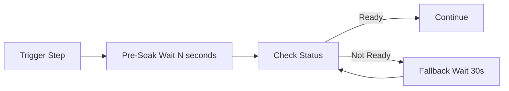

# Design Document: SFN Transition Optimization

## Overview

This feature optimises the five HPC-platform Step Functions state machines to reduce state transitions and Lambda invocations, keeping usage within the AWS Free Tier limits (4,000 transitions/month, 1,000,000 Lambda invocations/month). Two complementary strategies are applied:

1. **Lambda consolidation** — consecutive fast Lambda steps that execute sequentially without intervening waits are merged into a single Lambda invocation. The consolidated handler calls each original step function in order, propagating the accumulated payload, and re-raises any error with the original step name so existing catch blocks continue to work.

2. **Pre-soak Wait states** — a one-time `Wait` state is inserted before each polling loop, calibrated to historical execution data so the first poll is likely to find the resource ready. The existing polling loop is retained as a fallback.

### Affected State Machines

| State Machine | Current Transitions (typical) | Strategy |
|---|---|---|
| `hpc-cluster-creation` | 296–305 | Consolidate pre-parallel (4→1) and post-parallel tail (4→1); pre-soak PCS cluster (270s) and node groups (270s) |
| `hpc-cluster-destruction` | 65–74 | Consolidate two linear chains after PCS deletion wait |
| `hpc-project-deploy` | ~103 | Consolidate pre-loop (2→1) and post-loop (2→1); pre-soak CodeBuild (210s) |
| `hpc-project-update` | 67–76 | Consolidate pre-loop (2→1) and post-loop (2→1); pre-soak CodeBuild (90s) |
| `hpc-project-destroy` | ~65 | Consolidate pre-loop (2→1) and post-loop (2→1); pre-soak CodeBuild (210s) |

### Design Rationale

The consolidation approach was chosen over alternatives (Express Workflows, Distributed Map) because:
- The existing standard workflows are already deployed and battle-tested.
- Express Workflows have a 5-minute execution limit, incompatible with cluster creation (~15 min).
- The step handler dispatch pattern already exists — consolidation adds a new dispatch key that calls existing functions sequentially, minimising new code.
- Pre-soak waits are a zero-cost optimisation (Wait states are free) that eliminate the majority of polling transitions.

## Architecture

### Current vs Optimised Flow

The optimisation does not change the overall architecture. Each state machine retains its existing Lambda functions, IAM roles, DynamoDB tables, and error handling paths. The changes are purely structural within the state machine definitions and the step handler dispatch tables.

```mermaid
graph TD
    subgraph "Cluster Creation — Before"
        A1[ValidateAndRegisterName] --> A2[CheckBudgetBreach]
        A2 --> A3[ResolveTemplate]
        A3 --> A4[CreateIamResources]
        A4 --> A5[ParallelProvision]
        A5 --> A6[CreateLoginNodeGroup]
        A6 --> A7[CreateComputeNodeGroup]
        A7 --> A8[CheckNodeGroupsStatus ↻ Wait 30s]
        A8 --> A9[ResolveLoginNodeDetails]
        A9 --> A10[CreatePcsQueue]
        A10 --> A11[TagResources]
        A11 --> A12[RecordCluster]
    end

    subgraph "Cluster Creation — After"
        B1[ConsolidatedPreParallel] --> B5[ParallelProvision]
        B5 --> B6[CreateLoginNodeGroup]
        B6 --> B7[CreateComputeNodeGroup]
        B7 --> B7w[PreSoakWait 270s]
        B7w --> B8[CheckNodeGroupsStatus ↻ Wait 30s]
        B8 --> B12[ConsolidatedPostParallel]
    end
```



### Pre-Soak Wait Pattern



The pre-soak duration is calibrated so the resource is ready ~80% of the time on the first poll. The fallback loop handles the remaining cases with the same 30-second interval as before.

## Components and Interfaces

### 1. Consolidated Step Handlers (Python)

New step functions are added to the existing Lambda handler modules. Each consolidated handler calls the original step functions sequentially and merges their results.

#### Cluster Creation — `cluster_creation.py`

| New Step Name | Calls (in order) | Registered In |
|---|---|---|
| `consolidated_pre_parallel` | `validate_and_register_name` → `check_budget_breach` → `resolve_template` → `create_iam_resources` | `_STEP_DISPATCH` |
| `consolidated_post_parallel` | `resolve_login_node_details` → `create_pcs_queue` → `tag_resources` → `record_cluster` | `_STEP_DISPATCH` |

**Interface contract:**
```python
def consolidated_pre_parallel(event: dict[str, Any]) -> dict[str, Any]:
    """Execute pre-parallel steps sequentially.
    
    Calls validate_and_register_name, check_budget_breach,
    resolve_template, and create_iam_resources in order.
    Each step receives the accumulated payload from prior steps.
    
    Raises the original error from whichever sub-step fails,
    preserving the error type and message for the catch block.
    
    Returns the merged payload with all fields from all four steps.
    """
```

```python
def consolidated_post_parallel(event: dict[str, Any]) -> dict[str, Any]:
    """Execute post-parallel tail steps sequentially.
    
    Calls resolve_login_node_details, create_pcs_queue,
    tag_resources, and record_cluster in order.
    Preserves progress tracking calls within each sub-step.
    
    Returns the merged payload with all fields from all four steps.
    """
```

#### Cluster Destruction — `cluster_destruction.py`

| New Step Name | Calls (in order) | Registered In |
|---|---|---|
| `consolidated_delete_resources` | `delete_pcs_cluster_step` → `delete_fsx_filesystem` → (conditionally) `remove_mountpoint_s3_policy` | `_STEP_DISPATCH` |
| `consolidated_cleanup` | `delete_iam_resources` → `delete_launch_templates` → `deregister_cluster_name_step` → `record_cluster_destroyed` | `_STEP_DISPATCH` |

**Interface contract:**
```python
def consolidated_delete_resources(event: dict[str, Any]) -> dict[str, Any]:
    """Execute resource deletion steps sequentially.
    
    Calls delete_pcs_cluster_step, delete_fsx_filesystem, and
    conditionally remove_mountpoint_s3_policy (when storageMode == 'mountpoint').
    
    Returns the merged payload.
    """
```

```python
def consolidated_cleanup(event: dict[str, Any]) -> dict[str, Any]:
    """Execute cleanup steps sequentially.
    
    Calls delete_iam_resources, delete_launch_templates,
    deregister_cluster_name_step, and record_cluster_destroyed.
    
    Returns the merged payload.
    """
```

#### Project Deploy — `project_deploy.py`

| New Step Name | Calls (in order) |
|---|---|
| `consolidated_pre_loop` | `validate_project_state` → `start_cdk_deploy` |
| `consolidated_post_loop` | `extract_stack_outputs` → `record_infrastructure` |

#### Project Update — `project_update.py`

| New Step Name | Calls (in order) |
|---|---|
| `consolidated_pre_loop` | `validate_update_state` → `start_cdk_update` |
| `consolidated_post_loop` | `extract_stack_outputs` → `record_updated_infrastructure` |

#### Project Destroy — `project_destroy.py`

| New Step Name | Calls (in order) |
|---|---|
| `consolidated_pre_loop` | `validate_and_check_clusters` → `start_cdk_destroy` |
| `consolidated_post_loop` | `clear_infrastructure` → `archive_project` |

### 2. CDK Construct Changes (TypeScript)

#### `lib/constructs/cluster-operations.ts`

**Cluster Creation State Machine changes:**
- Replace the four sequential `LambdaInvoke` states (ValidateAndRegisterName → CheckBudgetBreach → ResolveTemplate → CreateIamResources) with a single `LambdaInvoke` state dispatching to `consolidated_pre_parallel`.
- Replace the four sequential `LambdaInvoke` states (ResolveLoginNodeDetails → CreatePcsQueue → TagResources → RecordCluster) with a single `LambdaInvoke` state dispatching to `consolidated_post_parallel`.
- Insert a `Wait` state of 270 seconds between `CreatePcsCluster` and the first `CheckPcsClusterStatus` invocation (inside the PCS parallel branch).
- Insert a `Wait` state of 270 seconds between `CreateComputeNodeGroup` and the first `CheckNodeGroupsStatus` invocation.
- Retain all existing `addCatch` configurations on the new consolidated states.
- Retain the `ParallelProvision` state and its `resultSelector` unchanged.

**Cluster Destruction State Machine changes:**
- Replace `DeletePcsCluster → DeleteFsxFilesystem → StorageModeDestroyChoice → (RemoveMountpointS3Policy | skip) → DeleteIamResources → DeleteLaunchTemplates → DeregisterClusterName → RecordClusterDestroyed` with `ConsolidatedDeleteResources → ConsolidatedCleanup`.
- Retain all `addCatch` configurations routing to `RecordClusterDestructionFailed`.

#### `lib/constructs/project-lifecycle.ts`

**Project Deploy State Machine changes:**
- Replace `ValidateProjectState → StartCdkDeploy` with a single `ConsolidatedPreLoop` state.
- Insert a `Wait` state of 210 seconds between `ConsolidatedPreLoop` and the first `CheckDeployStatus`.
- Replace `ExtractStackOutputs → RecordInfrastructure` with a single `ConsolidatedPostLoop` state.

**Project Update State Machine changes:**
- Replace `ValidateUpdateState → StartCdkUpdate` with a single `ConsolidatedPreLoop` state.
- Insert a `Wait` state of 90 seconds between `ConsolidatedPreLoop` and the first `CheckUpdateStatus`.
- Replace `ExtractUpdateStackOutputs → RecordUpdatedInfrastructure` with a single `ConsolidatedPostLoop` state.

**Project Destroy State Machine changes:**
- Replace `ValidateAndCheckClusters → StartCdkDestroy` with a single `ConsolidatedPreLoop` state.
- Insert a `Wait` state of 210 seconds between `ConsolidatedPreLoop` and the first `CheckDestroyStatus`.
- Replace `ClearInfrastructure → ArchiveProject` with a single `ConsolidatedPostLoop` state.

### 3. Documentation

A new file `docs/sfn-transition-optimization.md` will document:
- The consolidation mapping (which consolidated step replaces which original steps)
- The pre-soak calibration rationale with historical execution data
- Transition count estimates before and after

## Data Models

No new DynamoDB tables, indexes, or schema changes are required. The optimisation is purely structural — consolidated handlers produce the same DynamoDB writes as the original individual handlers.

### Payload Contract Preservation

Each consolidated handler must produce the same output payload as the sequential execution of its constituent steps. The payload is an accumulating `dict[str, Any]` where each step adds its result fields via `{**event, "newField": value}`.

**Cluster creation pre-parallel payload fields (accumulated):**

| Field | Set By | Type |
|---|---|---|
| `projectId`, `clusterName`, `templateId` | Input | `str` |
| `budgetBreached` (absent = OK) | `check_budget_breach` | — |
| `loginInstanceType`, `instanceTypes`, `maxNodes`, etc. | `resolve_template` | various |
| `loginInstanceProfileArn`, `computeInstanceProfileArn` | `create_iam_resources` | `str` |

**Cluster creation post-parallel payload fields (accumulated):**

| Field | Set By | Type |
|---|---|---|
| `loginNodeIp`, `loginNodeInstanceId` | `resolve_login_node_details` | `str` |
| `queueId` | `create_pcs_queue` | `str` |
| `tagResults` | `tag_resources` | `list` |
| `status`, `createdAt` | `record_cluster` | `str` |

### Pre-Soak Wait Calibration Data

| Polling Loop | Historical Wait Iterations | Avg Time per Iteration | Total Wait | Pre-Soak Duration | Expected Remaining Polls |
|---|---|---|---|---|---|
| PCS Cluster (creation) | 10–11 | 30s | 300–333s | 270s | 0–2 |
| Node Groups (creation) | 10–12 | 30s | 304–366s | 270s | 0–3 |
| CodeBuild Deploy | 8 | 30s | ~240s | 210s | 0–1 |
| CodeBuild Update | 4–5 | 30s | 120–150s | 90s | 0–2 |
| CodeBuild Destroy | ~8 | 30s | ~240s | 210s | 0–1 |

Pre-soak durations are set to approximately the 10th percentile of observed completion times, ensuring the resource is ready on the first poll in the majority of executions while avoiding unnecessary waiting in fast cases.

## Correctness Properties

*A property is a characteristic or behavior that should hold true across all valid executions of a system — essentially, a formal statement about what the system should do. Properties serve as the bridge between human-readable specifications and machine-verifiable correctness guarantees.*

The core correctness guarantee of this optimisation is **functional equivalence**: each consolidated handler must produce the same output payload as the sequential execution of its constituent step functions. This is a classic round-trip / equivalence property that is well-suited to property-based testing with generated event payloads.

### Property 1: Cluster creation pre-parallel output equivalence

*For any* valid cluster creation event payload, calling `consolidated_pre_parallel(event)` SHALL produce the same output dict as calling `validate_and_register_name`, `check_budget_breach`, `resolve_template`, and `create_iam_resources` sequentially, where each step receives the output of the previous step.

**Validates: Requirements 1.1, 1.3, 14.1**

### Property 2: Cluster creation post-parallel output equivalence

*For any* valid post-parallel cluster creation event payload (containing fields from all three parallel branches), calling `consolidated_post_parallel(event)` SHALL produce the same output dict as calling `resolve_login_node_details`, `create_pcs_queue`, `tag_resources`, and `record_cluster` sequentially, where each step receives the output of the previous step.

**Validates: Requirements 2.1, 2.3, 14.1**

### Property 3: Cluster destruction consolidated delete output equivalence

*For any* valid cluster destruction event payload with `storageMode` in `{"lustre", "mountpoint"}`, calling `consolidated_delete_resources(event)` SHALL produce the same output dict as calling `delete_pcs_cluster_step`, `delete_fsx_filesystem`, and conditionally `remove_mountpoint_s3_policy` (when `storageMode == "mountpoint"`) sequentially.

**Validates: Requirements 3.1, 3.4, 14.5**

### Property 4: Cluster destruction consolidated cleanup output equivalence

*For any* valid cluster destruction event payload, calling `consolidated_cleanup(event)` SHALL produce the same output dict as calling `delete_iam_resources`, `delete_launch_templates`, `deregister_cluster_name_step`, and `record_cluster_destroyed` sequentially.

**Validates: Requirements 3.2, 14.5**

### Property 5: Project lifecycle consolidated pre-loop output equivalence

*For any* valid project event payload and *for any* project lifecycle workflow (deploy, update, destroy), calling the respective `consolidated_pre_loop(event)` SHALL produce the same output dict as calling the two constituent pre-loop steps sequentially (validate then start).

**Validates: Requirements 4.1, 5.1, 6.1, 14.2, 14.3, 14.4**

### Property 6: Project lifecycle consolidated post-loop output equivalence

*For any* valid project event payload and *for any* project lifecycle workflow (deploy, update, destroy), calling the respective `consolidated_post_loop(event)` SHALL produce the same output dict as calling the two constituent post-loop steps sequentially (extract/clear then record/archive).

**Validates: Requirements 4.2, 5.2, 6.2, 14.2, 14.3, 14.4**

### Property 7: Error propagation preservation

*For any* consolidated handler and *for any* sub-step position within that handler, if the sub-step raises an exception, the consolidated handler SHALL re-raise an exception of the same type with a message containing the original error message, and no subsequent sub-steps SHALL be executed.

**Validates: Requirements 1.2, 2.2, 3.3, 4.3, 5.3, 6.3, 12.1, 12.2, 12.3**

## Error Handling

### Consolidated Handler Error Strategy

Each consolidated handler follows a strict fail-fast pattern:

1. Sub-steps are called sequentially in a `for` loop (or explicit sequence).
2. If any sub-step raises an exception, the consolidated handler **does not catch it** — the exception propagates directly to the Step Functions catch block.
3. The exception type and message are preserved exactly, so existing catch configurations (`addCatch` with `resultPath: '$.error'`) continue to route to the correct failure handler.

This means:
- **Cluster creation**: Errors in `consolidated_pre_parallel` or `consolidated_post_parallel` route to `HandleCreationFailure` → `CreationFailed`, exactly as before.
- **Cluster destruction**: Errors in `consolidated_delete_resources` or `consolidated_cleanup` route to `RecordClusterDestructionFailed` → `DestructionFailed`.
- **Project workflows**: Errors route to the respective `Handle*Failure` → `*Failed` states.

### Partial Execution in Consolidated Handlers

When a consolidated handler fails partway through, some sub-steps will have completed and their side effects (DynamoDB writes, AWS resource creation/deletion) will persist. This is **identical to the pre-optimisation behaviour** — if step 3 of 4 failed in the original sequential state machine, steps 1 and 2 had already completed. The existing rollback handlers already account for this.

### Pre-Soak Wait — No Error Handling Needed

`Wait` states in Step Functions cannot fail. If the state machine is stopped during a Wait, the execution terminates normally. No additional error handling is needed for pre-soak waits.

## Testing Strategy

### Unit Tests (Example-Based)

Unit tests verify specific scenarios and edge cases:

- **Consolidated handler registration**: Each new step name is present in `_STEP_DISPATCH`.
- **Progress tracking**: `consolidated_post_parallel` calls `_update_step_progress` with the correct step numbers for each sub-step.
- **Conditional execution**: `consolidated_delete_resources` calls `remove_mountpoint_s3_policy` only when `storageMode == "mountpoint"` and skips it for `"lustre"`.
- **Empty/missing fields**: Consolidated handlers handle missing optional fields the same way as the original individual handlers.

### Property-Based Tests (Hypothesis)

Property tests verify universal correctness guarantees using the [Hypothesis](https://hypothesis.readthedocs.io/) library (already used in this project):

- **Library**: Hypothesis (Python)
- **Minimum iterations**: 100 per property
- **Tag format**: `# Feature: sfn-transition-optimization, Property {N}: {title}`

Each of the 7 correctness properties above maps to a single property-based test. The test generates random event payloads (with mocked AWS clients) and verifies the consolidated handler output matches sequential execution of the constituent steps.

**Generator strategy**: Use `@st.composite` to build valid event dicts with random `projectId`, `clusterName`, `storageMode`, and other fields. AWS SDK calls are mocked to return deterministic responses based on input, ensuring the equivalence comparison is meaningful.

### Integration Tests (CDK Synth)

CDK synth snapshot tests verify state machine structure:

- Pre-soak Wait states exist with correct durations (270s, 210s, 90s).
- Consolidated Lambda invocations dispatch to the correct step names.
- Existing polling loops (30s Wait) are preserved as fallbacks.
- Error catch configurations route to the correct failure handlers.
- Parallel branch structure and `resultSelector` are unchanged.
- `MarkClusterFailed` catch chain is preserved in cluster creation.

### Documentation Verification

- `docs/sfn-transition-optimization.md` exists and contains consolidation mapping and calibration data.
