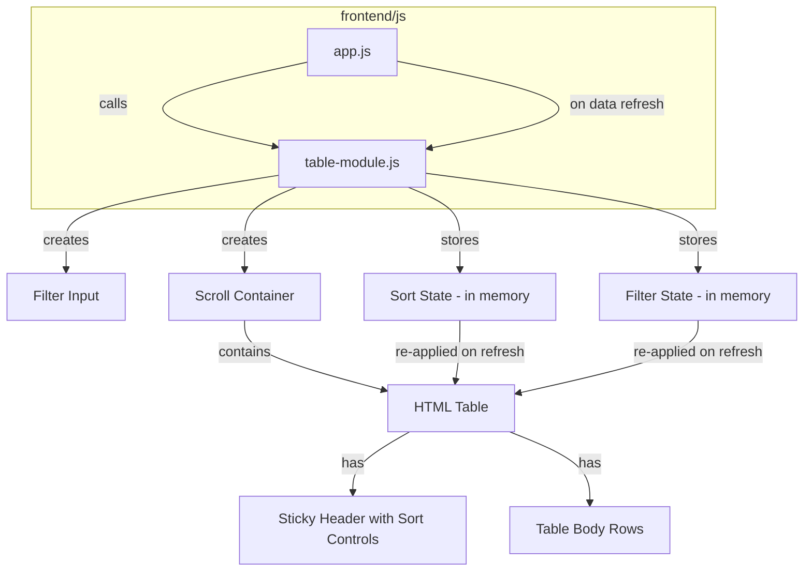

# Design Document

## Overview

This design introduces a reusable `TableModule` for the HPC Self-Service Portal that wraps all five data tables (Users, Projects, Templates, Clusters, Accounting/Jobs) with three capabilities:

1. **Viewport-constrained scrolling** — each table lives inside a scroll container whose max-height is calculated to fit the remaining viewport space, with a sticky header row.
2. **Column-header sorting** — clicking a `<th>` sorts rows by that column (ascending → descending toggle), using the appropriate comparator (case-insensitive text or numeric).
3. **Text filtering** — a search input above each table hides rows that don't match a case-insensitive substring search across all visible (non-Actions) columns.

Sort and filter state is held in memory per table instance and automatically re-applied when polling refreshes replace the underlying data. Navigating away from a page discards the state.

The implementation is pure vanilla JavaScript with no build system, matching the existing `app.js` architecture. A new file `frontend/js/table-module.js` contains all reusable logic; each existing `load*()` function is updated to delegate rendering to the module.

## Architecture



### Data Flow

1. Each `load*()` function in `app.js` fetches data from the API and receives an array of objects.
2. Instead of building raw `<table>` HTML, it calls `TableModule.render(tableId, config, data)`.
3. `TableModule` stores the current sort/filter state keyed by `tableId`.
4. On each call, it builds the full DOM (filter input → scroll container → table), applies the stored sort and filter, and replaces the container's content.
5. When the user interacts with sort headers or the filter input, the module updates its internal state and re-renders the table body in place (no full DOM rebuild needed for sort/filter — only for data refresh).

### Key Design Decisions

| Decision | Rationale |
|---|---|
| Single new file `table-module.js` | Keeps the module isolated and testable without modifying the existing `app.js` structure more than necessary |
| State keyed by `tableId` string | Each table (users, projects, templates, clusters, accounting) gets independent sort/filter state |
| In-memory state only | Requirements explicitly prohibit localStorage/URL persistence; navigating away naturally clears state because `navigate()` re-renders the page |
| `position: sticky` for header | Well-supported in modern browsers, simpler than duplicating the header outside the scroll container |
| Comparator selection via column config | Each column definition specifies its type (`text`, `numeric`, `html-text`) so the sort function picks the right comparator |
| Filter searches raw data values, not rendered HTML | Avoids matching on HTML tags or action button text; each column config provides a `filterValue` accessor |

## Components and Interfaces

### TableModule (frontend/js/table-module.js)

The module exposes a single global object `TableModule` with the following interface:

```javascript
/**
 * Render a sortable, filterable, scroll-contained table.
 *
 * @param {string} tableId - Unique identifier for state tracking (e.g. 'users', 'projects')
 * @param {TableConfig} config - Column definitions and options
 * @param {Object[]} data - Array of row data objects
 * @param {HTMLElement} container - DOM element to render into
 */
TableModule.render(tableId, config, data, container);

/**
 * Clear stored sort/filter state for a given table.
 * Called implicitly when navigating away (page re-render).
 *
 * @param {string} tableId - Table identifier to clear
 */
TableModule.clearState(tableId);

/**
 * Clear all stored state for all tables.
 */
TableModule.clearAllState();
```

### TableConfig

```javascript
/**
 * @typedef {Object} ColumnDef
 * @property {string} key - Unique column identifier
 * @property {string} label - Display header text
 * @property {('text'|'numeric'|'custom')} [type='text'] - Sort comparator type
 * @property {boolean} [sortable=true] - Whether this column supports sorting
 * @property {(row: Object) => string} [render] - Custom cell renderer (returns HTML string)
 * @property {(row: Object) => string} [value] - Value accessor for sorting/filtering
 *     (returns plain text). Defaults to row[key].
 */

/**
 * @typedef {Object} TableConfig
 * @property {ColumnDef[]} columns - Ordered column definitions
 * @property {string} [filterLabel] - aria-label for the filter input
 *     (e.g. "Filter users")
 * @property {string} [emptyMessage='No data found.'] - Message when data array is empty
 * @property {string} [noMatchMessage='No matching results found.'] - Message when
 *     filter produces zero visible rows
 */
```

### State Structure (internal)

```javascript
// Keyed by tableId
const tableStates = {
  'users': {
    sortColumn: null,    // column key or null
    sortDirection: 'asc', // 'asc' | 'desc'
    filterText: '',       // current filter string
  },
  // ...
};
```

### Integration Points in app.js

Each existing `load*()` function changes from building raw HTML to calling `TableModule.render()`. Example for `loadUsers()`:

```javascript
// Before (current):
el.innerHTML = `<table>...<tbody>${users.map(u => `<tr>...`)}</tbody></table>`;

// After:
TableModule.render('users', usersTableConfig, users, el);
```

The `navigate()` function already clears and re-renders pages, which naturally resets table state since the container DOM is replaced. For explicit cleanup, `TableModule.clearAllState()` can be called in `navigate()`.

### Scroll Container Height Calculation

The scroll container's max-height is computed as:

```
maxHeight = window.innerHeight - container.getBoundingClientRect().top - bottomMargin
```

Where `bottomMargin` is a small constant (e.g. 32px) to provide breathing room at the bottom of the viewport. This is recalculated on `window.resize` via a debounced event listener.

## Data Models

No new persistent data models are introduced. All state is transient and in-memory.

### Column Configurations (defined in app.js)

Each table has a configuration object mapping its API data shape to columns:

**Users Table:**
| Column Key | Label | Type | Sortable |
|---|---|---|---|
| userId | User ID | text | yes |
| displayName | Display Name | text | yes |
| role | Role | text | yes |
| posixUid | POSIX UID | numeric | yes |
| status | Status | text | yes |
| _actions | Actions | custom | no |

**Projects Table:**
| Column Key | Label | Type | Sortable |
|---|---|---|---|
| projectId | Project ID | text | yes |
| projectName | Name | text | yes |
| budgetLimit | Budget | numeric | yes |
| status | Status | text | yes |
| _actions | Actions | custom | no |

**Templates Table:**
| Column Key | Label | Type | Sortable |
|---|---|---|---|
| templateId | Template ID | text | yes |
| templateName | Name | text | yes |
| instanceTypes | Instance Types | text | yes |
| loginInstanceType | Login Instance | text | yes |
| nodes | Nodes (min–max) | text | yes |
| _actions | Actions | custom | no |

**Clusters Table:**
| Column Key | Label | Type | Sortable |
|---|---|---|---|
| clusterName | Cluster Name | text | yes |
| templateId | Template | text | yes |
| status | Status | text | yes |
| _progress | Progress | custom | no |
| _actions | Actions | custom | no |

**Accounting/Jobs Table:**
| Column Key | Label | Type | Sortable |
|---|---|---|---|
| jobId | Job ID | text | yes |
| user | User | text | yes |
| cluster | Cluster | text | yes |
| partition | Partition | text | yes |
| state | State | text | yes |
| start | Start | text | yes |
| end | End | text | yes |

## Correctness Properties

*A property is a characteristic or behavior that should hold true across all valid executions of a system — essentially, a formal statement about what the system should do. Properties serve as the bridge between human-readable specifications and machine-verifiable correctness guarantees.*

### Property 1: Sorting produces correctly ordered output

*For any* non-empty array of row objects and *for any* sortable column, sorting the array by that column in ascending order SHALL produce rows where each consecutive pair satisfies `comparator(row[i], row[i+1]) <= 0`, and sorting in descending order SHALL produce rows where each consecutive pair satisfies `comparator(row[i], row[i+1]) >= 0`. Text columns use case-insensitive lexicographic comparison; numeric columns use numeric comparison.

**Validates: Requirements 2.1, 2.2, 2.5, 2.6**

### Property 2: Filtering returns exactly the matching rows

*For any* array of row objects and *for any* filter string, the filtered output SHALL contain exactly those rows where at least one visible (non-Actions) column value contains the filter string as a case-insensitive substring. Rows not matching SHALL be excluded. An empty filter string SHALL return all rows.

**Validates: Requirements 3.2, 3.3, 3.5**

### Property 3: Sort and filter state is preserved across data refresh

*For any* stored sort state (column + direction) and filter state (filter text), when `TableModule.render()` is called again with new data for the same `tableId`, the output SHALL be sorted according to the stored sort state AND filtered according to the stored filter state.

**Validates: Requirements 2.7, 3.4, 4.1, 4.2**

## Error Handling

| Scenario | Handling |
|---|---|
| Empty data array | Display `emptyMessage` from config (e.g. "No users found.") inside the container. No table, filter input, or scroll container is rendered. |
| Filter produces zero visible rows | Display `noMatchMessage` (e.g. "No matching results found.") below the filter input. The filter input remains visible so the user can adjust their search. |
| Column `value` accessor returns `undefined` or `null` | Treat as empty string for text comparison, or `0` for numeric comparison. This ensures rows with missing data sort to the beginning (ascending) rather than causing errors. |
| Scroll container height calculation yields ≤ 0 | Fall back to a minimum height (e.g. 200px) to ensure the table is always visible. |
| Window resize during render | Debounce the resize handler (150ms) to avoid excessive recalculations. |
| `tableId` not found in state map | Initialise a fresh default state (no sort, no filter) on first render. |

## Testing Strategy

### Test Framework

The frontend code is vanilla JavaScript with no module bundler. Tests will use **Jest** with **jsdom** environment (already available in the project's devDependencies). A separate Jest config or project entry will target `frontend/js/` files.

Since `table-module.js` will be a self-contained module that attaches to `window.TableModule`, tests can load it into a jsdom environment and exercise the sorting, filtering, and rendering logic directly.

### Unit Tests (Example-Based)

Unit tests cover specific scenarios, edge cases, and DOM structure:

- **Scroll container structure**: Verify rendered DOM contains a wrapper with `overflow-y: auto`, `max-height` style, and sticky header CSS class
- **Sticky header**: Verify `<thead>` elements get `position: sticky` styling
- **Resize handling**: Simulate window resize, verify max-height recalculation
- **Sort indicator rendering**: Verify correct `aria-sort` attribute values (`ascending`, `descending`, `none`) on column headers
- **Filter input rendering**: Verify filter input exists with correct `aria-label`
- **Keyboard accessibility**: Verify Enter and Space keydown on headers triggers sort
- **Empty data**: Verify empty message is displayed when data array is empty
- **No filter matches**: Verify "no matching results" message when filter excludes all rows
- **State reset on navigation**: Verify `clearAllState()` resets all table states
- **Actions column excluded from sort and filter**: Verify Actions columns are not sortable and not searched during filtering
- **Column configurations**: Verify all five table configs have correct sortable flags

### Property-Based Tests

Property-based tests use **fast-check** (to be added as a devDependency) and validate the three correctness properties above. Each test runs a minimum of 100 iterations.

- **Property 1 test**: Generate random arrays of objects with string and numeric fields, sort by each column type in both directions, assert ordering invariant.
  - Tag: `Feature: table-ui-enhancements, Property 1: Sorting produces correctly ordered output`
- **Property 2 test**: Generate random arrays of objects and random filter strings, apply filter, assert every included row contains the substring and every excluded row does not.
  - Tag: `Feature: table-ui-enhancements, Property 2: Filtering returns exactly the matching rows`
- **Property 3 test**: Generate random sort state + filter state + two different data arrays, render with first data, then re-render with second data using same tableId, assert output matches sort+filter state.
  - Tag: `Feature: table-ui-enhancements, Property 3: Sort and filter state is preserved across data refresh`

### Test File Structure

```
test/
  frontend/
    table-module.test.js          # Unit tests for TableModule
    table-module.property.test.js # Property-based tests
```

Jest configuration will be extended with a second project targeting `test/frontend/**/*.test.js` using `jsdom` environment.
