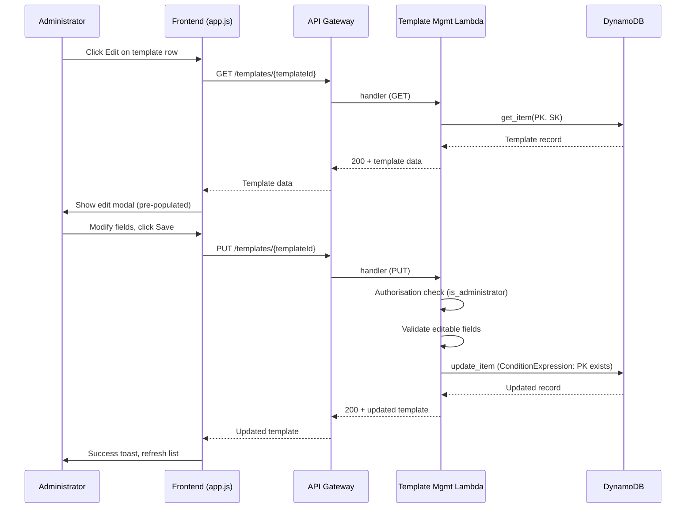
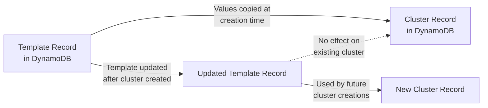

# Design Document: Template Editing

## Overview

This feature adds a PUT endpoint to the Template Management API, allowing administrators to update cluster template fields after creation. The design follows the existing patterns established by the template CRUD operations and the project update (PUT /projects/{projectId}) feature.

The key architectural constraint is that template updates only affect future cluster creations. Cluster creation already copies template values into the cluster record at creation time (in `cluster_creation.py`'s `record_cluster` step), so existing clusters are naturally isolated from template changes — no additional isolation logic is needed.

### Scope

- **Backend**: New `update_template` function in `templates.py`, new PUT route in `handler.py`
- **Frontend**: Edit button in templates table, modal dialog for editing, PUT API call
- **CDK**: PUT method on `/templates/{templateId}` resource (placeholder stack — documented for future wiring)
- **Documentation**: API reference update for the new endpoint
- **Testing**: Property-based tests (Hypothesis) and unit tests

### Design Decisions

1. **Full replacement semantics**: The PUT endpoint requires all editable fields in the request body. This matches the existing project update pattern and avoids the complexity of partial updates (PATCH). The frontend pre-populates the form with current values, so the user always submits a complete set.

2. **DynamoDB `update_item` over `put_item`**: Using `update_item` with a `ConditionExpression` that checks the item exists preserves the original `createdAt` and `PK`/`SK` keys atomically, rather than requiring a read-then-write with `put_item`.

3. **`updatedAt` timestamp**: Added on every update to provide an audit trail. The `createdAt` field is never modified.

4. **templateId immutability enforced at two levels**: The handler rejects requests where the body `templateId` differs from the path parameter, and the `update_template` function never writes `templateId` or `PK`/`SK` fields.

## Architecture



### Cluster Isolation



Cluster creation (`cluster_creation.py` → `record_cluster`) copies template values (`templateId`, `instanceTypes`, `loginInstanceType`, `minNodes`, `maxNodes`, `amiId`, `softwareStack`) into the cluster's DynamoDB item. After creation, the cluster record is independent of the template. This is the existing behaviour — no changes are needed to maintain isolation.

## Components and Interfaces

### Backend: `templates.py` — New `update_template` Function

```python
def update_template(
    table_name: str,
    template_id: str,
    template_name: str,
    description: str,
    instance_types: list[str],
    login_instance_type: str,
    min_nodes: int,
    max_nodes: int,
    ami_id: str,
    software_stack: dict[str, Any],
) -> dict[str, Any]:
```

- Validates all editable fields using the existing `_validate_template_fields` function
- Uses `DynamoDB.Table.update_item` with `ConditionExpression="attribute_exists(PK)"` to ensure the template exists
- Sets all editable fields plus `updatedAt` timestamp
- Returns the sanitised updated record
- Raises `NotFoundError` if the template does not exist

### Backend: `handler.py` — New PUT Route

New handler function `_handle_update_template(event, template_id)`:
- Checks `is_administrator(event)` — raises `AuthorisationError` if not
- Parses request body
- Rejects body `templateId` that differs from path parameter (raises `ValidationError`)
- Calls `update_template` with extracted fields
- Returns 200 with updated template record

Route added to the dispatcher:
```python
elif resource == "/templates/{templateId}" and http_method == "PUT":
    template_id = path_parameters.get("templateId", "")
    response = _handle_update_template(event, template_id)
```

### Frontend: `app.js` — Edit Modal

Follows the pattern established by `showEditProjectDialog`:
- Add an **Edit** button to each template row in `loadTemplates` (alongside the existing Delete button)
- `editTemplate(templateId)` function fetches the template via GET, then opens a modal
- Modal pre-populates all editable fields; `templateId` is displayed as read-only (disabled input)
- On Save, sends PUT request to `/templates/{templateId}` with all editable fields
- On success: toast notification, close modal, refresh template list
- On error: toast with error message

### CDK: API Gateway Route

The CDK stack (`lib/self-service-hpc-stack.ts`) is currently a minimal placeholder. The design documents the required configuration for when the stack is built out:
- Add a PUT method on the existing `/templates/{templateId}` resource
- Integrate with the Template Management Lambda
- Protect with the Cognito authoriser
- This follows the same pattern as other PUT routes (e.g., `PUT /projects/{projectId}`)

### API Documentation

Add a `PUT /templates/{templateId}` section to `docs/api/reference.md` in the Cluster Templates section, documenting:
- Required role: Administrator
- Request body schema (all editable fields)
- Response format (full template record with `updatedAt`)
- Error codes: VALIDATION_ERROR (400), AUTHORISATION_ERROR (403), NOT_FOUND (404)

## Data Models

### Template Record (DynamoDB)

| Field | Type | Mutable | Description |
|-------|------|---------|-------------|
| `PK` | String | No | `TEMPLATE#{templateId}` |
| `SK` | String | No | `METADATA` |
| `templateId` | String | No | Unique template identifier |
| `templateName` | String | Yes | Human-readable name |
| `description` | String | Yes | Template description |
| `instanceTypes` | List[String] | Yes | Compute instance types |
| `loginInstanceType` | String | Yes | Login node instance type |
| `minNodes` | Number | Yes | Minimum compute nodes |
| `maxNodes` | Number | Yes | Maximum compute nodes |
| `amiId` | String | Yes | AMI identifier |
| `softwareStack` | Map | Yes | Scheduler configuration |
| `createdAt` | String | No | ISO 8601 creation timestamp |
| `updatedAt` | String | Yes (set on update) | ISO 8601 last-update timestamp |

### PUT Request Body Schema

```json
{
  "templateName": "string (required)",
  "description": "string (optional, defaults to empty)",
  "instanceTypes": ["string"] ,
  "loginInstanceType": "string (required)",
  "minNodes": 0,
  "maxNodes": 10,
  "amiId": "string (required)",
  "softwareStack": {}
}
```

The `templateId` field MAY be included in the body but MUST match the path parameter if present. All other editable fields are required (matching creation semantics).

### PUT Response (200 OK)

```json
{
  "templateId": "cpu-general",
  "templateName": "Updated Name",
  "description": "Updated description",
  "instanceTypes": ["c7g.large"],
  "loginInstanceType": "c7g.medium",
  "minNodes": 0,
  "maxNodes": 20,
  "amiId": "ami-newid123",
  "softwareStack": {"scheduler": "slurm", "schedulerVersion": "24.11"},
  "createdAt": "2025-01-15T10:00:00Z",
  "updatedAt": "2025-06-20T14:30:00Z"
}
```


## Correctness Properties

*A property is a characteristic or behavior that should hold true across all valid executions of a system — essentially, a formal statement about what the system should do. Properties serve as the bridge between human-readable specifications and machine-verifiable correctness guarantees.*

### Property 1: Update storage round-trip

*For any* valid template record and *for any* valid set of editable fields, updating the template and then retrieving it by templateId SHALL return a template record where every editable field (`templateName`, `description`, `instanceTypes`, `loginInstanceType`, `minNodes`, `maxNodes`, `amiId`, `softwareStack`) equals the corresponding value from the update payload.

**Validates: Requirements 1.1, 8.1**

### Property 2: Timestamp invariants on update

*For any* valid template record and *for any* valid set of editable fields, updating the template SHALL preserve the original `createdAt` value unchanged AND set an `updatedAt` field containing a valid ISO 8601 UTC timestamp that is greater than or equal to the `createdAt` value.

**Validates: Requirements 1.2, 1.3, 8.2**

### Property 3: Invalid fields are rejected

*For any* template update request containing at least one invalid editable field (empty `templateName`, empty `instanceTypes` list, non-positive `maxNodes`, `minNodes` exceeding `maxNodes`, empty `amiId`, or non-string `loginInstanceType`), the `update_template` function SHALL raise a `ValidationError` and leave the stored template record unchanged.

**Validates: Requirements 3.1, 3.2**

## Error Handling

| Scenario | Error Type | HTTP Status | Details |
|----------|-----------|-------------|---------|
| Non-admin caller | `AuthorisationError` | 403 | "Only administrators can update cluster templates." |
| Template not found | `NotFoundError` | 404 | `{"templateId": "<id>"}` |
| Empty request body | `ValidationError` | 400 | "Request body is required." |
| Invalid JSON body | `ValidationError` | 400 | "Request body must be valid JSON." |
| Body templateId ≠ path templateId | `ValidationError` | 400 | `{"field": "templateId"}` |
| Empty templateName | `ValidationError` | 400 | `{"field": "templateName"}` |
| Empty instanceTypes | `ValidationError` | 400 | `{"field": "instanceTypes"}` |
| Invalid loginInstanceType | `ValidationError` | 400 | `{"field": "loginInstanceType"}` |
| minNodes > maxNodes | `ValidationError` | 400 | `{"fields": ["minNodes", "maxNodes"]}` |
| Empty amiId | `ValidationError` | 400 | `{"field": "amiId"}` |
| DynamoDB failure | `InternalError` | 500 | Logged to CloudWatch |

Error responses follow the existing format:
```json
{
  "error": {
    "code": "VALIDATION_ERROR",
    "message": "templateName is required.",
    "details": { "field": "templateName" }
  }
}
```

## Testing Strategy

### Property-Based Tests (Hypothesis)

Property-based tests use the Hypothesis library with moto-mocked DynamoDB, following the existing pattern in `test_property_template_roundtrip.py`.

- **Library**: Hypothesis (already in use)
- **Minimum iterations**: 100 per property (configured via `max_examples`)
- **Tag format**: `Feature: template-editing, Property {number}: {property_text}`

Each correctness property maps to a single property-based test:

| Property | Test File | What It Generates |
|----------|-----------|-------------------|
| Property 1: Update round-trip | `test_property_template_update_roundtrip.py` | Random valid template definitions + random valid update payloads |
| Property 2: Timestamp invariants | `test_property_template_update_roundtrip.py` | Same as Property 1 (tested in the same test for efficiency, with separate assertions) |
| Property 3: Invalid fields rejected | `test_property_template_update_roundtrip.py` | Random invalid field combinations applied to a valid base template |

Generators reuse the existing strategies from `test_property_template_roundtrip.py` (`template_id_strategy`, `template_name_strategy`, `instance_types_strategy`, etc.) and add a new `valid_update_payload` composite strategy that generates a second set of valid editable fields.

### Unit Tests

Unit tests cover specific examples, edge cases, and error conditions. Added to the existing `test_unit_template_management.py` in a new `TestTemplateUpdate` class using the shared `template_mgmt_env` fixture:

| Test | Validates |
|------|-----------|
| `test_update_template_returns_200` | Req 1.1 — happy path |
| `test_update_nonexistent_template_returns_404` | Req 1.4 |
| `test_update_with_mismatched_template_id_returns_400` | Req 1.5 |
| `test_non_admin_cannot_update_template` | Req 2.1 |
| `test_admin_can_update_template` | Req 2.2 |
| `test_update_with_empty_body_returns_400` | Req 3.3 |
| `test_update_with_invalid_fields_returns_400` | Req 3.1, 3.2 (specific examples) |

### Integration / Manual Tests

| Test | Validates |
|------|-----------|
| Cluster isolation: create template → create cluster → update template → verify cluster unchanged | Req 4.1, 4.2 |
| Frontend edit modal renders with pre-populated values | Req 5.1–5.6 |
| CDK synthesis includes PUT method on templates resource | Req 6.1 |
| API docs contain PUT /templates/{templateId} section | Req 7.1, 7.2 |
