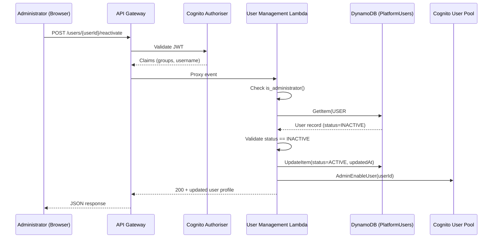

# Design Document: User Reactivation

## Overview

This design adds a user reactivation capability to the Self-Service HPC Platform. Currently, deactivated users (status `INACTIVE`) cannot be restored — the only workaround is creating a new user, which loses the original POSIX identity and audit trail. This feature introduces a `POST /users/{userId}/reactivate` endpoint that allows Administrators to re-enable a deactivated user, preserving their POSIX UID/GID, project memberships, and historical records.

The implementation touches four layers:

1. **Lambda business logic** (`users.py`) — new `reactivate_user()` function
2. **Lambda handler** (`handler.py`) — new route for `POST /users/{userId}/reactivate`
3. **CDK infrastructure** (`foundation-stack.ts`) — new API Gateway resource and method
4. **Frontend** (`app.js`) — Reactivate button for INACTIVE users, updated user list to show all statuses
5. **User list query** (`users.py`) — `list_users()` updated to return both ACTIVE and INACTIVE users
6. **Documentation** — updated user management docs, API reference, and user lifecycle diagram

### Design Rationale

- **Dedicated endpoint over PATCH/PUT**: A `POST /users/{userId}/reactivate` action endpoint is clearer than a generic PATCH on the user resource. It makes the intent explicit, simplifies authorisation checks, and avoids partial-update complexity.
- **Reuse existing Lambda**: The reactivation logic fits naturally in the existing `user_management` Lambda, which already has the required DynamoDB and Cognito permissions (including `AdminEnableUser`).
- **Preserve POSIX identity**: The reactivation only flips the status and re-enables Cognito — it never touches `posixUid`, `posixGid`, or project membership records.

## Architecture

The reactivation flow follows the same request path as existing user management operations:



### User List Query Change

The current `list_users()` queries the `StatusIndex` GSI with `status = ACTIVE`. To show both active and inactive users, the implementation will perform a DynamoDB Scan filtered to `SK = PROFILE` items (excluding the COUNTER row), rather than querying a single GSI partition. Since the user count on an HPC platform is typically small (tens to low hundreds), a Scan is acceptable and simpler than querying two GSI partitions and merging results.

## Components and Interfaces

### 1. `reactivate_user()` — Business Logic (`lambda/user_management/users.py`)

New function added alongside `create_user()` and `deactivate_user()`.

```python
def reactivate_user(
    table_name: str,
    user_pool_id: str,
    user_id: str,
) -> dict[str, Any]:
    """Reactivate a previously deactivated user.

    1. Fetch the user record from DynamoDB.
    2. Validate the user exists and is currently INACTIVE.
    3. Update DynamoDB status to ACTIVE.
    4. Re-enable the Cognito user account.
    5. Return the updated user profile.

    Raises:
        NotFoundError: if the user does not exist.
        ValidationError: if the user is already ACTIVE.
    """
```

**Key behaviours:**
- Reads the full user record first (to validate status and return the profile)
- Uses a conditional UpdateItem (`status = :inactive`) to guard against race conditions
- Calls `cognito.admin_enable_user()` after the DynamoDB update succeeds
- Returns the sanitised user record with the updated status and `updatedAt` timestamp

### 2. Handler Route (`lambda/user_management/handler.py`)

New route added to the existing `handler()` function:

```python
elif resource == "/users/{userId}/reactivate" and http_method == "POST":
    user_id = path_parameters.get("userId", "")
    response = _handle_reactivate_user(event, user_id)
```

The `_handle_reactivate_user()` function:
- Checks `is_administrator(event)` — rejects non-admins with `AuthorisationError`
- Calls `reactivate_user()` from the business logic layer
- Returns HTTP 200 with the updated user profile

### 3. Updated `list_users()` (`lambda/user_management/users.py`)

Changed from GSI query (ACTIVE only) to a table Scan with a filter:

```python
def list_users(table_name: str) -> list[dict[str, Any]]:
    """List all platform users (both ACTIVE and INACTIVE)."""
    table = dynamodb.Table(table_name)
    response = table.scan(
        FilterExpression=boto3.dynamodb.conditions.Attr("SK").eq("PROFILE"),
    )
    return [_sanitise_record(item) for item in response.get("Items", [])]
```

This returns both ACTIVE and INACTIVE users, enabling the admin UI to show deactivated users with a Reactivate button.

### 4. CDK Infrastructure (`lib/foundation-stack.ts`)

Add a new API Gateway resource under the existing `{userId}` resource:

```typescript
// POST /users/{userId}/reactivate — reactivate user
const reactivateResource = userIdResource.addResource('reactivate');
reactivateResource.addMethod('POST', userManagementIntegration, cognitoMethodOptions);
```

No new Lambda permissions are needed — the user management Lambda already has `AdminEnableUser` in its Cognito policy.

### 5. Frontend Changes (`frontend/js/app.js`)

**User list table:**
- The Actions column shows a "Reactivate" button for INACTIVE users and a "Deactivate" button for ACTIVE users.

**New `reactivateUser()` function:**
```javascript
async function reactivateUser(userId) {
  if (!confirm(`Reactivate user '${userId}'?`)) return;
  try {
    await apiCall('POST', `/users/${encodeURIComponent(userId)}/reactivate`);
    showToast(`User '${userId}' reactivated`);
    loadUsers();
  } catch (e) { showToast(e.message, 'error'); }
}
```

### 6. Documentation Updates

- `docs/admin/user-management.md` — add Reactivating a User section, update lifecycle diagram
- `docs/api/reference.md` — add `POST /users/{userId}/reactivate` endpoint documentation

## Data Models

### DynamoDB: PlatformUsers Table

No schema changes. The reactivation operation updates existing fields on the user profile item:

| Field | Change | Description |
|-------|--------|-------------|
| `status` | `INACTIVE` → `ACTIVE` | User status restored |
| `updatedAt` | Set to current UTC ISO timestamp | Tracks when reactivation occurred |

All other fields remain untouched: `PK`, `SK`, `userId`, `displayName`, `email`, `posixUid`, `posixGid`, `cognitoSub`, `createdAt`.

### API Request/Response

**Request:** `POST /users/{userId}/reactivate`
- No request body required
- `userId` provided as path parameter

**Success Response (200 OK):**
```json
{
  "userId": "jsmith",
  "displayName": "Jane Smith",
  "email": "jane.smith@example.com",
  "posixUid": 10001,
  "posixGid": 10001,
  "status": "ACTIVE",
  "cognitoSub": "abc-123",
  "createdAt": "2025-01-15T10:30:00Z",
  "updatedAt": "2025-06-20T14:00:00Z"
}
```

**Error Responses:**

| Code | Status | Condition |
|------|--------|-----------|
| `AUTHORISATION_ERROR` | 403 | Caller is not an Administrator |
| `VALIDATION_ERROR` | 400 | User is already ACTIVE |
| `NOT_FOUND` | 404 | User does not exist |


## Correctness Properties

*A property is a characteristic or behavior that should hold true across all valid executions of a system — essentially, a formal statement about what the system should do. Properties serve as the bridge between human-readable specifications and machine-verifiable correctness guarantees.*

### Property 1: Reactivation round-trip restores user to ACTIVE with correct profile

*For any* user created with a valid userId, displayName, and email, if that user is deactivated and then reactivated, the reactivation response SHALL have HTTP status 200, contain the fields userId, displayName, email, posixUid, posixGid, and status, and the status SHALL be `ACTIVE`.

**Validates: Requirements 1.1, 1.3, 3.2**

### Property 2: Reactivation preserves POSIX identity

*For any* user who is created, deactivated, and then reactivated, the posixUid and posixGid in the reactivation response SHALL be identical to the posixUid and posixGid assigned at creation time.

**Validates: Requirements 1.2**

### Property 3: Reactivating an already-active user is rejected

*For any* user who is currently in ACTIVE status, submitting a reactivation request SHALL return an HTTP 400 response with error code `VALIDATION_ERROR`.

**Validates: Requirements 1.4**

### Property 4: Non-administrator reactivation is rejected

*For any* non-administrator caller (with any combination of non-admin Cognito groups) and any target userId, submitting a reactivation request SHALL return an HTTP 403 response with error code `AUTHORISATION_ERROR`.

**Validates: Requirements 2.1**

### Property 5: User list returns both ACTIVE and INACTIVE users

*For any* set of created users where a random subset has been deactivated, the list_users response SHALL contain every user regardless of status, and the count SHALL equal the total number of created users.

**Validates: Requirements 5.1**

## Error Handling

### Reactivation Errors

| Scenario | Error Class | HTTP Status | Error Code | Message |
|----------|-------------|-------------|------------|---------|
| User not found | `NotFoundError` | 404 | `NOT_FOUND` | `User '{userId}' not found.` |
| User already ACTIVE | `ValidationError` | 400 | `VALIDATION_ERROR` | `User '{userId}' is already active.` |
| Caller not admin | `AuthorisationError` | 403 | `AUTHORISATION_ERROR` | `Only administrators can reactivate users.` |
| Cognito enable fails | Logged as warning | — | — | DynamoDB status is already updated; Cognito failure is logged but does not roll back the status change (matches the existing deactivation pattern) |
| DynamoDB conditional check fails (race condition) | `ValidationError` | 400 | `VALIDATION_ERROR` | `User '{userId}' is already active.` |

### Cognito Failure Strategy

The existing `deactivate_user()` function logs Cognito failures as warnings without rolling back the DynamoDB status change. The `reactivate_user()` function follows the same pattern: if `admin_enable_user()` fails after the DynamoDB update, the failure is logged but the status remains ACTIVE. This is acceptable because:

1. Cognito failures are rare and typically transient
2. A retry of the reactivation would succeed (DynamoDB already shows ACTIVE, Cognito enable is idempotent)
3. An admin can manually enable the Cognito user if needed

### List Users Error Handling

The updated `list_users()` uses a Scan instead of a GSI query. For large result sets, DynamoDB Scan paginates at 1 MB. The implementation should handle pagination, though in practice HPC platform user counts are small enough that pagination is unlikely. The existing error handling in the handler (catch-all for `InternalError`) covers any DynamoDB failures.

## Testing Strategy

### Property-Based Tests (Hypothesis)

Property-based tests use the [Hypothesis](https://hypothesis.readthedocs.io/) library, consistent with the existing test suite. Each property test runs a minimum of 100 iterations with randomised inputs.

| Property | Test File | Description |
|----------|-----------|-------------|
| Property 1 | `test/lambda/test_property_reactivation_roundtrip.py` | Create → deactivate → reactivate round-trip returns correct profile |
| Property 2 | `test/lambda/test_property_reactivation_roundtrip.py` | Same test also verifies POSIX UID/GID preservation (combined with Property 1 for efficiency since they share the same setup) |
| Property 3 | `test/lambda/test_property_reactivation_roundtrip.py` | Reactivating an ACTIVE user returns VALIDATION_ERROR |
| Property 4 | `test/lambda/test_property_admin_only.py` | Extend the existing admin-only property test to include the reactivation endpoint |
| Property 5 | `test/lambda/test_property_reactivation_roundtrip.py` | List users returns all statuses |

**Test infrastructure:** All property tests use `@mock_aws` per-example (consistent with existing property tests) and the shared `conftest.py` helpers for table creation and module reloading.

**Configuration:**
- Minimum 100 examples per property (`@settings(max_examples=100)`)
- Each test tagged with: `# Feature: user-reactivation, Property N: {description}`
- Deadline disabled to avoid flaky timeouts with moto

### Unit Tests

Unit tests are added to the existing `test/lambda/test_unit_user_management.py` file, following the established class-scoped `user_mgmt_env` fixture pattern:

| Test Class | Tests | Validates |
|------------|-------|-----------|
| `TestUserReactivationHappyPath` | Reactivate returns 200, status ACTIVE in DynamoDB, Cognito re-enabled | Req 1.1, 1.3 |
| `TestUserReactivationPosixPreservation` | POSIX UID/GID unchanged after reactivation | Req 1.2 |
| `TestUserReactivationValidation` | Already-active user returns 400, nonexistent user returns 404 | Req 1.4, 1.5 |
| `TestUserReactivationAuthorisation` | Non-admin rejected with 403 | Req 2.1 |
| `TestListUsersIncludesInactive` | List returns both ACTIVE and INACTIVE users | Req 5.1 |

### Integration / Smoke Tests

- CDK synthesis test: verify the `POST /users/{userId}/reactivate` resource exists in the synthesised CloudFormation template
- Documentation smoke test: verify `docs/admin/user-management.md` and `docs/api/reference.md` contain reactivation content (extends existing `test_smoke_docs.py`)
